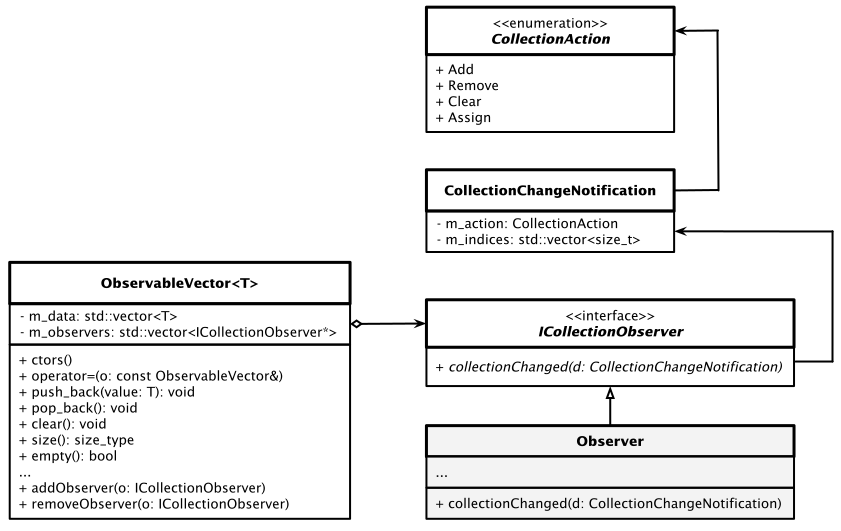

# Observable Vector Container

#### Lösung

Wir haben es offensichtlich mit einem Anwendungsfall des *Observer* Patterns zu tun.
Dieses Muster beschreibt ein Objekt, in der Regel als *Subject* bezeichnet,
das eine Liste abhängiger Objekte verwaltet, die als *Observer* bezeichnet werden,
und benachrichtigt diese über jegliche Zustandsänderung,
indem eine ihrer Methoden aufgerufen wird. Das folgende Klassendiagramm beschreibt eine mögliche
Musterimplementierung für das vorgeschlagene Problem:



Abbildung 1: Schematische Darstellung des *Observer* Patterns im Anwendungsfall *Observable Vector Container*.


`ObservableVector` ist eine Klasse, die ein `std::vector`-Objekt umschließt und die geforderten Operationen
zur Verfügung stellt. Die Klasse enthält auch eine Liste von Zeigern auf `CollectionObserver`-Objekte.
Dies ist ein Basisklasse für Objekte, die über Statusänderungen eines `ObservableVector`-Objekts informiert werden möchten.
Die Klasse hat eine virtuelle Methode namens `collectionChanged` mit einem
Argument des Typs `CollectionChangeNotification`, das nähere Informationen zu einer Zustandsänderung enthält.
Ändert sich der interne Status eines `ObservableVector`-Objekts, wird diese Methode 
bei allen registrierten Beobachtern aufgerufen.
Beobachter können dem `ObservableVector`-Objekt mit `addObserver` hinzugefügt werden
oder durch `removeObserver` von diesem wieder entfernt werden.


```cpp
ObservableVector<int> v;
Observer o;
v.addObserver(&o);
v.push_back(1);
v.push_back(2);
v.pop_back();
v.clear();
v.removeObserver(&o);
v.push_back(3);
v.push_back(4);
v.addObserver(&o);
ObservableVector<int> v2{ 1,2,3 };
v = v2;
v = ObservableVector<int>{ 7,8,9 };
```

*Ausgabe*: 

```cpp
action: add, indexes: 0
action: add, indexes: 1
action: remove, indexes: 2
action: clear
action: assign
action: assign
```


#### Quellcode

[Siehe hier](../ObservableVectorContainer.cpp)

---

[Zurück](Readme.md)

---
