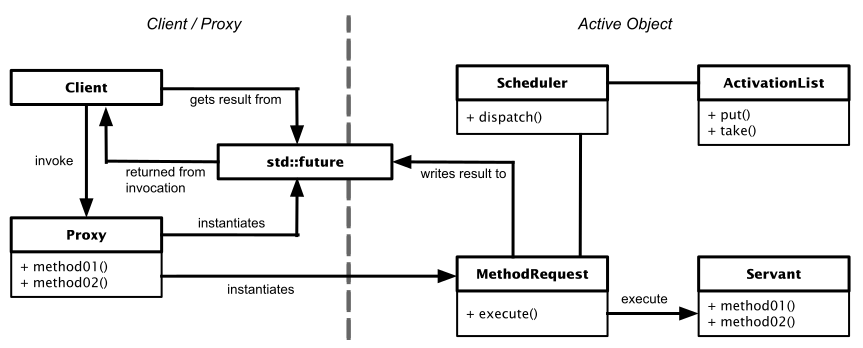

# Active Object Pattern

[Zurück](../../../Resources/Readme_05_Catalog.md)

---

## Wesentliche Merkmale

#### Kategorie: *Concurrency Pattern*

###### In einem Satz:

&bdquo;*Active Object* ist ein *Concurrency Pattern*, bei dem man versucht, den Aufruf einer Methode von ihrer Ausführung zu trennen.&rdquo;

#### Ziel / Absicht:

Das *Active Object* entkoppelt den Methodenaufruf von der Methodenausführung.
Der Methodenaufruf wird im Kontext des Client-Threads ausgeführt,
die Methodenausführung selbst in einem Thread des *Active Objects*.

Das *Active Object* verwaltet (mindestens) einen Thread (Kontrollthread) und eine Liste (Warteschlange)
von Objekten, die einen Methodenaufruf beschreiben.

Ein Methodenaufruf eines Clients reiht einen *Request* in der Warteschlange des *Active Objects* ein (auch als *ActivationList* bezeichnet).
Derartige *Requests* können bei der Ausführung an einen Server (*Servant*) weitergeleitet werden.

Das Pattern wurde maßgeblich von *Douglas C. Schmidt* von der Vanderbilt University entwickelt.
Er beschreibt es in dem Buch
[Pattern-Oriented Software Architecture: Volume 2](https://www.amazon.de/Pattern-Oriented-Software-Architecture-Concurrent-Networked/dp/0471606952)
auf folgende Weise:

  > Das *Active Object Pattern* entkoppelt die Methodenausführung vom Methodenaufruf,
  um die Parallelität zu verbessern und den synchronisierten Zugriff auf Objekte zu vereinfachen,
  die sich in einem eigenen Kontrollthread befinden.

---

#### Struktur:

Die Schlüsselelemente des *Active Object* Patterns sind:

  * Proxy (oder auch Client) &ndash; Der Proxy stellt eine Schnittstelle für die öffentlichen Member-Funktionen
  des aktiven Objekts bereit. Der Proxy löst damit die Erstellung eines Request-Objekts
  in der *ActivationList* aus. Der Proxy läuft im Client-Thread.

  * Dispatch Queue (auch *ActivationList*) &ndash; Die Aktivierungsliste
  verwaltet ausstehende Anfragen (in C++ im Regelfall ein `std::packaged_task`-Objekt).
  Die Aktivierungsliste entkoppelt den Thread des Clients
  vom Thread des aktiven Objekts. Der Proxy fügt Anforderungsobjekte ein und der Scheduler entfernt diese.
  Folglich muss der Zugriff auf die Aktivierungsliste serialisiert werden.

  * Scheduler &ndash; Der Scheduler läuft im Thread des aktiven Objekts und entscheidet,
    welche Anfrage aus der Aktivierungsliste als nächstes ausgeführt wird.

  * Result Handle (in C++ im Regelfall ein `std::future`-Objekt) &ndash;
  Wenn der Request ein Ergebnis zurückgibt, erhält der Client zu diesem Zweck ein `std::future`-Objekt
  und kann dadurch das Ergebnis des Methodenaufrufs erhalten (Methode `get`).
  Dieser Zugriff kann blockierend oder nicht-blockierend sein.


*Abbildung* 1: Schematische Darstellung des *Active Object* Patterns.

---

#### Ein Vergleich

*Bemerkung*: Das *Active Object Pattern* weist Ähnlichkeiten zum *Command Pattern* auf. 
Im Prinzip beschreibt es eine Variante des *Command Patterns* ausgelegt für Nebenläufigkeit.

---

#### Conceptual Example:

Das konzeptionelle Beispiel soll in einer vereinfachenden Betrachtung
die Schlüsselelemente des *Active Object* Patterns vorstellen.

Es treten im *Active Object* ein Scheduler und eine so genannte *ActivationList* auf:
Unter einer *ActivationList* verstehen wir eine FIFO-Warteschlange,
die einzelne Methodenaufrufe verwaltet.

Das Beispiel ist mit C++ 11 Sprachmitteln realisiert.
Es orientiert sich stark an dem Beispiel aus
[Wikipedia](https://en.wikipedia.org/wiki/Active_object),
das dort allerdings in Java realisiert ist.

Das konzeptionelle Beispiel besitzt &ndash; in Folge seiner vereinfachenden Darstellung &ndash; einige Nachteile:

  * Client (Proxy) und *Active Object* werden durch dasselbe Objekt dargestellt.
  * Die Methodenaufrufe liefern keinen Ergebniswert zurück.

[Quellcode](../ConceptualExample.cpp)

---

#### Erstes &bdquo;Real-World&rdquo; Example:

Das Beispiel veranschaulicht eine einfache Umsetzung des *Active Object* Patterns mit C++&ndash;Sprachmitteln wie
`std::future`, `std::packaged_task` und `std::jthread`.

Neben vielen Vereinfachungen wird auch gezeigt, wie ein berechnetes Ergebnis vom *Active Object* zum Client
transportiert werden kann.



*Abbildung* 2: Zusammenspiel der Komponenten des *Active Object* Patterns.

---

#### Zweites &bdquo;Real-World&rdquo; Example:

Das zweite &bdquo;Real-World&rdquo;-Beispiel berechnet die Summe der natürlichen Zahlen von 1 bis *n*.
Das könnte man natürlich in einem einzigen Thread abhandeln, und mit Hilfe der Gaußschen Summenformel ließe sich
die Berechnung nochmals vereinfachen.
Dennoch habe ich dieses Beispiel gewählt, um zum einen den Anwendungsfall
einfach gestalten zu können, und zum anderen, weil sich die Summe der natürlichen Zahlen von 1 bis *n* auch abschnittsweise berechnen lässt.
An dieser Stelle kommen nun viele Teilaufgaben (*Tasks*) und ein *Active Object* ins Spiel.

Das Beispiel liegt in 2 Versionen vor:

[Client in synchroner Ausführung](../ActiveObject_02.cpp)

[Client in asynchroner Ausführung](../ActiveObject_03.cpp)

Das Beispiel gewinnt dann an Charme, wenn die vielen Tasks (Teilaufgaben) an das *Active Object* von unterschiedlichen
Threads aus initiiert werden. Man vergleiche zu diesem Zweck die Ausgaben in der Konsole.

  * Ausschnittsweise Betrachtung mit einem synchronem Client:


```
Active Object Demo (Synchron)
Enqueue tasks synchronously ...
   queueing task [1,101]
   queueing task [101,201]
   queueing task [201,301]
   queueing task [301,401]
   queueing task [401,501]
   queueing task [501,601]
   queueing task [601,701]
   queueing task [701,801]
   queueing task [801,901]
   queueing task [901,1001]
   queueing task [1001,1101]
   ...
Run ...
   calculating range [1,101]
   calculating range [101,201]
   calculating range [201,301]
   calculating range [301,401]
   calculating range [401,501]
   calculating range [501,601]
   calculating range [601,701]
   calculating range [701,801]
   calculating range [801,901]
   calculating range [901,1001]
   calculating range [1001,1101]
   ...
```


  * Ausschnittsweise Betrachtung mit mehreren asynchronen Clients:

```
Active Object Demo (Asynchron)
Enqueue tasks asynchronously ...
   queueing task [1,101]
   queueing task [1001,1101]
   queueing task [101,201]
   queueing task [1101,1201]
   queueing task [201,301]
   queueing task [1201,1301]
   queueing task [301,401]
   queueing task [1301,1401]
   queueing task [401,501]
   queueing task [1401,1501]
   queueing task [2001,2101]
   ...
Run ...
   calculating range [1,101]
   calculating range [1001,1101]
   calculating range [101,201]
   calculating range [1101,1201]
   calculating range [201,301]
   calculating range [1201,1301]
   calculating range [301,401]
   calculating range [1301,1401]
   calculating range [401,501]
   calculating range [1401,1501]
   calculating range [2001,2101]
   calculating range [501,601]
   calculating range [2101,2201]
   ...
```

---

#### Abgrenzung zu anderen Entwurfsmustern:

  * Das *Monitor Object* Pattern steuert den gleichzeitigen Zugriff auf eine Methode in einem Objekt.
    Wenn mehrere Threads gleichzeitig eine Methode aufrufen wollen, kann zu einem Zeitpunkt
    nur ein Thread diese Methode ausführen. Interessanterweise ist das *Monitor Object* Pattern Teil
    des *Active Object* Patterns:
    Der Zugriff auf die *ActivationList* im Dispatcher (Methoden `enqueue` und `dequeue`) wird im Sinne des *Monitor Object* Pattern durchgeführt.
 
---

## Literaturhinweise

Die Anregungen zum konzeptionellen Beispiel finden Sie unter

[Revisiting the Active Object Pattern - with C++11 Closures](https://www.codeproject.com/Articles/991641/Revisiting-the-Active-Object-Pattern-with-Cplusplu).

Die anderen Beispiele orientieren sich an einem Beispiel aus dem Blog von Rainer Grimm:
[Active Object](https://www.modernescpp.com/index.php/active-object/)

---

[Zurück](../../../Resources/Readme_05_Catalog.md)

---
