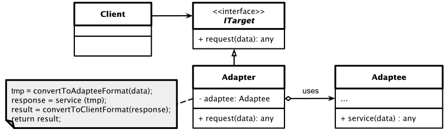
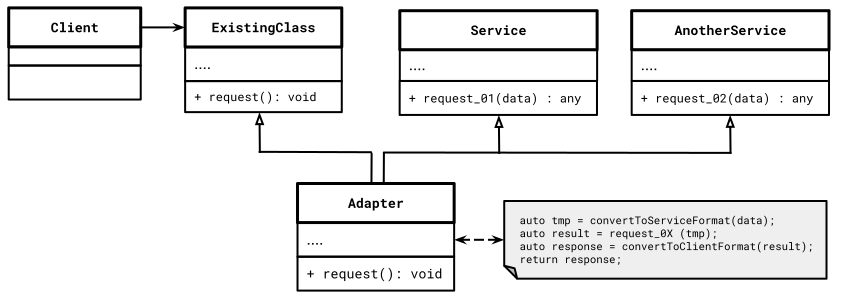

# Adapter Pattern

## Wesentliche Merkmale

#### Kategorie: *Structural Pattern*

#### Ziel / Absicht:

Das *Adapter Pattern* ist ein strukturelles Entwurfsmuster, das es Objekten mit
inkompatiblen Schnittstellen ermöglicht, zusammenarbeiten zu können.

#### Problem:

Wir demonstrieren den Einsatz des Adapter Patterns anhand des folgenden Beispiels,
in dem ein Audio-Player-Geröt nur MP3-Dateien abspielen kann, aber einen erweiterten Audio-Player verwenden möchte,
der VLC- und MP4-Dateien abspielen kann.

Ausgangspunkt ist eine Schnittstelle `MediaPlayer` und eine konkrete Klasse `AudioPlayer`,
die die `MediaPlayer`-Schnittstelle implementiert.
`AudioPlayer` Objekte spielen standardmäßig nur Audiodateien im MP3-Format ab.

Wir haben ferner zur Verfügung eine zusätzliche Schnittstelle `AdvancedMediaPlayer` und konkrete Klassen,
die die `AdvancedMediaPlayer`-Schnittstelle implementieren.
Diese Klassen können Dateien im VLC- und MP4-Format abspielen.

Wir wollen nun erreichen, dass die `AudioPlayer` Klasse auch die Formate VLC und MP4 wiedergibt.
Um dies zu erreichen, erstellen wir eine Adapterklasse `MediaAdapter`.
Diese Klasse `MediaAdapter` implementiert einerseits die `MediaPlayer`-Schnittstelle,
um damit die Kompatibilität zu dieser Schnittstelle aufrecht zu erhalten. 
Zum Anderen benutzt sie (*hat-sie*) eine Instanz der Klasse `AdvancedMediaPlayer`,
um auch die weiteren Formate VLC und MP4 abspielen zu können.

Ein Redesign der Klasse `AudioPlayer` verwendet nun die Adapterklasse `MediaAdapter`.
Die Klasse `AudioPlayer` kennt dabei nicht die tatsächlichen Klassen, die das gewünschte Format wiedergeben können.
Sie reicht allerdings bei Anforderung entsprechender Audiotypen bei Benutzung der Klasse `AudioPlayer`
diese an die Adapterklasse weiter, so dass die Anforderung doch unterstützt werden kann.

*Hinweis*: Der Clientcode wird bei Einhaltung des Patterns nicht an die konkrete Adapterklasse gekoppelt,
sondern er darf nur über die vorhandene Clientschnittstelle mit dem Adapter zusammenarbeiten
(im vorliegenden Beispiel: Schnittstelle `MediaPlayer`). Auf diese Weise lassen sich neue Adapterklassen
in das Programm einführen, ohne inkompatibel zum vorhandenen Client-Code zu sein!

#### Lösung:

Das Pattern steht im Prinzip für eine einzige Klasse (Adapterklasse),
deren Aufgabe die Verknüpfung von Funktionen / das Weiterreichen unabhängiger oder inkompatibler Schnittstellen ist.

#### Struktur (UML):

Das folgende UML-Diagramm beschreibt eine Implementierung des *Adapter Patterns*.
Es besteht im Wesentlichen aus vier Teilen:

  * **Client**: Stellt die Klasse dar, die eine inkompatible Schnittstelle verwenden muss. Diese inkompatible Schnittstelle wird von der Klasse `Adaptee` implementiert.
  * **ITarget**: Definiert eine Schnittstelle, die der Client verwendet.
  * **Adaptee**: Stellt eine Klasse dar, die eine vom Client benötigte Funktionalität bietet. Typischerweise unterstützt die Adaptee-Klasse die `ITarget`-Schnittstelle nicht.
  * **Adapter**: Konkrete Implementierung des Adapters. Diese Klasse übersetzt die inkompatible Schnittstelle von `Adaptee` in die Schnittstelle, die der Client verwendet.

Abbildung 1: Schematische Darstellung des *Adapter Pattern*.

Der Klassenname `Adaptee` steht stellvertretend für Service-Klassen, die es gilt,
über Adapter-Klassen verfügbar zu machen.

#### Conceptual Example:

[Quellcode](../ConceptualExample.cpp)

---

Die Anregung zum konzeptionellen Beispiel finden Sie unter

[https://refactoring.guru/design-patterns](https://refactoring.guru/design-patterns/adapter/cpp/example#example-0)

vor.

#### Beginners Example:

Das oben zitierte Beispiel eines MediaPlayers finden Sie im Quellcode exemplarisch umgesetzt vor.

*Hinweis*: Prinzipiell gibt es für das Adapter Pattern zwei Vorgehensweisen in der Umsetzung mit einer realen Programmiersprache:

  * **Objekt Adapter Ansatz**:
    Diese Implementierung verwendet das Prinzip der Komposition von Objekten:
    Der Adapter implementiert die Schnittstelle eines Objekts, die für den Client relevant sind.
    Die anderen Objekte werden "umhüllt", deren Funktionalität ist über die eine bekannte Schnittstelle nach außen zu transportieren.
    Der Zugriff auf die - schnittstellentechnisch gesehen - inkompatiblen Funktion dieser Objekte ist die eigentliche Dienstleistung des Adapter-Objekts.
    Dieser Ansatz kann in allen gängigen Programmiersprachen implementiert werden ("*has-a*" Relationship / "*hat-ein*" Beziehung).

  * **Klassen Adapter Ansatz**:
    Diese Implementierung verwendet die Vererbung: Der Adapter erbt Schnittstellen von allen Objekten gleichzeitig (vorhandenes Objekt, neue Service-Objekte mit inkompatiblen Service-Funktionen).
    Beachten Sie, dass dieser Ansatz nur in Programmiersprachen implementiert werden kann, die Mehrfachvererbung unterstützen, z.B. C ++.
    Wie beim *Objekt Adapter Ansatz* besteht auch hier die eigentliche Aufgabe der Adapter Klasse,
    die geerbten Funktionalitäten über die vorhandene Schnittstelle verfügbar zu machen.

Abbildung 1 gibt das Entwurfsmuster mit dem *Objekt Adapter Ansatz* wieder. In Abbildung 2 finden Sie
das Muster auf Basis des *Klassen Adapter Ansatzes* vor:

Abbildung 2: Schematische Darstellung des *Adapter Pattern* (*Klassen Adapter Ansatzes*).

---

[Zurück](../../../Resources/Readme_05_Catalog.md)

---