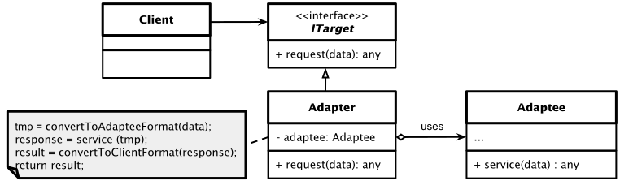
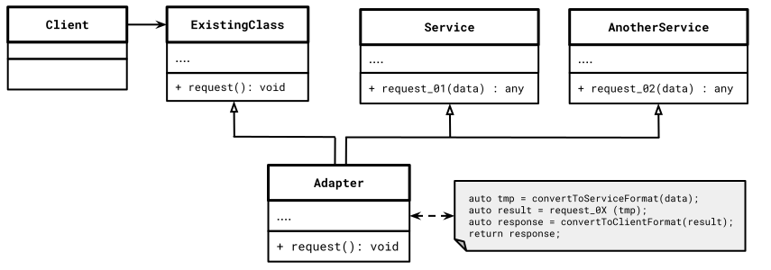

# Adapter Pattern

[Zurück](../../../Resources/Readme_05_Catalog.md)

---


<sup>(Credits: [Blog von Vishal Chovatiya](https://vishalchovatiya.com/pages/start-here/))</sup>

---

## Wesentliche Merkmale

#### Kategorie: *Structural Pattern*

#### Ziel / Absicht:

###### In einem Satz:

> &bdquo;Das Adapter Pattern konvertiert die Schnittstelle einer bestehenden Klasse in eine andere Schnittstelle, die von einem Client erwartet wird,
sodass Klassen mit inkompatiblen Schnittstellen zusammenarbeiten können.&rdquo;

Das *Adapter Pattern* gehört zur Kategorie der strukturellen Entwurfsmuster und löst ein sehr häufiges Problem:
Eine vorhandene Klasse oder Bibliothek bietet genau die benötigte Funktionalität,
aber ihre Schnittstelle passt nicht zu dem, was der Client erwartet.

Anstatt den vorhandenen Code zu ändern &ndash; was oft gar nicht möglich ist, etwa bei Bibliotheken
von Drittanbietern &ndash; wird eine Zwischenschicht eingeführt, der Adapter.
Dieser implementiert die vom Client erwartete Zielschnittstelle und delegiert die eigentlichen Aufrufe
intern an das sogenannte *Adaptee*, also die anzupassende Klasse.

Auf diese Weise bleibt der bestehende Code unverändert und wiederverwendbar,
während der Client über eine für ihn passende Schnittstelle mit ihm kommuniziert.

Man unterscheidet üblicherweise zwischen dem *Objekt-Adapter*, der auf Komposition basiert und das Adaptee als Member hält,
und dem *Klassen-Adapter*, der über Mehrfachvererbung realisiert wird.

In C++ ist der Objekt-Adapter meist vorzuziehen, da er flexibler ist und sich besser mit Modern-C++-Prinzipien
wie losem Kopplung und Testbarkeit verträgt.

Ein typisches Beispiel ist die Anpassung einer alten oder fremden API an ein modernes, im eigenen System etabliertes Interface.
So wird das Adapter Pattern zu einem wichtigen Werkzeug für Wiederverwendbarkeit, Entkopplung und die Integration heterogener Systeme.


#### Struktur (UML):

Das folgende UML-Diagramm beschreibt eine Implementierung des *Adapter Patterns*.
Es besteht im Wesentlichen aus vier Teilen:

  * **Client**: Stellt die Klasse dar, die eine inkompatible Schnittstelle verwenden muss.
    Diese inkompatible Schnittstelle wird von der Klasse `Adaptee` implementiert.
  * **ITarget**: Definiert die Schnittstelle, die der Client kennt und verwendet.
  * **Adaptee**: Stellt eine Klasse dar, die eine vom Client benötigte Funktionalität bietet. Typischerweise unterstützt die `Adaptee`-Klasse die `ITarget`-Schnittstelle nicht.
  * **Adapter**: Konkrete Implementierung des Adapters. Diese Klasse übersetzt die inkompatible Schnittstelle von `Adaptee` in die Schnittstelle, die der Client verwendet.



*Abbildung* 1: Schematische Darstellung des *Adapter Patterns*.

Der Klassenname `Adaptee` steht stellvertretend für Service-Klassen, die es gilt,
über Adapter-Klassen verfügbar zu machen.

---

#### Conceptual Example:

[Quellcode](../ConceptualExample.cpp)

---

#### Beispiele zum Adapter Pattern in der STL:

Die STL Container `std::stack`, `std::queue` und `std::priority_queue` bieten eine andere Schnittstelle
für STL Sequenzcontainer an. Aus diesem Grund spricht man bei diesen drei Klassen auch von so genannten
*Container Adaptern*.

Das folgende Code-Snippet zeigt die Template-Signatur der drei Container-Adapter:

```cpp
template<typename T, typename Container = std::deque<T>> 
class stack;

template<typename T, typename Container = std::deque<T>> 
class queue;

template<
    typename T,
    typename Container = std::vector<T>, 
    typename Compare = std::less<typename Container::value_type>
> 
class priority_queue;
```

Man kann erkennen, das `std::stack` und `std::queue` standardmäßig den Container `std::deque`
als Sequenzcontainer verwenden, hingegen wird `std::vector` von `std::priority_queue` verwendet.

Darüber hinaus erfordert `std::priority_queue` auch ein Vergleichsobjekt,
das standardmäßig auf `std::less` voreingestellt ist.

---

#### Weitere Beispiele zum Adapter Pattern in der STL:

Neben den *Container Adaptern* in der STL gibt es auch *Iteratoren Adapter*,
beispielsweise die &bdquo;Einfüge Iteratoren&rdquo;:

  * `std::front_inserter`
  * `std::back_inserter`
  * `std::inserter`

Mit diesen *Iteratoren Adaptern* lassen sich Elemente am Anfang, am Ende oder an einer beliebigen Stelle
in einen Container einfügen.

---

#### Das Addapter Pattern in Modern C++

Ein Compile-Time-Adapter (auch statischer Adapter genannt) verzichtet komplett auf Laufzeit-Polymorphie (virtual-Funktionen, vtables)
und Heap-Allokationen (std::unique_ptr).

Anstatt ein gemeinsames Interface über Vererbung zu erzwingen, nutzen wir in Modern C++ (C++20) sogenannte Concepts,
um die Schnittstellen-Bedingungen zur Compile-Zeit zu prüfen.

Der Compiler generiert dann exakt den passenden, hochoptimierten Maschinencode für die jeweilige Kombination.

```cpp
TBD
```


##### Warum ist das echtes Modern C++?

Zero-Cost Abstraction: Es gibt keine virtuelle Funktionstabelle (vtable) mehr.
Der Compiler weiß beim Compilieren ganz genau, welche Funktion aufgerufen wird (static dispatch), und kann den Code extrem aggressiv optimieren und inlinen.

Keine Heap-Allokation: Der Adapter hält den Adaptee als direktes Memberobjekt. Wenn Sie CompileTimeAdapter auf dem Stack anlegen, wird kein einziges Byte Speicher vom Betriebssystem angefordert.

Duck Typing mit Typ-Sicherheit: Über das C++ 20 Concept wird sichergestellt, dass der Client nur Typen übergeben bekommt, die auch wirklich request() unterstützen. Die Fehlermeldungen des Compilers bei Inkompatibilität sind dank Concepts glasklar (anders als bei alten C++98-Templates).

##### Wann nutzt man was?

Laufzeit-Adapter (Ihr vorheriger Code): Wenn Sie zur Compile-Zeit noch nicht wissen, ob Sie ein Target oder einen Adapter nutzen (z.B. weil die Entscheidung auf User-Input oder einer Konfigurationsdatei basiert und Sie die Objekte in einem gemeinsamen std::vector speichern wollen).

Compile-Zeit-Adapter (dieser Code): Wenn die Struktur der Software feststeht und die Typen zur Compile-Zeit bekannt sind. Das ist der Standardweg in modernen, performance-kritischen C++ Bibliotheken.


---

**Hinweis**: Prinzipiell gibt es für das Adapter Pattern zwei Vorgehensweisen in der Umsetzung mit einer realen Programmiersprache:

  * **Objekt Adapter Ansatz**:
    Diese Implementierung verwendet das Prinzip der *Komposition* von Objekten:
    Der Adapter implementiert die Schnittstelle eines Objekts, die für den Client relevant sind.
    Die anderen Objekte werden &bdquo;umhüllt&rdquo;, deren Funktionalität ist über die eine bekannte Schnittstelle nach außen zu transportieren.
    Der Zugriff auf die - schnittstellentechnisch gesehen - inkompatiblen Funktion dieser Objekte ist die eigentliche Dienstleistung des Adapter-Objekts.
    Dieser Ansatz kann in allen gängigen Programmiersprachen implementiert werden (&bdquo;*has-a*&rdquo; Relationship / &bdquo;*hat-ein*&rdquo; Beziehung).

  * **Klassen Adapter Ansatz**:
    Diese Implementierung verwendet die Vererbung: Der Adapter erbt Schnittstellen von allen Objekten gleichzeitig
   (vorhandenes Objekt, neue Service-Objekte mit inkompatiblen Service-Funktionen).
    Beachten Sie, dass dieser Ansatz nur in Programmiersprachen implementiert werden kann,
    die Mehrfachvererbung unterstützen, z.B. C++.
    Wie beim *Objekt Adapter Ansatz* besteht auch hier die eigentliche Aufgabe der Adapter Klasse darin,
    die geerbten Funktionalitäten über die vorhandene Schnittstelle verfügbar zu machen.


*Abbildung* 1 gibt das Entwurfsmuster mit dem *Objekt Adapter* Ansatz wieder. In *Abbildung* 2 finden Sie
das Muster auf Basis des *Klassen Adapter* Ansatzes vor:



*Abbildung* 2: Schematische Darstellung des *Adapter Patterns* (*Klassen Adapter Ansatzes*).

Im &bdquo;Real-World&rdquo; Beispiel zu diesem Entwurfsmuster finden Sie beide Varianten umgesetzt vor.

---

#### Abgrenzung zu anderen Entwurfsmustern:

  * Das *Adapter Pattern* implementiert als Objektadapter ähnelt dem *Bridge Pattern*,
  hat jedoch eine andere Absicht.
  Der Zweck des *Bridge Patterns* besteht darin, die Schnittstelle von der Implementierung zu trennen.
  Der Zweck des *Adapter Patterns* besteht darin, eine vorhandene Schnittstelle zu modifizieren.

  * Das *Decorator Pattern* erweitert ein Objekt, ohne seine Schnittstelle zu ändern.
  Decoratoren-Objekte sind in diesem Sinne *pluggable*, im Gegensatz zum *Bridge-* oder *Adapter Pattern*.

  * Das *Proxy Pattern* erweitert die Implementierung für das Objekt, für das es steht,
  ändert jedoch nicht seine Schnittstelle.

---

#### Pluggable Adapter Design Pattern mit Modern C++:

Unter 
[Adapter Design Pattern in Modern C++ (Vishal Chovatiya)](https://vishalchovatiya.com/posts//adapter-design-pattern-in-modern-cpp/)
findet sich eine Umsetzung des Adapter Patterns mit Modern C++ Sprachmitteln vor.

Der Adapter unterstützt hier die Adaptees (die nicht verwandt sind und unterschiedliche Schnittstellen haben)
unter Verwendung derselben &bdquo;Zielschnittstelle&rdquo;, die dem Client/API-Benutzer bekannt ist.

Das Beispiel erfüllt diese Eigenschaft, indem es die Lambda-Funktionen und das Klassentemplate `std::function<>`
von C++ 11 verwendet.

*Hinweise zum Quellcode*:

  * Der *Pluggable Adapter* besitzt ab einem bestimmten Zeitpunkt eine Verbindung zu einem Zielobjekt.
  Sobald das Zielobjekt vorhanden ist und seine Methode(n) an ein *Callable*-Objekt
  (in unserem Beispiel: `m_request`) zugewiesen wurden, bleibt die Zuordnung bestehen,
  bis ein anderer Satz von Methode(n) zugewiesen wird.

  * Der *Pluggable Adapter* zeichnet sich dadurch aus, dass er über Konstruktoren für jeden Typ verfügt,
  für den er die Stellvertreterrolle übernimmt.

---

#### &bdquo;Real-World&rdquo; Beispiel:

Wir demonstrieren den Einsatz des Adapter Patterns anhand des folgenden Beispiels,
in dem wir ein Audio-Player-Gerät betrachten, das nur *MP3*-Dateien abspielen kann,
aber erweitert werden soll, um *VLC*- und *MP4*-Dateien abspielen zu können.

Ausgangspunkt ist eine Schnittstelle `IMediaPlayer` und eine konkrete Klasse `AudioPlayer`,
die die `IMediaPlayer`-Schnittstelle implementiert.
`AudioPlayer` Objekte spielen nur Audiodateien im MP3-Format ab.
Bei anderen Formaten reagiert das `AudioPlayer`-Objekt mit einer Fehlermeldung.

Wir haben ferner zwei zusätzliche Schnittstellen `IVlcMediaPlayer` und `IMp4MediaPlayer` sowie konkrete Klassen zur Verfügung,
die die beiden Schnittstellen implementieren.
Diese Klassen können Dateien im *VLC*- und *MP4*-Format abspielen.

Wir wollen nun erreichen, dass die `AudioPlayer` Klasse auch die Formate *VLC* und *MP4* wiedergibt.
Um dies zu erreichen, erstellen wir eine Adapterklasse `MediaAdapter`.
Diese Klasse `MediaAdapter` implementiert einerseits die `IMediaPlayer`-Schnittstelle,
um damit die Kompatibilität zu dieser Schnittstelle aufrecht zu erhalten. 
Zum Anderen benutzt sie (*hat-sie*) zwei Instanzen der Klassen `VlcPlayer` und `Mp4Player`,
um auch die weiteren Formate *VLC* und *MP4* abspielen zu können.

Ein Redesign der Klasse `AudioPlayer` (im beiliegenden Quellcode hat sie den Namen `AudioPlayerExtended`)
verwendet nun die Adapterklasse `MediaAdapter`.
Die Klasse `AudioPlayer` kennt nach wie vor nicht die tatsächlichen Klassen, die das gewünschte Format wiedergeben können.
Sie reicht allerdings bei Benutzung der Klasse `AudioPlayer` und bei Anforderung entsprechender Audiotypen
diese an die Adapterklasse weiter, so dass die Anforderung doch unterstützt werden kann.

*Hinweis*: Der Client-Code wird bei Einhaltung des Patterns nicht an die konkrete Adapterklasse gekoppelt,
sondern er darf nur über die vorhandene Client-Schnittstelle mit dem Adapter zusammenarbeiten
(im vorliegenden Beispiel: Schnittstelle `IMediaPlayer`). Auf diese Weise lassen sich neue Adapterklassen
in das Programm einführen, ohne inkompatibel zum vorhandenen Client-Code zu sein!

---

## Literaturhinweise

Die Anregungen zum konzeptionellen Beispiel finden Sie unter

[https://refactoring.guru/design-patterns](https://refactoring.guru/design-patterns/adapter/cpp/example#example-0)

vor.

---

[Zurück](../../../Resources/Readme_05_Catalog.md)

---
