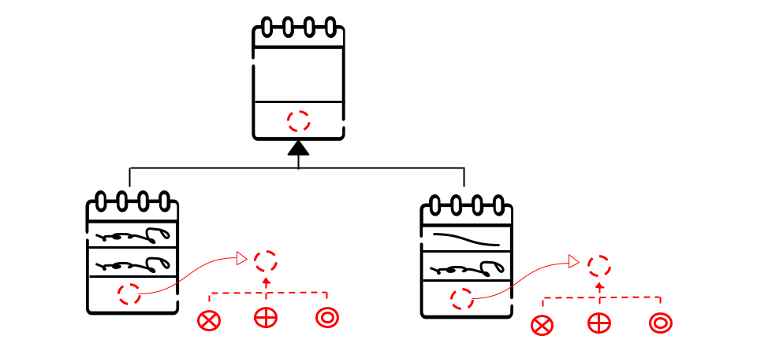

# Bridge Pattern

[Zurück](../../../Resources/Readme_05_Catalog.md)

---

(Credits: [Blog von Vishal Chovatiya](http://www.vishalchovatiya.com/category/design-patterns/))

---

## Wesentliche Merkmale

#### Kategorie: *Structural Pattern*

#### Ziel / Absicht:

###### In einem Satz:

&ldquo;Trennung der Schnittstelle von ihrer Implementierung&rdquo;

Das *Bridge Pattern* ist ein strukturelles Entwurfsmuster,
mit dem sich eine große Klasse oder eine Reihe eng verwandter Klassen in zwei separate Hierarchien aufteilen
lassen &ndash; Abstraktion und Implementierung &ndash;, die beide unabhängig voneinander entwickelt werden können.

#### Problem:

Das *Bridge Pattern* genießt einen guten Ruf,
da sich mit ihm die abstrakten Elemente der Klasse von den Implementierungsdetails trennen lassen.
Dieses Muster ist vor allem dann zu empfehlen,
wenn die betrachteten Klassen häufig variieren,
da sich dann Änderungen an der Codebasis bei minimalem Wissen über das Programm leichter durchführen lassen.

Betrachten wir ein Beispiel, in dem eine Implementierung auf zwei oder mehreren Realisierungen fußt.
Zum Beispiel ein Programm, das die Persistenz von Objekten auf verschiedenen Plattformen (Betriebssystemen) realisiert.
Einige Objekte sollen in einer Datenbank und andere Objekte wiederum im Dateisystem des unterlagerten
Betriebssystems gespeichert werden. 
Wird das Programm um diese Funktionalität &ldquo;straight forward&rdquo; erweitert,
sind Probleme vorprogrammiert, da die Abstraktion mit der Implementierung verknüpft wird.
In diesem Fall ist es besser, das *Bridge Pattern*  zu verwenden und die Abstraktion von der Implementierung zu trennen.
Wird dieses Muster nicht verwendet, kann man die Beobachtung machen,
dass Implementierungsdetails in einer Abstraktion enthalten sind.

Ein weiterer Vorteil des *Bridge Patterns* ist die Möglichkeit, Implementierungsdetails zur Laufzeit zu verändern.
Dies ermöglicht es dem Benutzer, Implementierungen zu wechseln, um auf diese Weise zu bestimmen,
wie die Software mit anderen Systemen zusammenarbeitet.

#### Lösung:

#### Struktur (UML):

Das folgende UML-Diagramm beschreibt eine Implementierung des *Bridge Patterns*.
Es besteht im Wesentlichen aus vier Teilen:

  * **Abstraction**: Definiert eine Abstraktionsschnittstelle. Sie fungiert als Basisklasse für andere verfeinerte Abstraktionsklassen.
    Sie bezieht sich auch auf eine bestimmte Implementierung, die für plattformspezifische Funktionen verwendet wird.
  * **RefinedAbstraction**: Stellt eine verfeinerte Variation einer Abstraktionsschnittstelle dar,
    enthält jedoch keine Implementierungsdetails. *De facto* erweitert sie nur die Abstraktion.
  * **Implementor**: Definiert die Schnittstelle für Implementierungsklassen.
  * **ConcreteImplementor**: Diese Klasse erbt von der Klasse `Implementor`. Es kann mehr als eine Instanz von `Implementor`-Klassen geben,
    die dieselbe Schnittstelle unterstützen, aber plattformspezifische Funktionen bereitstellen.

*Abbildung* 1: Schematische Darstellung des *Bridge Patterns*.

---

#### Conceptual Example:

[Quellcode 1](../ConceptualExample01.cpp) &ndash; Sehr einfache Version

[Quellcode 2](../ConceptualExample02.cpp) &ndash; Ein etwas ausführlicheres Beispiel

---

#### 'Real-World' Beispiel:

Bei diesem Muster steht eine Schnittstelle im Mittelpunkt,
die als Brücke fungiert, die die Funktionalität konkreter Klassen unabhängig
von den Schnittstellenimplementierungsklassen macht.
Beide Klassentypen können strukturell verändert werden, ohne sich gegenseitig zu beeinflussen.

Wir demonstrieren die Verwendung des Bridge-Entwurfsmusters anhand des folgenden Beispiels,
in dem ein Kreis in verschiedenen Farben mit derselben abstrakten Basisklassenmethode,
aber unterschiedlichen Bridge-Implementiererungsklassen gezeichnet werden kann.

In *Abbildung* 2 finden Sie eine `IDrawAPI`-Schnittstelle vor, die als Bridge-Schnittstellenklasse fungiert,
und zwei konkrete Klassen `RedCircleDrawer` und `GreenCircleDrawer`,
die die `IDrawAPI`-Schnittstelle implementieren.

`Shape` ist eine abstrakte Klasse und besitzt einen `IDrawAPI`-Schnittstellenzeiger
(*Raw*-Pointer oder Smart-Pointer). In der Anwendung finden Sie ein Beispiel, in dem ein Kreis mit zwei verschiedenen Farben 
gezeichnet wird:

*Abbildung* 2: Ein Anwendungsbeispiel des *Bridge* Patterns.

---

#### Das *Pimpl* Pattern

Das *Pimpl* Pattern kann als ein Anwendungsfall des *Bridge* Patterns angesehen werden:
Bei diesem Pattern geht es darum, die Implementierungsdetails einer bestimmten Klasse zu verbergen,
indem diese in eine separate Implementierungsklasse ausgelagert werden, auf die ein Zeiger zeigt.
Weitere Details hierzu finden sich [hier](https://github.com/pelocpp/cpp_design_patterns/blob/master/Patterns/Pimpl/Resources/Readme.md).

---

Die Anregungen zum konzeptionellen Beispiel finden Sie unter

[https://refactoring.guru/design-patterns](https://refactoring.guru/design-patterns/bridge/cpp/example#example-0)

und 

[https://www.codeproject.com](https://www.codeproject.com/Articles/438922/Design-Patterns-2-of-3-Structural-Design-Patterns#Bridge)

vor.

---

[Zurück](../../../Resources/Readme_05_Catalog.md)

---
