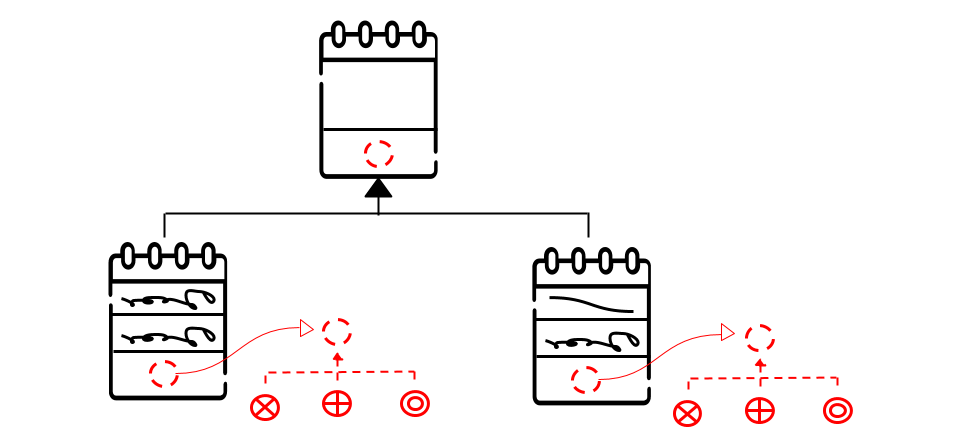
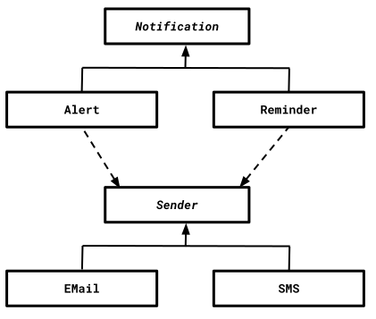

# Bridge Pattern

[Zurück](../../../Resources/Readme_05_Catalog.md)

---



<sup>(Credits: [Blog von Vishal Chovatiya](https://vishalchovatiya.com/pages/start-here/))</sup>

---

## Wesentliche Merkmale

#### Kategorie: *Structural Pattern*

#### Ziel / Absicht:

###### In einem Satz:

> &bdquo;Das Bridge Pattern trennt eine Abstraktion von ihrer Implementierung,
sodass beide unabhängig voneinander variiert und weiterentwickelt werden können.&rdquo;

Das *Bridge Pattern* ist ein strukturelles Entwurfsmuster, das eine Klassenhierarchie in zwei getrennte,
aber über eine Referenz verbundene Hierarchien aufspaltet: eine für die Abstraktion und eine für die Implementierung.

Ohne dieses Pattern führt die Kombination mehrerer unabhängiger Variationsdimensionen &ndash; etwa verschiedene Formen und verschiedene Rendering-Verfahren  &ndash; schnell zu einer explosionsartig wachsenden Anzahl von Unterklassen.

Bridge löst dieses Problem, indem die Abstraktion nicht selbst die Implementierung enthält,
sondern lediglich einen Zeiger oder eine Referenz auf ein Implementierungs-Interface hält.
Neue Abstraktionen und neue Implementierungen lassen sich dadurch jeweils unabhängig voneinander hinzufügen,
ohne bestehenden Code anzupassen.

In C++ wird dies typischerweise über eine abstrakte Basisklasse für die Implementierung
sowie eine (ggf. abstrakte) Klasse für die Abstraktion realisiert, die einen Pointer auf die Implementierungsklasse hält.
Zur Laufzeit kann die konkrete Implementierung sogar ausgetauscht werden, was zusätzliche Flexibilität bietet.

Das Pattern ähnelt oberflächlich dem *Strategy-Pattern*, unterscheidet sich aber in der Absicht:
Bridge zielt auf die strukturelle Entkopplung zweier Hierarchien ab, nicht primär auf austauschbares Verhalten.
Besonders nützlich ist Bridge, wenn man plattformübergreifenden Code schreibt oder mehrere Implementierungsvarianten
(z. B. verschiedene Grafik-APIs) unterstützen möchte.


#### Struktur (UML):

Das folgende UML-Diagramm beschreibt eine Implementierung des *Bridge Patterns*.
Es besteht im Wesentlichen aus vier Teilen:

  * **Abstraction**: Definiert eine Abstraktionsschnittstelle. Sie fungiert als Basisklasse für andere verfeinerte Abstraktionsklassen.
    Sie bezieht sich auch auf eine bestimmte Implementierung, die für plattformspezifische Funktionen verwendet wird.
  * **RefinedAbstraction**: Stellt eine verfeinerte Variation einer Abstraktionsschnittstelle dar,
    enthält jedoch keine Implementierungsdetails. *De facto* erweitert sie nur die Abstraktion.
  * **Implementor**: Definiert die Schnittstelle für Implementierungsklassen.
  * **ConcreteImplementor**: Diese Klasse erbt von der Klasse `Implementor`. Es kann mehr als eine Instanz von `Implementor`-Klassen geben,
    die dieselbe Schnittstelle unterstützen, aber plattformspezifische Funktionen bereitstellen.


*Abbildung* 1: Schematische Darstellung des *Bridge Patterns*.

---

#### Hinweise zu Modern C++:

##### &bdquo;*Inheriting Constructors*&rdquo;

In beiden konzeptionellen Beispielen tritt eine Zeile

```cpp
using Abstraction::Abstraction;
```

in Erscheinung. Das macht exakt dasselbe wie:

  * `RefinedAbstraction` bekommt einen eigenen Konstruktor mit demselben Parameter wie `Abstraction`.
  * Im Initialisierungsteil &ndash; `Abstraction(std::move(implementor))` &ndash; wird der Basisklassen-Konstruktor explizit aufgerufen und der `std::unique_ptr` weitergereicht. 


Also ausgeschrieben:

```cpp
class RefinedAbstraction final : public Abstraction
{
public:
    explicit RefinedAbstraction(std::unique_ptr<Implementor> implementor)
        : Abstraction(std::move(implementor))
    {
    }

    void operation() override
    {
        m_implementor->concreteOperation();
    }
};
```

Dieses Feature lautet (seit C++ 11) &bdquo;*Inheriting Constructors*&rdquo;:

Es sagt dem Compiler: &bdquo;Übernimm alle Konstruktoren der Basisklasse &ndash; hier: `Abstraction` &ndash; auch als Konstruktoren
von `RefinedAbstraction`, ohne dass man sie einzeln neu schreiben muss.&rdquo;

Bei nur einem Konstruktor wie hier ist das Ersparte gering, aber bei mehreren überladenen Basiskonstruktoren spart es viel Schreibarbeit.
Beide Varianten sind funktional identisch.

---

#### Abgrenzung zu anderen Entwurfsmustern:

  * Das *Adapter Pattern* implementiert als Objektadapter ähnelt dem *Bridge Pattern*, hat jedoch eine andere Absicht:
    * Der Zweck des *Bridge Patterns* besteht darin, die Schnittstelle von der Implementierung zu trennen.
    * Der Zweck des *Adapter Patterns* besteht darin, eine vorhandene Schnittstelle zu modifizieren.

---

#### Conceptual Example:

[Quellcode 1](../ConceptualExample01.cpp) &ndash; Sehr einfache Version<br />
[Quellcode 2](../ConceptualExample02.cpp) &ndash; Ein etwas ausführlicheres Beispiel

---

#### &bdquo;Real-World&rdquo; Beispiel: Notification System



*Abbildung* 2: Ein Notification System

Das ist für mich der Kern des *Bridge Patterns*: 

Nicht &bdquo;ich möchte ein Verhalten austauschen&rdquo; (*Strategy Pattern*),
sondern &bdquo;ich habe zwei Achsen, die unabhängig voneinander wachsen&rdquo;.


*Abbildung* 3: Architektur des Notification Systems

---

#### &bdquo;Real-World&rdquo; Beispiel: Rendering von grafischen Figuren

Bei diesem Muster steht eine Schnittstelle im Mittelpunkt,
die als Brücke fungiert, die die Funktionalität konkreter Klassen unabhängig
von den Schnittstellenimplementierungsklassen macht.
Beide Klassentypen können strukturell verändert werden, ohne sich gegenseitig zu beeinflussen.

Wir demonstrieren die Verwendung des Bridge-Entwurfsmusters anhand des folgenden Beispiels,
in dem ein Kreis in verschiedenen Farben mit derselben abstrakten Basisklassenmethode,
aber unterschiedlichen Bridge-Implementiererungsklassen gezeichnet werden kann.

In *Abbildung* 4 finden Sie eine `IDrawAPI`-Schnittstelle vor, die als Bridge-Schnittstellenklasse fungiert,
und zwei konkrete Klassen `RedCircleDrawer` und `GreenCircleDrawer`,
die die `IDrawAPI`-Schnittstelle implementieren.

`Shape` ist eine abstrakte Klasse und besitzt einen `IDrawAPI`-Schnittstellenzeiger
(*Raw*-Pointer oder Smart-Pointer). In der Anwendung finden Sie ein Beispiel, in dem ein Kreis mit zwei verschiedenen Farben 
gezeichnet wird:


*Abbildung* 4: Ein Anwendungsbeispiel des *Bridge* Patterns.

---

#### Das *Pimpl* Pattern

Das *Pimpl* Pattern kann als ein Anwendungsfall des *Bridge* Patterns angesehen werden:
Bei diesem Pattern geht es darum, die Implementierungsdetails einer bestimmten Klasse zu verbergen,
indem diese in eine separate Implementierungsklasse ausgelagert werden, auf die ein Zeiger zeigt.
Weitere Details hierzu finden sich [hier](https://github.com/pelocpp/cpp_design_patterns/blob/master/Patterns/Pimpl/Resources/Readme.md).

---

## Literaturhinweise

Die Anregungen zum konzeptionellen Beispiel finden Sie unter

[https://refactoring.guru/design-patterns](https://refactoring.guru/design-patterns/bridge/cpp/example#example-0)

und 

[https://www.codeproject.com](https://www.codeproject.com/Articles/438922/Design-Patterns-2-of-3-Structural-Design-Patterns#Bridge)

vor.

---

[Zurück](../../../Resources/Readme_05_Catalog.md)

---
