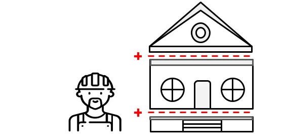

# Builder Pattern

[Zurück](../../../Resources/Readme_05_Catalog.md)

---



<sup>(Credits: [Blog von Vishal Chovatiya](http://www.vishalchovatiya.com/category/design-patterns/))</sup>

---

## Wesentliche Merkmale

##### Kategorie: Erzeugungsmuster / *Creational Pattern*

#### Ziel / Absicht:

Das *Builder Pattern* ist ein Entwurfsmuster, mit dem schrittweise komplexe Objekte mit der richtigen Reihenfolge von Aktionen erstellt werden können.
Die Konstruktion wird von einem *Director*-Objekt gesteuert,
das nur den Objekttyp kennen muss, den es erstellen soll.

#### Ziel / Absicht:

Das *Builder Pattern* ist ein Entwurfsmuster aus der Kategorie der *Creational Pattern*. 
Mit diesem Entwurfsmuster soll die Konstruktion eines komplexen Objekts von seiner Repräsentation getrennt werden.
Dieses Muster wird verwendet, wenn komplexe Objekte, die zu erstellen sind, aus Bestandteilen bestehen,
die in einer bestimmten Reihenfolge oder unter Verwendung eines bestimmten Algorithmus erstellt werden müssen.

#### Lösung:

#### Struktur (UML):

Das folgende UML-Diagramm beschreibt eine Implementierung des *Builder Patterns*.
Es besteht im Wesentlichen aus vier Teilen:

  * **Product**: Klasse, die das komplexe Objekt repräsentiert, das zu erstellen ist.
  * **Builder**: Abstrakte Basisklasse (oder Schnittstelle) für `Builder`-Objekte. Es werden die Schritte definiert,
    die ausgeführt werden müssen, um ein komplexes Objekt (Produkt) korrekt zu erstellen.
    Typischerweise ist jeder Schritt eine abstrakte Methode, die durch eine konkrete Implementierung überschrieben wird.
  * **ConcreteBuilder**: Stellt eine Implementierung der `Builder`-Schnittstelle bereit. Ein `Builder`-Objekt ist ein Objekt,
    das andere komplexe Objekte ("Produkte") erstellen kann.
  * **Director**: Stellt die Klasse dar, die den Algorithmus steuert, der zum Erstellen des komplexen Objekts verwendet wird.


*Abbildung* 1: Schematische Darstellung des *Builder Patterns*.

---

#### Conceptual Example:

[Quellcode 1](../ConceptualExample01.cpp) &ndash; Sehr einfache Version

[Quellcode 2](../ConceptualExample02.cpp) &ndash; Ein etwas ausführlicheres Beispiel

Die Ausgaben des konzeptionellen Beispiels lauten:

```
Standard basic product:
Product parts: Part A1

Standard full featured product:
Product parts: Part A1, Part B1, Part C1

Custom product:
Product parts: Part A1, Part C1
```

---

#### 'Real-World' Beispiel:

Das 'Real-World' Beispiel zu diesem Entwurfsmuster orientiert sich an den UI-Bibliotheken von Java.
Wir implementieren - natürlich stark vereinfacht - einen Layoutmanager.
Das Ergebnis könnten Java-Containerobjekte sein, oder - etwas einfacher gestrickt - in unserem Fall HTML-Code.

Folgende Klassen sind an dem Beispiel beteiligt:

###### Klasse `HtmlPage`

Die Klasse `HtmlPage` steht für das *Produkt* des Entwurfsmusters, in unserem Fall die zu erstellende HTML-Seite.
Das Produkt enthält einer Reihe von UI-Steuerelementen, wir führen zu diesem Zweck eine
weitere (Hilfs-)Klasse `Widget` ein. Ein `HtmlPage`-Objekt besitzt eine Liste mit `Widget`-Objekten.
Wesentlich bei dieser Klasse ist, dass sie den fertig generierten HTML-Code, der durch einen Layoutmanager erzeugt wird,
enthält. Über eine *getter*-Methode `getHtmlCode` ist dieser verfügbar.

###### Abstrakte Klasse `LayoutManager`

Diese Klasse entspricht der abstrakten Klasse *Builder*.
Die Methode `buildPart` aus dem allgemeinen UML-Diagramm findet ihre Entsprechung in der Methode `addWidget`.
Der wiederholte Aufruf der `addWidget`-Methode "konfiguriert" gewissermaßen das Produkt.

Die `getProduct`-Methode aus dem allgemeinen UML-Diagramm entspricht der Methode `getHtmlPage`.
Etwas abweichend vom allgemeinen UML-Diagramm ist hierzu noch ein vorgelagerter Aufruf der `render`-Methode,
die das eigentliche Ergebnis berechnet.

###### Konkrete Klassen `FlowLayoutManager`, `BorderLayoutManager` und `BoxLayoutManager`

Diese Klassen sind Ableitungen von der abstrakten Basisklasse `LayoutManager`.
In ihrem Aufbau sind sie sehr ähnlich,
sie unterscheiden sich lediglich in der Generierung des HTML-Codes.
Je nach der Funktionsweise des Layouts sind die Widgets in einer Reihe, in einer Spalte
und bzw. oder mit einer entsprechenden Kopf- und Fußzeile anzuzeigen.

Zentral in diesen Klassen ist natürlich die konkrete Realisierung der beiden Methoden
`render` und `addWidget`.

###### Klasse `Layouter`

Die `Layouter`-Klasse übernimmt die Funktion der *Director*-Klasse.
Das Pendant zur `construct`-Methode ist hier die `doLayout`-Methode.

###### Klasse `Widget`

Die Klasse `Widget` ist eine Hilfsklasse und verwaltet den erzeugten HTML-Code.

Einen Überblick über die beteiligten Klassen und ihren Zusammenhang mit dem *Builder Pattern*
entnehmen Sie *Abbildung* 2:


*Abbildung* 2: Implementierung eines LayoutManagers mit dem *Builder Pattern*.

Weitere Details zur Umsetzung des Beispiels entnehmen Sie bitte dem [Quellcode](../LayoutManagerExample.cpp).
Die Ausgaben des 'Real-World'-Beispiels lauten:

```
HTML: HTML-Code for BorderLayoutManager
HTML: HTML-Code for BoxLayoutManager
HTML: HTML-Code for FlowLayout
```

---

Die Anregungen zum konzeptionellen Beispiel finden Sie unter

[https://refactoring.guru/design-patterns](https://refactoring.guru/design-patterns/builder/cpp/example#example-0)

und 

[https://www.codeproject.com](https://www.codeproject.com/Articles/430590/Design-Patterns-1-of-3-Creational-Design-Patterns#Builder)

vor.

Das 'Real-World'-Beispiel ist eine Portierung eines entsprechenden C#-Beispiels aus dem Buch von Matthias Geirhos,
siehe dazu das [Literaturverzeichnis](../../../Resources/Readme_07_Literature.md).

---

[Zurück](../../../Resources/Readme_05_Catalog.md)

---
