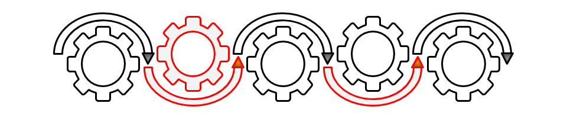

# Chain of Responsibility Pattern

[Zurück](../../../Resources/Readme_05_Catalog.md)

---



<sup>(Credits: [Blog von Vishal Chovatiya](https://vishalchovatiya.com/pages/start-here/))</sup>

---

## Wesentliche Merkmale

#### Kategorie: *Behavioral Pattern*

#### Ziel / Absicht:

###### In einem Satz:

> &bdquo;Das Chain-of-Responsibility-Pattern leitet eine Anfrage entlang einer Kette von Objekten weiter, bis eines dieser Objekte sie bearbeiten kann.&rdquo;

Beim *Chain-of-Responsibility-Pattern* wird eine Anfrage nicht direkt an ein bestimmtes Objekt zur Bearbeitung übergeben,
sondern an das erste Glied einer Verarbeitungskette. Jedes Glied entscheidet selbst, ob es für die Bearbeitung der Anfrage zuständig ist.
Ist dies der Fall, verarbeitet es die Anfrage und beendet damit die Weiterleitung.
Andernfalls gibt es die Anfrage an das nächste Glied der Kette weiter.
Dadurch muss der Sender einer Anfrage nicht wissen, welches konkrete Objekt für ihre Bearbeitung zuständig ist.

Die einzelnen Glieder der Kette sind über eine gemeinsame Schnittstelle miteinander verbunden
und können in der Regel flexibel kombiniert oder ausgetauscht werden.
So lassen sich beispielsweise unterschiedliche Verarbeitungsstufen oder Zuständigkeiten hintereinander anordnen.

Ein wesentlicher Vorteil des Patterns ist die geringe Kopplung zwischen dem Absender einer Anfrage und ihrem konkreten Bearbeiter.

Typische Einsatzgebiete sind zum Beispiel die Verarbeitung von Ereignissen in GUI-Frameworks, mehrstufige Validierungs- oder Genehmigungsprozesse
sowie Middleware-Ketten in Webanwendungen. In C++ wird die Kette meist über eine gemeinsame Basisklasse mit einem Zeiger (ggf. `std::shared_ptr`)
auf den nächsten Handler sowie einer virtuellen `handle()`-Methode realisiert.

#### Struktur (UML):

Das folgende UML-Diagramm beschreibt eine Implementierung des *Chain of Responsibility Patterns*.
Es besteht im Wesentlichen aus drei Teilen:

  * **Client**: Diese Klasse übergibt das Ereignis (die Anforderung) an das erste Objekt in der Kette der Verarbeitungsobjekte.
  * **HandlerBase**: Repräsentiert eine Schnittstelle oder Basisklasse für die konkreten Handler einer Verarbeitungskette.
    Typischerweise enthält es eine Instanzvariable, die auf das nächste Handlerobjekt in der Verarbeitungskette verweist.
  * **ConcreteHandler**: Konkrete Implementierung der `HandlerBase`-Klasse.


*Abbildung* 1: Schematische Darstellung des *Chain of Responsibility Patterns*.

---

#### Conceptual Example:

[Quellcode](../ConceptualExample.cpp)

---

#### &bdquo;Real-World&rdquo; Example:

Wir betrachten als reale Anwendung dieses Entwurfsmusters die (triviale) Realisierung 
eines Anmeldeprozesses (Login).
Dieser erfordert eine bestimmte Anzahl von Schritten, um erfolgreich abgeschlossen werden zu können,
wie z.B. die Eingabe von Benutzername, Passwort, den Abgleich mit einem Captcha usw.

Ein erster Aufruf von

```cpp
login->authenticate();
```

löst eine &bdquo;*Chain of Responsibility*&rdquo; Kette aus,
um jeden für die Anmeldung erforderlichen Schritt einzeln in die Wege zu leiten.

Man kann den Anmeldeprozess auch auf einfachste Weise um weitere Schritte ergänzen,
z.B. um einen Captcha-Abgleich hinzuzufügen,
so wie dies für Benutzername und Passwort im [Quellcode](../Authentication.cpp) demonstriert wird.

##### Zuordnung der Klassen und Methoden:

  * Klasse `Authentication` &ndash; Klasse `HandlerBase` 
  * Methode `authenticate` &ndash; Methode `handleRequest`
  * Methode `nextAuthentication` &ndash; Methode `setSuccessor` 
  * Klasse `AuthenticateUserName` &ndash; Klasse `ConcreteHandler` 
  * Klasse `AuthenticatePassword` &ndash; Klasse `ConcreteHandler` 

[Quellcode zum 'Authentication' Beispiel](../Authentication.cpp) &ndash; Anwendungsfall des *Chain of Responsibility* Patterns.

*Hinweis*: In der Realisierung des Beispiels sind zwei Implementierungsdetails zu beachten:

  * Einsatz von Klasse `std::unique_ptr<>`.
  * `std::move`: `std::unique_ptr<>`-Objekte unterstützen nur die Verschiebe-Semantik.

*Ausgabe*:

```
Authentication of User Name succeeded!
Authentication of Password succeeded!
Authentication succeeded!
```

---

## Literaturhinweise

Die Anregungen zum konzeptionellen Beispiel finden Sie unter

[https://refactoring.guru/design-patterns](https://refactoring.guru/design-patterns/chain-of-responsibility/cpp/example#example-0)

und 

[https://www.codeproject.com](https://www.codeproject.com/Articles/455228/Design-Patterns-3-of-3-Behavioral-Design-Patterns#Chain)

vor.

Das *Real*-*World*-Beispiel kann [hier](https://vishalchovatiya.com/posts//chain-of-responsibility-design-pattern-in-modern-cpp) im Original nachgelesen werden.
                                     
---

[Zurück](../../../Resources/Readme_05_Catalog.md)

---
