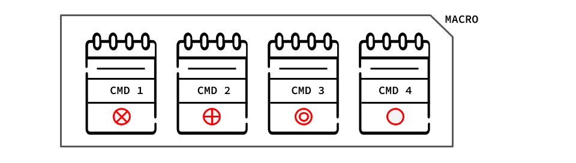

# Command Pattern

[Zurück](../../../Resources/Readme_05_Catalog.md)

---

(Credits: [Blog von Vishal Chovatiya](http://www.vishalchovatiya.com/category/design-patterns/))

---

## Wesentliche Merkmale

#### Kategorie: *Behavioral Pattern*

#### Ziel / Absicht:

Das *Command Pattern* ist ein Entwurfsmuster aus der Kategorie der *Behavioral Pattern*,
das eine Anforderung (einen *Request*, einen *Befehl*) in ein eigenständiges Objekt umwandelt,
das alle Informationen über das Kommando enthält.
Der Befehl kann dann nach Bedarf aufgerufen werden, häufig als Teil einer Reihe von Befehlen,
die in einer Warteschlange (*Queue*) abgelegt sind.
Die Befehle in der Warteschlange können auf diese Weise sequentiell abgearbeitet werden,
denkbar sind auch *Rollback*- bzw. *Undo*-Funktionalitäten.

#### Problem:

Das *Command Pattern* ist ein Entwurfsmuster, bei dem alle zur Ausführung einer Methode erforderlichen Informationen
in einem Objekt gekapselt sind, das sofort verwendet oder zum späteren Gebrauch aufbewahrt werden kann.
Dieses Objekt führt nichts aus, es enthält nur Informationen.

Es gibt drei Schlüsselbegriffe, die im Umfeld dieses Patterns zu definieren sind: *Client*, *Invoker* und *Receiver*.
Der *Client* erstellt das Befehlsobjekt ("*Command Object*").
Das *Invoker*-Objekt entscheidet, wann die Methode, deren Informationen (*Parameter*) im *Command Object* abgelegt sind, aufgerufen werden soll.
Das *Receiver*-Objekt ist eine Instanz einer Klasse, die den eigentlichen Code der auszuführenden Methode enthält.

#### Lösung:

#### Struktur (UML):

Das folgende UML-Diagramm beschreibt eine Implementierung des *Command Patterns*.
Es besteht im Wesentlichen aus fünf Teilen:

  * **Client**: Genereller Konsument der Klassen des Entwurfsmusters. Er erstellt das *Command Object* und verknüpft es mit *Receiver*-Objekten.
  * **Receiver**: Objekt, das weiß, wie das Kommando (Methode) auszuführen ist.
  * **CommandBase**: Abstrakte Klasse (oder Schnittstelle) für *Command*-Objekte. Enthält Informationen über das *Receiver*-Objekt,
    das für die Ausführung der Operation unter Verwendung der im *Command*-Objekt abgelegten Informationen verantwortlich ist.
  * **ConcreteCommand**: Konkrete Implementierung der abstrakten `CommandBase`-Klasse bzw. -Schnittstelle.
  * **Invoker**: Objekt, das entscheidet, wann das Kommando ausgeführt werden soll.

*Abbildung* 1: Schematische Darstellung des *Command Patterns*.

---

#### Conceptual Example:

[Quellcode 1](../ConceptualExample_01.cpp) &ndash; Sehr einfaches Beispiel

[Quellcode 2](../ConceptualExample_02.cpp) &ndash; Ein etwas ausführlicheres Beispiel

---

Die Anregungen zum konzeptionellen Beispiel finden Sie unter

[https://refactoring.guru/design-patterns](https://refactoring.guru/design-patterns/command/cpp/example#example-0)

und 

[https://www.codeproject.com](https://www.codeproject.com/Articles/455228/Design-Patterns-3-of-3-Behavioral-Design-Patterns#Command)

vor.

#### 'Real-World' Beispiel:

Für das *Command Pattern* wird in
["Entwurfsmuster: Das umfassende Handbuch" von Matthias Geirhos](https://www.amazon.de/Entwurfsmuster-umfassende-Handbuch-Matthias-Geirhos/dp/3836227622)
ein Beispiel aus dem Umfeld der Spieleprogrammierung betrachtet: Die Implementierung eines Ausschnitts aus dem Schachspiel,
soweit er die Verwendung des *Command Pattern* Entwurfsmusters betrifft, siehe *Abbildung* 2:

*Abbildung* 2: Ein Schachspiel modelliert mit dem *Command Pattern*.

Ein Kommando wird in *Abbildung* 2 durch die Klasse `Move` dargestellt.
Davon leiten sich unterschiedliche Kommandos ab, beim Schachspiel reden wir hier von einem Spielzug.
Neben einem "normalen" Zug, der nur die Regeln der jeweiligen Spielfigur zu beachten hat, gibt es auch spezielle Züge
wie "Rochaden" (engl. *Castling*)
und die "Umwandlung eines Bauern" (engl. *PromotePawn*).

Ein Spielfeld (engl. *Board*) verwaltet Spielzüge, oder eben Kommandos, um in der Nomenklatur dieses Entwurfsmusters zu bleiben.
In einer listenartigen Datenstruktur (`std::queue`) kann es mehrere Züge (Kommandos) abspeichern, ohne diese sofort auszuführen.

Für die konkrete Ausführung eines Spielzugs ist die Klasse `ChessPiece` verantwortlich. 

  * Bringen Sie das Beispiel auf Ihrem Rechner zum Laufen.
  * Überlegen Sie, welche Beteiligten des allgemeinen Musters (*Receiver*, *CommandBase*, etc.) welchen Klassen des Schachspiels zuzuordnen sind. 
  * Ergänzen Sie eine Klasse `PromotePawn` und integrieren Sie das Kommando "Umwandlung des Bauern" in das Spiel.

---

[Zurück](../../../Resources/Readme_05_Catalog.md)

---
