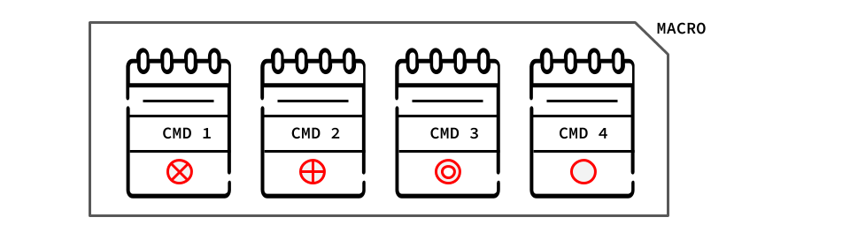
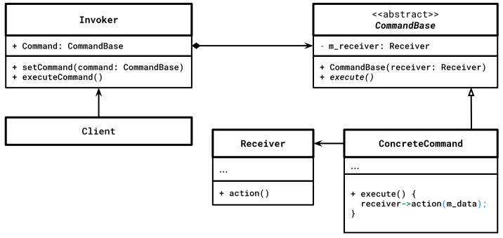

# Command Pattern

[Zurück](../../../Resources/Readme_05_Catalog.md)

---

(Credits: [Blog von Vishal Chovatiya](https://vishalchovatiya.com/pages/start-here/))

---

## Wesentliche Merkmale

#### Kategorie: *Behavioral Pattern*

#### Ziel / Absicht:

###### In einem Satz:

> &bdquo;Das Command Pattern kapselt eine Anfrage (einen Methodenaufruf mit allen dazugehörigen Parametern) als eigenständiges Objekt, sodass sich Aufrufer und Ausführender entkoppeln lassen und Anfragen sich parametrisieren,
in Warteschlangen einreihen, protokollieren oder rückgängig machen lassen.&rdquo;

Das *Command Pattern* kapselt eine auszuführende Aktion in einem eigenen Objekt, dem sogenannten *Command*.
Dadurch wird ein Objekt, das eine Aktion auslösen möchte, von dem Objekt entkoppelt, das diese Aktion tatsächlich ausführt.
Der Aufrufer muss somit nicht wissen, wie die angeforderte Operation implementiert ist.
Stattdessen kennt er lediglich die einheitliche Schnittstelle des Commands, beispielsweise eine Methode wie `execute()`.

Da ein Command als vollwertiges Objekt existiert, lassen sich ausgeführte Commands zudem protokollieren,
in einer Historie ablegen und &ndash; sofern eine `undo()`-Methode implementiert wird &ndash; rückgängig machen,
was das Pattern zur Standardlösung für Undo/Redo-Funktionalität macht.
Ebenso einfach lassen sich mehrere Commands zu Makro-Befehlen zusammensetzen, die nacheinander ausgeführt werden.

Häufig wird ein Command mit einem sogenannten *Receiver* verbunden, der die eigentliche Fachlogik der Aktion enthält.
Das Pattern trennt damit insbesondere die Anforderung einer Aktion von ihrer konkreten Ausführung.

In C++ bietet sich für die gemeinsame Schnittstelle typischerweise eine abstrakte Basisklasse mit einer rein virtuellen `execute`()-Methode an,
von der konkrete Command-Klassen erben. Insgesamt fördert das Pattern die lose Kopplung zwischen den Komponenten,
die eine Aktion anstoßen, und denen, die sie ausführen, und erhöht dadurch die Erweiterbarkeit und Testbarkeit des Systems.

#### Struktur (UML):

Das folgende UML-Diagramm beschreibt eine Implementierung des *Command Patterns*.
Es besteht im Wesentlichen aus fünf Teilen:

  * **Client**: Genereller Konsument der Klassen des Entwurfsmusters. Er erstellt das *Command Object* und verknüpft es mit *Receiver*-Objekten.
  * **Receiver**: Objekt, das weiß, wie das Kommando (Methode) auszuführen ist.
  * **CommandBase**: Abstrakte Klasse (oder Schnittstelle) für *Command*-Objekte. Enthält Informationen über das *Receiver*-Objekt,
    das für die Ausführung der Operation unter Verwendung der im *Command*-Objekt abgelegten Informationen verantwortlich ist.
  * **ConcreteCommand**: Konkrete Implementierung der abstrakten `CommandBase`-Klasse bzw. -Schnittstelle.
  * **Invoker**: Objekt, das entscheidet, wann das Kommando ausgeführt werden soll.

*Abbildung* 1: Schematische Darstellung des *Command Patterns*.

---

#### 'Beginners Example':

Bei den Fallstudien zu diesem Seminar finden Sie unter dem Stichwort &bdquo;Bankkonten&rdquo;
ein praxisnahes Beispiel vor.

---

#### Conceptual Example:

[Quellcode 1](../ConceptualExample_01.cpp) &ndash; Sehr einfaches Beispiel 
[Quellcode 2](../ConceptualExample_02.cpp) &ndash; Dasselbe Beispiel mit zusätzlichen Modern C++ Sprachkonstrukten
[Quellcode 3](../ConceptualExample_03.cpp) &ndash; Ein etwas ausführlicheres Beispiel

*Bemerkung*: 
Mit Modernen C++ Sprachmitteln benötigen Sie oft überhaupt keine `CommandBase`-Basisklasse und keine `ConcreteCommand`-Klassen mehr.
Jedes aufrufbare Objekt (*Callable*), wie eine Lambda-Funktion, kann als Kommando dienen.

Mithilfe von `std::move_only_function` (C++23) oder `std::function` (C++11) kapseln wir das Verhalten direkt zur Laufzeit.
Das reduziert den "Boilerplate-Code" (Rahmencode) drastisch, siehe dazu [Quellcode 2](../ConceptualExample_02.cpp).

---

#### &bdquo;Real-World&rdquo; Beispiel:

Für das *Command Pattern* wird in
["Entwurfsmuster: Das umfassende Handbuch" von Matthias Geirhos](https://www.amazon.de/Entwurfsmuster-umfassende-Handbuch-Matthias-Geirhos/dp/3836227622)
ein Beispiel aus dem Umfeld der Spieleprogrammierung betrachtet: Die Implementierung eines Ausschnitts aus dem Schachspiel,
soweit er die Verwendung des *Command Pattern* Entwurfsmusters betrifft, siehe *Abbildung* 2:

*Abbildung* 2: Ein Schachspiel modelliert mit dem *Command Pattern*.

Ein Kommando wird in *Abbildung* 2 durch die Klasse `Move` dargestellt.
Davon leiten sich unterschiedliche Kommandos ab, beim Schachspiel reden wir hier von einem Spielzug.
Neben einem "normalen" Zug, der nur die Regeln der jeweiligen Spielfigur zu beachten hat, gibt es auch spezielle Züge
wie "Rochade" (engl. *Castling*)
und die "Umwandlung eines Bauern" (engl. *PromotePawn*).

Ein Spielfeld (engl. *Board*) verwaltet Spielzüge, oder eben Kommandos, um in der Nomenklatur dieses Entwurfsmusters zu bleiben.
In einer listenartigen Datenstruktur (`std::queue`) kann es mehrere Züge (Kommandos) abspeichern, ohne diese sofort auszuführen.

Für die konkrete Ausführung eines Spielzugs ist die Klasse `ChessPiece` verantwortlich. 

  * Bringen Sie das Beispiel auf Ihrem Rechner zum Laufen.
  * Überlegen Sie, welche Beteiligten des allgemeinen Musters (*Receiver*, *CommandBase*, etc.) welchen Klassen des Schachspiels zuzuordnen sind. 
  * Ergänzen Sie eine Klasse `PromotePawn` und integrieren Sie das Kommando "Umwandlung des Bauern" in das Spiel.

Beachten Sie folgende Überlegungen:

  * Da beim Schach mehrere Züge dieselbe Spielfigur betreffen können
	ist der Einsatz von `std::shared_ptr` für die `ChessPiece`-Objekte architektonisch korrekt.
  * Für die *Command*-Klasse (Klasse `Move`) und die internen Container auf dem Spielebrett sollten ` std::unique_ptr`-Variablen zum Einsatz kommen.
	Das *Command*-Objekt repräsentiert einen konkreten Befehl in der Historie; dieser sollte exklusiv vom Spielfeld verwaltet werden.

##### Anpassungen an Modern C++

Eigentumslogik (Ownership): 
Durch `std::unique_ptr<Move>` ist nun klar geregelt, wer für den Lebenszyklus des Zuges verantwortlich ist. Das Board &bdquo;besitzt&rdquo; die Historie.
Da `std::unique_ptr` keinen Referenzzähler verwalten muss, ist es zudem spürbar schneller und speichereffizienter als `std::shared_ptr`.

Keine Kopien von Positionen: 
Da `Position` nun mittels `std::move` durchgereicht wird, entfallen unnötige Kopierprozesse bei der Übergabe.

Typ-Sicherheit und Lesbarkeit: 
`std::println` formatiert Variablen direkt über `{}`. Es kann nicht mehr passieren, dass man ein `<<` vergisst oder den Typ falsch konvertiert.

---

## Literaturhinweise

Die Anregungen zum konzeptionellen Beispiel finden Sie unter

[https://refactoring.guru/design-patterns](https://refactoring.guru/design-patterns/command/cpp/example#example-0)

und 

[https://www.codeproject.com](https://www.codeproject.com/Articles/455228/Design-Patterns-3-of-3-Behavioral-Design-Patterns#Command)

vor.

---

[Zurück](../../../Resources/Readme_05_Catalog.md)

---
