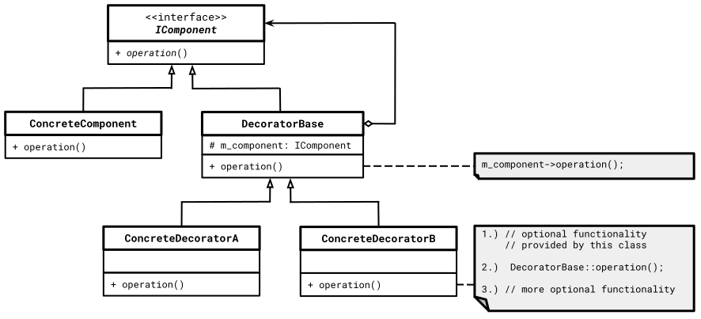

# Decorator Pattern

[Zurück](../../../Resources/Readme_05_Catalog.md)

---


<sup>(Credits: [Blog von Vishal Chovatiya](http://www.vishalchovatiya.com/category/design-patterns/))</sup>

---

## Wesentliche Merkmale

##### Kategorie: *Structural Pattern*

#### Ziel / Absicht:

###### In einem Satz:

&ldquo;Erleichtert das Hinzufügen zusätzlicher Funktionalität zu Objekten.&rdquo;

Das *Decorator Pattern* ist ein strukturelles Entwurfsmuster, das die Funktionalität eines Objekts erweitert,
indem es dieses mit einer oder mehreren Dekorationsklassen &ldquo;umhüllt&rdquo;, oder gewissermaßen *dekoriert*.
*Decorator* Klassen können vorhandene Elemente ändern und zur Laufzeit neue Methoden und Eigenschaften hinzufügen.

##### Hinweis:

Das Spezialisieren (Vererbung) einer Klasse ist typischerweise das Erste, was einem einfällt,
wenn man das Verhalten eines Objekts ändern (erweitern) möchte.
Die Vererbung weist jedoch einige schwerwiegende Einschränkungen auf, die es zu beachten gilt:

  * Die Vererbung ist ein statisches Konzept, also etwas, was zur Übersetzungszeit festgelegt sein muss.
    Zur Laufzeit lässt sich das Verhalten eines bestimmten Objekts nicht ändern.
    Ferner kann man nur ein ganzes Objekt durch ein anderes Objekt ersetzen, das aus einer anderen Unterklasse erstellt wurde.
    Das *Decorator Pattern* zielt auf das Ändern von Verhaltensweisen bestimmter Methoden ab.
  * Unterklassen können nur eine übergeordnete Klasse haben. In den meisten Sprachen lässt das Prinzip der Vererbung nicht zu,
    dass eine Klasse das Verhalten mehrerer Klassen gleichzeitig erbt (Prinzip der *Mehrfachvererbung*, in C++ allerdings möglich).

Eine Möglichkeit, diese Einschränkungen zu überwinden, ist die Verwendung von
*Aggregation* oder *Komposition* anstelle von Vererbung.
Beide Alternativen funktionieren fast gleich: Ein Objekt hat einen Verweis (Referenz, Zeiger) 
auf ein anderes Objekt und *delegiert* ihm dadurch Tätigkeiten.
Bei der Vererbung kann das Objekt diese Arbeit *selbst* ausführen,
es *erbt* das Verhalten von seiner Oberklasse.

Mit diesem Ansatz (Gebrauch eines Verweises) können Sie das verknüpfte &ldquo;Hilfs&rdquo;-Objekt leicht durch ein
anderes ersetzen und so das Verhalten des Containers zur Laufzeit ändern.
Ein Objekt kann das Verhalten mehrerer Klassen verwenden,
indem es Verweise auf mehrere Objekte verwaltet.


*Abbildung* 1: Vererbung versus Aggregation.

#### Problem:

Das Objekt, das Sie verwenden möchten, führt die grundlegenden Funktionen aus, die Sie benötigen.
Möglicherweise müssen Sie dem Objekt jedoch noch einige zusätzliche Funktionalitäten hinzufügen,
die vor oder nach der Basisfunktionalität des betrachteten Objekts auszuführen sind.

#### Lösung:

*Wrapper* oder Hülle ist der alternative Kurzname für das Decorator-Pattern,
der die Hauptidee des Musters klar zum Ausdruck bringt. Ein &ldquo;Wrapper&rdquo; ist ein Objekt,
das mit einem &ldquo;Ziel&rdquo;-Objekt verknüpft werden kann. Das Wrapper-Objekt enthält die gleichen Methoden
wie das Ziel und delegiert alle eingehenden Requests an es.
Der Wrapper kann das Verhalten jedoch ändern,
indem er entweder vor oder nach dem Weiterleiten der Anforderung an das Ziel
zusätzliches Verhalten hinzufügt.

#### Struktur (UML):

Das folgende UML-Diagramm beschreibt eine Implementierung des *Decorator Patterns*.
Es besteht im Wesentlichen aus vier Teilen:

  * **Component**: Abstrakte Basisklasse für alle konkreten Komponenten und Decorator-Klassen.
    Diese Klasse definiert diejenigen Klassenelemente, die standardmäßig von diesen Klassentypen implementiert werden müssen.
  * **ConcreteComponent**: Diese Klasse erbt von der Klasse `Component`. Es kann diese Klasse mehrfach geben.
    Es wird damit jeweils ein Objekttyp definiert, der von einer Decorator-Klasse umhüllt werden kann.
  * **DecoratorBase**: Stellt die abstrakte Basisklasse für alle Decorator-Klassen dar. Es wird ein Konstruktor hinzugefügt,
    der ein `Component-Objekt` als Parameter akzeptiert. Das übergebene Objekt ist die Komponente, die umhüllt wird.
    Da das umhüllte Objekt von `Component` erben muss, kann es sich um ein `ConcreteComponent`-Objekt
    oder ein anderes Decorator-Objekt handeln. Auf diese Weise können mehrere Decorator-Objekte auf ein einzelnes Objekt angewendet werden.
  * **ConcreteDecorator**: Diese Klasse repräsentiert ein konkretes Decorator-Objekt für eine Komponente.
    Es kann einige zusätzliche Methoden enthalten, die die Funktionalität der Komponente erweitern.
    Die `operation`-Methoden können auf zwei Arten verwendet werden:
    Sie können unverändert bleiben und in diesem Fall wird die Basisklassenmethode der Komponente aufgerufen
    oder die `operation`-Methode kann geändert werden oder vollständig durch eine neue Implementierung ersetzt werden.



*Abbildung* 2: Schematische Darstellung des *Decorator* Patterns.


##### Hinweis:

Während ein Dekorateur seine Funktionalität vor oder nach Weiterleiten der Anforderung an das Objekt,
was es dekoriert, hinzufügen kann, sollte die Kette der Instanziierung immer mit dem `ConcreteComponent`-Objekt enden.

#### Implementierung:

Erstellen Sie eine abstrakte Klasse, die sowohl die ursprüngliche Klasse darstellt
als auch die neuen Methoden besitzt, die der Klasse hinzugefügt werden sollen.
Platzieren Sie in den Dekoratoren die neuen Methoden-Anrufe
vor oder nach den Anrufen an das eingehüllte Objekt, um die richtige Reihenfolge zu erhalten.

#### Pro / Kontra:

###### Pros:

  * Das Verhalten eines Objekts kann erweitert werden, ohne eine neue Unterklasse erstellen zu müssen.
  * Einem Objekt können zur Laufzeit Verantwortlichkeiten hinzugefügt oder daraus entfernt werden.
  * Es können mehrere Verhaltensweisen kombiniert werden, indem man ein Objekt in mehrere Dekoratoren einhüllt.
  * *Single Responsibility Principle*: Eine monolithische Klasse,
    die viele mögliche Verhaltensvarianten implementiert, kann so in mehrere kleinere Klassen unterteilt werden.

###### Kontras:

  * Es ist schwierig, einen bestimmten Wrapper vom Wrapper-Stapel zu entfernen.
  * Es ist schwierig, einen Dekorateur so zu implementieren, dass sein Verhalten nicht von der Reihenfolge im Dekorationsstapel abhängt.
  * Der anfängliche Konfigurationscode von Ebenen (Hüllen) sieht möglicherweise nicht sehr gut aus.

---

#### Conceptual Example:

[Quellcode](../ConceptualExample.cpp)

*Hinweis*: Man beachte in dem konzeptionellen Beispiel auch die Demonstration
der Deklaration zur Laufzeit:

```cpp
01: // component which is going to be decorated
02: std::shared_ptr<Component> component{ std::make_shared<ConcreteComponent>() };
03: 
04: // run-time dependent decorator
05: std::shared_ptr<Component> decorator;
06: 
07: if (true)   // <== change 'true' to 'false'
08: {
09:     std::shared_ptr<Component> decorator1{ std::make_shared<ConcreteDecoratorA>(component) };
10:     decorator = std::make_shared<ConcreteDecoratorB>(decorator1);
11: 
12:     std::cout << "Client: Now I've this decorated component (if):" << std::endl;
13: }
14: else {
15:     std::shared_ptr<Component> decorator1 {std::make_shared<ConcreteDecoratorB>(component)};
16:     decorator = std::make_shared<ConcreteDecoratorA>(decorator1);
17: 
18:     std::cout << "Client: Now I've that decorated component (else):" << std::endl;
19: }
```

---

#### 'Real-World' Beispiel:

[Quellcode &ldquo;Dynamic Shapes&rdquo;](../DynamicShapes.cpp)

---

Das 'Real-World' Beispiel zu diesem Entwurfsmuster beschäftigt sich mit semi-grafischen GDI-Elementen (*Graphics Device Interface*)
wie Kreisen, Rechtecken, etc.
In einer Grundausführung lassen sich derartige Figuren einfach schwarz-weiß zeichnen. Auf Wunsch, auch zur Laufzeit, könnte man diese Figuren
farbig und/oder mit einer entsprechenden Transparenz zeichnen.

Diese &ldquo;Zusatzwünsche&rdquo; lassen sich sehr einfach und elegant mit dem *Decorator Pattern* Entwurfsmuster in die Tat umsetzen.
Einen entsprechenden Satz an GDI- und Dekorator-Klassen finden Sie in *Abbildung* 3 vor:


*Abbildung* 3: Das *Decorator* Pattern in der Anwendung mit GDI-Elementen.

Es folgen vier exemplarische Anwendungsbeispiele, die das Zeichen von GDI-Elementen

  * ohne Dekoration
  * mit Farbe
  * mit Transparenz
  * mit Farbe und Transparenz

verdeutlichen sollen. 

###### *Szenario* 1:

*Code*:

```cpp
std::shared_ptr<Shape> circle = std::make_shared<Circle>(0.5f);
std::cout << circle->draw() << std::endl;
```

*Ausgabe*:

```
A circle of radius 0.500000
```

###### *Szenario* 2:

*Code*:

```cpp
std::shared_ptr<Shape> circle{
    std::make_shared<Circle>(0.5)
};
std::shared_ptr<Shape> redCircle{
    std::make_shared<ColoredShapeDecorator>(circle, "red") 
};
std::cout << redCircle->draw() << std::endl;
```

*Ausgabe*:

```
A circle of radius 0.500000 has color red
```

###### *Szenario* 3:

*Code*:

```cpp
std::shared_ptr<Shape> square{
    std::make_shared<Square>(3.0) 
};

std::shared_ptr<Shape> transparentSquare{
    std::make_shared<TransparentShapeDecorator>(square, static_cast<uint8_t>(85)) 
};

std::cout << transparentSquare->draw() << std::endl;
```

*Ausgabe*:

```
A square with side 3 has 33.3333% transparency
```

###### *Szenario* 4:

*Code*:

```cpp
std::shared_ptr<Shape> circle{
    std::make_shared<Circle>(15.0) 
};

std::shared_ptr<Shape> greenCircle{ 
    std::make_shared<ColoredShapeDecorator>(circle, "green")
};

std::shared_ptr<Shape> greenTransparentCircle{
    std::make_shared<TransparentShapeDecorator>(greenCircle, static_cast<uint8_t>(50)) 
};
std::cout << greenTransparentCircle->draw() << std::endl;
```

*Ausgabe*:

```
A circle of radius 15.000000 has color green has 19.6078% transparency
```

---

#### 'Real-World' Beispiel zum Zweiten:

[Quellcode &ldquo;Statische Shapes&rdquo;](../StaticShapes.cpp)

---

Das &ldquo;Real-World&rdquo;-Beispiel liegt in einer zweiten, alternativen Version vor.
Wenngleich es dem Charakter des *Decorator Patterns* etwas widerspricht, kann man
das Entwurfsmuster auch mit Template Klassen umsetzen: 
Auf diese Weise muss man zwar die Dekoration zur Übersetzungszeit festlegen,
mit Hilfe der Templates bewahrt man sich aber doch eine gewisse Flexibilität!

---

## Literaturhinweise

Die Anregungen zu den Beispielen findet man unter

[refactoring.guru](https://refactoring.guru/design-patterns/decorator/cpp/example#example-0)<br>(abgerufen am 23.06.2020).

und 

[Dmitri Nesteruk &ldquo;Design Patterns in Modern C++&rdquo;](https://github.com/Apress/design-patterns-in-modern-cpp)<br>(abgerufen am 14.05.2020).

---

[Zurück](../../../Resources/Readme_05_Catalog.md)

---
