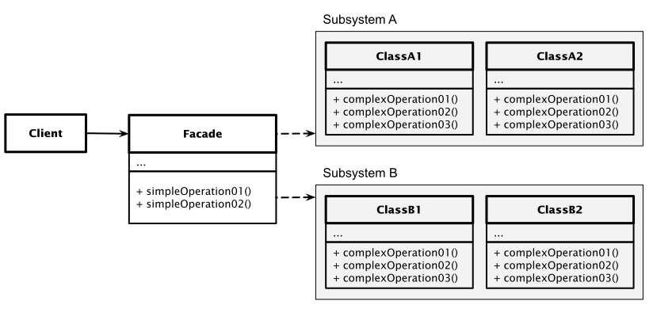

# Facade Pattern

[Zurück](../../../Resources/Readme_05_Catalog.md)

---

(Credits: [Blog von Vishal Chovatiya](http://www.vishalchovatiya.com/category/design-patterns/))

---

## Wesentliche Merkmale

##### Kategorie: *Structural Pattern*

#### Ziel / Absicht:

Das *Facade Pattern* ist ein strukturelles Entwurfsmuster,
das verwendet wird, um den Zugriff auf Funktionen in komplexen oder schlecht gestalteten Subsystemen/Bibliotheken
oder Vergleichbares zu vereinfachen.
Die Fassadenklasse stellt eine einfache Schnittstelle zur Verfügung,
die die Implementierungsdetails des zugrunde liegenden Codes verbirgt.

#### Problem:

Gegeben sei ein komplexes Subsystem mit vielen Klassen und Abhängigkeiten zwischen ihnen.
Clients die dieses Subsystem oder Teile davon nutzen möchten,
müssen sich mit den verschiedenen Schnittstellen der enthaltenen Klassen befassen und die Funktionsweise verstehen.
Dabei bauen sie zwangsläufig viele Abhängigkeiten zu verschiedenen Objekten auf und koppeln sich eng an die Klassen des Subsystems.
Das *Facade Pattern* definiert eine vereinfachte Schnittstelle zur Benutzung eines Systems (Bibliothek) oder einer Menge von Objekten.

#### Lösung:

Die *Facade* (dt. Fassade) wird zwischen Clients und dem Subsystem geschaltet.
Es "kapselt" dabei das Subsystem, beinhaltet die komplexe Logik zum Arbeiten mit dem Subsystem
und bietet für den Client eine vereinfachte Schnittstelle (Methoden) nach außen an.
Die Fassade delegiert die Clientaufrufe an das Subsystem.
Dadurch kann der Client das System über die Facade nutzen,
ohne die Klassen, ihre Beziehungen, und Abhängigkeiten zu kennen.

Der Einsatz des *Facade Pattern* bietet sich vor allem dann an, wenn mehrere Entwickler eines Teams davon
profitieren können. Es müssen sich nicht alle Entwickler des Teams mit dem komplexen Subsystem beschäftigen.

#### Hinweis 1:

Eine Facade kann auch als eine Art "*Wrapper*" angesehen werden. Häufig gibt es - zum Beispiel unter Windows -
Bibliotheken, die rein prozedural sind (DLL, *Dynamic Link Library*).
Mit Hilfe einer Facade kann man eine objektorientierte Sicht auf eine reine C-Bibliothek zur 
Verfügung stellen.

#### Hinweis 2:

Eine Facadenklasse soll eine Vereinfachung in der Komplexität des/der unterlagerten Subsystems/Subsysteme darstellen.
Dies hat allerdings auch zur Folge, dass die Facadenklasse nur einen Teil
(in manchen Fällen sogar nur einen Bruchteil) von den Fähigkeiten der Subsysteme besitzt.

#### Struktur (UML):

Das folgende UML-Diagramm beschreibt eine Implementierung des *Facade Patterns*.
Es besteht im Wesentlichen aus drei Teilen:

  * **Facade**: Diese Klasse enthält eine Reihe einfacher Funktionen (Methoden), die ihren Benutzern zur Verfügung gestellt werden und die die Komplexität der schwer zu verwendenden Subsysteme verbergen.
  * **SubSystemA/B**: Die komplexe Funktionalität, auf die über die Fassadenklasse zugegriffen wird, muss nicht in einem einzelnen Subsystem (Paket, Namensraum, Bibliothek, ...) vorhanden sein.
  * **ClassA/B**: Diese Klassen (Funktionen bei einer prozeduralen Schnittstelle) enthalten die Funktionalität, die über die Fassade präsentiert wird.

*Abbildung* 1: Schematische Darstellung des *Facade Patterns*.

---

#### Conceptual Example:

[Quellcode](../ConceptualExample.cpp)

---

Die Anregungen zum konzeptionellen Beispiel finden Sie unter

[https://refactoring.guru/design-patterns](https://refactoring.guru/design-patterns/facade/cpp/example#lang-features)

und

[https://www.codeproject.com](https://www.codeproject.com/Articles/438922/Design-Patterns-2-of-3-Structural-Design-Patterns#Facade)

vor.

---

[Zurück](../../../Resources/Readme_05_Catalog.md)

---
