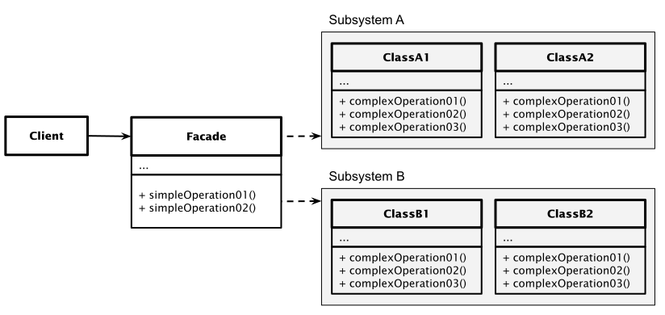

# Facade Pattern

[Zurück](../../../Resources/Readme_05_Catalog.md)

---

(Credits: [Blog von Vishal Chovatiya](https://vishalchovatiya.com/pages/start-here/))

---

## Wesentliche Merkmale

##### Kategorie: *Structural Pattern*

#### Ziel / Absicht:

###### In einem Satz:

> &bdquo;Das Facade Pattern stellt eine vereinfachte, einheitliche Schnittstelle vor ein komplexes Subsystem aus mehreren Klassen,
sodass Clients dieses Subsystem nutzen können, ohne seine innere Struktur und Zusammenhänge kennen zu müssen.&rdquo;

Viele Softwaresysteme bestehen aus mehreren Klassen, die eng zusammenarbeiten, um eine bestimmte Funktionalität bereitzustellen &ndash; etwa
ein Subsystem zur Videokonvertierung, zum Datenbankzugriff oder zur Gerätesteuerung.
Für einen Client, der nur eine einfache Aufgabe erledigen möchte, ist es oft unnötig kompliziert, sich mit all diesen Klassen,
ihren Abhängigkeiten und der korrekten Aufrufreihenfolge auseinanderzusetzen.

Das *Facade Pattern* löst dieses Problem, indem es eine eigene Klasse einführt &ndash; die Fassade &ndash;,
die genau diese Komplexität kapselt und dem Client stattdessen eine schlanke, aufgabenorientierte Schnittstelle anbietet.

Intern koordiniert die Fassade die Aufrufe an die verschiedenen Subsystem-Klassen, sodass der Client nur noch mit der Fassade kommuniziert.

Wichtig dabei ist: Das Subsystem bleibt weiterhin direkt zugänglich, falls ein Client mehr Kontrolle oder Flexibilität benötigt als die Fassade bietet.
Dadurch reduziert das Pattern die Kopplung zwischen Client-Code und Subsystem erheblich,
was den Code leichter verständlich, wartbarer und testbarer macht.

Zudem erleichtert es den Austausch oder die Weiterentwicklung des Subsystems, solange die Schnittstelle der Fassade stabil bleibt.

In C++ lässt sich das Pattern besonders elegant umsetzen, da die Fassade meist nur Referenzen oder Zeiger auf die Subsystem-Objekte hält
und deren Methoden in sinnvoller Reihenfolge aufruft.

#### Hinweis 1:

Eine Facade kann auch als eine Art "*Wrapper*" angesehen werden. Häufig gibt es - zum Beispiel unter Windows -
Bibliotheken, die rein prozedural sind (DLL, *Dynamic Link Library*).
Mit Hilfe einer Facade kann man eine objektorientierte Sicht auf eine reine C-Bibliothek zur 
Verfügung stellen.

#### Hinweis 2:

Eine Facadenklasse soll eine Vereinfachung in der Komplexität des/der unterlagerten Subsystems/Subsysteme darstellen.
Dies hat allerdings auch zur Folge, dass die Facadenklasse nur einen Teil
(in manchen Fällen sogar nur einen Bruchteil) von den Fähigkeiten der Subsysteme besitzt.

#### Struktur (UML):

Das folgende UML-Diagramm beschreibt eine Implementierung des *Facade Patterns*.
Es besteht im Wesentlichen aus drei Teilen:

  * **Facade**: Diese Klasse enthält eine Reihe einfacher Funktionen (Methoden), die ihren Benutzern zur Verfügung gestellt werden und die die Komplexität der schwer zu verwendenden Subsysteme verbergen.
  * **SubSystemA/B**: Die komplexe Funktionalität, auf die über die Fassadenklasse zugegriffen wird, muss nicht in einem einzelnen Subsystem (Paket, Namensraum, Bibliothek, ...) vorhanden sein.
  * **ClassA/B**: Diese Klassen (Funktionen bei einer prozeduralen Schnittstelle) enthalten die Funktionalität, die über die Fassade präsentiert wird.

*Abbildung* 1: Schematische Darstellung des *Facade Patterns*.

---

#### Conceptual Example:

[Quellcode](../ConceptualExample.cpp)

---

## Pro / Kontra:

###### Pros:

  * Die Komplexität eines existierenden Quellcodes kann vor dem Client verborgen werden.
  * &bdquo;Macht Schnittstellen einfach richtig zu bedienen und schwer falsch zu verwenden.&rdquo; (Scott Meyers).
  * Kann behilflich sein, komplexe Systeme auf eine andere Plattform zu portieren, weil der Client nur auf die Fassade angewiesen ist.

###### Kontras:

  * Eine Fassade hat möglicherweise zu viele Verantwortlichkeiten und endet im Antimuster &bdquo;God Object&rdquo;.

---

## Literaturhinweise

Die Anregungen zum konzeptionellen Beispiel finden Sie unter

[https://refactoring.guru/design-patterns](https://refactoring.guru/design-patterns/facade/cpp/example#lang-features)

und

[https://www.codeproject.com](https://www.codeproject.com/Articles/438922/Design-Patterns-2-of-3-Structural-Design-Patterns#Facade)

vor.

---

[Zurück](../../../Resources/Readme_05_Catalog.md)

---
