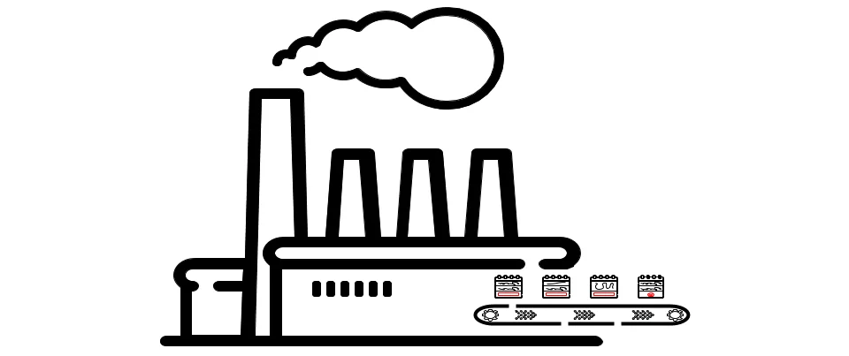

# Factory Method Pattern

[Zurück](../../../Resources/Readme_05_Catalog.md)

---

(Credits: [Blog von Vishal Chovatiya](https://vishalchovatiya.com/pages/start-here/))

---

## Wesentliche Merkmale

##### Kategorie: Erzeugungsmuster / *Creational Pattern*

#### Ziel / Absicht:

###### In einem Satz:

> &bdquo;Das Factory Method Pattern kapselt die Erzeugung von Objekten, indem es Unterklassen die Entscheidung darüber überlässt, welche konkrete Produktklasse instanziiert wird.&rdquo;

Das *Factory Method Pattern* gehört zu den Erzeugungsmustern (*Creational Patterns*)
und löst das Problem, dass Code, der Objekte erzeugt, oft eng an konkrete Klassen gekoppelt ist.

Statt Objekte direkt mit `new` zu erzeugen, definiert eine Basisklass
eine virtuelle Methode &ndash; die sogenannte Factory Method &ndash;, die von abgeleiteten Klassen überschrieben wird,
um die tatsächliche Instanz zu erzeugen.

Der aufrufende Code arbeitet dabei ausschließlich über die abstrakte Basisklasse bzw. ein gemeinsames Interface
und muss die konkrete Klasse gar nicht kennen.

Dadurch wird die Erzeugungslogik von der Verwendungslogik getrennt, was das Single-Responsibility-Prinzip stärkt.

Neue Produktvarianten lassen sich einführen, indem man einfach eine neue Unterklasse mit eigener Factory Method ergänzt,
ohne bestehenden Code zu verändern – ein klassisches Beispiel für das Open/Closed-Prinzip.

In C++ lässt sich das Pattern besonders elegant mit virtuellen Methoden und `std::unique_ptr` als Rückgabetyp umsetzen,
um klare Ownership-Verhältnisse zu garantieren.

Häufig wird es dort eingesetzt, wo ein Framework den Ablauf vorgibt,
die konkrete Ausprägung eines Schritts aber von der konkreten Anwendung abhängt
(z. B. bei parser- oder plugin-basierten Architekturen).

Abzugrenzen ist es vom *Abstract-Factory*-Pattern, das mehrere zusammengehörige Objektfamilien erzeugt,
während sich Factory Method typischerweise auf ein einzelnes Produkt konzentriert.

#### Struktur (UML):

Das folgende UML-Diagramm beschreibt eine Implementierung des *Factory Method Patterns*.
Es besteht im Wesentlichen aus vier Teilen:

  * **FactoryBase**: Abstrakte Klasse (oder Schnittstelle) für konkrete *Factory*-Klassen,
    die die gesuchten Objekte erzeugen.
    Wichtigste Aufgabe dieser Klasse ist die Bereitstellung (Definition) der *Fabrikmethode*: 
    Die Signatur der Methode `requestProduct` wird festgelegt, die `ProductBase`-Objekte zurückliefert.
  * **ConcreteFactory**: Repräsentiert eine konkrete Umsetzung der `FactoryBase`-Klasse.
    Normalerweise überschreibt diese Klasse eine private, virtuelle Memberfunktion `createProduct()`,
    die von `ProductBase` abgeleitete Objekte zurück gibt.
  * **ProductBase**: Basisklasse (oder Schnittstelle) für alle Produkte,
    die von konkreten *Factory*-Klassen hergestellt werden.
  * **ConcreteProduct**: Konkrete Implementierung der Klasse `ProductBase`.
    Einfacher formuliert: Eine Klasse für ein konkret zu erstellendes Produkt.
    Konkrete `ProductBase`-Klassen sollten produktspezifische
    Funktionalitäten enthalten. Objekte des Typs `ConcreteProduct` werden von Methoden
    der *Factory*-Klassen erstellt.

*Abbildung* 1: Schematische Darstellung des *Factory Method Patterns*.

*Bemerkung*: 
Die `FactoryBase`-Basisklasse ist interessant in Bezug auf ihren Entwurf:

Wenn die öffentliche, nicht-virtuelle Memberfunktion `requestProduct()` aufgerufen wird,
ruft diese intern die private, virtuelle Memberfunktion `createProduct()` auf,
die ein neues konkretes Produkt erstellt und zurückgibt.

Dieses Idiom wird auch als *nicht-virtuelles Schnittstellenidiom* (*NVI*) bezeichnet.

Die Idee dahinter ist, dass einzelne Fabriken `createProduct()` überschreiben,
um ein Objekt eines entsprechenden Produkttyps zurückzugeben.

Die `FactoryBase`-Basisklasse selbst implementiert eine Methode `requestProduct()`,
die sich nebenbei noch um andere Dinge kümmern kann,
wie zum Beispiel die Anzahl der produzierten Produkte zu verwalten.

Die Memberfunktion `requestProduct()` ist ein Beispiel für das
*Template Method* Entwurfsmuster.

Die Memberfunktion `createProduct()` ist ein Beispiel für das
*Virtual Constructor* Entwurfsmuster (auch als *Prototype* Entwurfsmuster bezeichnet).

---

#### Einige Anmerkungen

Der Begriff &bdquo;*Factory* (*Fabrik*)&rdquo; tritt in der Software als auch in der Literatur etwas inflationär in Erscheinung.
Nicht immer wird dieses Konzept einheitlich verwendet.
 
Das &bdquo;Factory Method Pattern&rdquo; definiert zuallererst eine Methode, die ein Objekt erzeugt.
Von welchem Klassentyp dieses Objekt ist, entscheidet die konkrete Klasse, die diese Methode implementiert.

Es gibt also **zwei** Vererbungshierarchien:

  * eine mit den *Factory*-Klassen.
  * eine zweite mit den zu erzeugenden Objekten (wir bezeichnen sie als *Produkte*).

---

#### Das Wesentliche des Factory Method Patterns

Im Mittelpunkt des Patterns steht die Methode `requestProduct` an der `FactoryBase`-Klasse:

`requestProduct()` kennt keinen konkreten Produkttyp.

<pre>
                 FactoryBase
                     │
          requestProduct()
                     │
             createProduct()
                     │
          ┌──────────┴──────────┐
          ▼                     ▼
 ConcreteFactoryA       ConcreteFactoryB
          │                     │
          ▼                     ▼
 ConcreteProductA       ConcreteProductB
</pre>

Was ist das Wesentliche am Factory Method Pattern?

&bdquo;*Die Basisklasse definiert einen Algorithmus, der ein Produkt benötigt,
überlässt aber den konkreten Produkttyp einer virtuellen Factory Method.*&rdquo;

Also:

<pre>
                    FactoryBase
                         │
                         │ defines
                         ▼
                 requestProduct()
                         │
             ┌───────────┴───────────┐
             │                       │
             ▼                       ▼
       createProduct()         other business logic
             │
       virtual call
             │
      ┌──────┴──────┐
      ▼             ▼
 FactoryA        FactoryB
      │             │
      ▼             ▼
 ProductA        ProductB
 </pre>

---

#### Eine Factory ohne Vererbung

In modernem C++ versucht man oft, tiefe Vererbungshierarchien, *vtables* (virtuelle Funktionsaufrufe)
und das ständige Instanziieren von Klassen auf dem Heap (`std::make_unique`) zu vermeiden,
wenn es um Performance geht.

Zwei populäre Alternativen ersetzen das klassische Pattern:

  * Value Semantics mit std::variant (wenn die Typen zur Kompilierzeit bekannt sind).
  * Funktionale Factories mit `std::function` / Lambdas (vollkommen dynamisch, aber ohne Klassenhierarchie).

Im Beispiel zu dem &bdquo;Quellcode 3&rdquo; findet man eine funktionale, schlanke Factory,
die komplett ohne Fabrik-Klassen auskommt. Jede &bdquo;Fabrik&rdquo; ist einfach ein registriertes Lambda.

---

#### Conceptual Example:

[Quellcode 1](../ConceptualExample01.cpp) &ndash; Einfaches Beispiel. 
[Quellcode 2](../ConceptualExample02.cpp) &ndash; Erweiterung des einfachen Beispiels um eine Fabrik mit Lastausgleich. 
[Quellcode 3](../ConceptualExample03.cpp) &ndash; Eine Fabrik ohne Vererbung. 
[Quellcode 4](../ConceptualExample04.cpp) &ndash; Beispiel zu heißen Getränken.

---

#### Beispiele:

Jeder Container der Standard Template Library verfügt über acht Factory-Funktionen zum Generieren verschiedener Iteratoren.

  * `begin`, `cbegin`: Gibt einen Iterator bzgl. des Anfangs des Containers zurück.
  * `end`, `cend`: Gibt einen Iterator bzgl. des Endes des Containers zurück.
  * `rbegin`, `crbegin`: Gibt einen Reverse-Iterator bzgl. des Anfangs des Containers zurück.
  * `rend`, `crend`: Gibt einen Reverse-Iterator bzgl. des Endes des Containers zurück.

Die mit `c` beginnenden Fabrikfunktionen geben konstante Iteratoren zurück.

---

#### &bdquo;Real-World&rdquo; Beispiel:

[Quellcode](../RealWorldFactoryMethod.cpp) - *Real-World*-Beispiel (`ITelevision`), das exemplarisch mehrere *Factory Methods* betrachtet. 

Im &bdquo;Real-World&rdquo; Beispiel finden Sie ein Programm
mit den Klassen `ITelevision`, `LEDTelevision`, `OledTelevision`, `AbstractTVFactory`, `LEDTVFactory` und `OledTVFactory` vor.
Studieren Sie die Methoden `manufactureTelevision`, `assembleTelevision`, `shippingCharge` 
und `productionCharge` der Klasse `AbstractTVFactory`.
Beschreiben Sie, wie diese Methoden zur Namensgebung des *Factory Method Patterns* beitragen.

*Abbildung* 2: Das *Factory Method Pattern* am Beispiel der Produktion von Fernsehgeräten.

---

#### Hinweis:

Die beiden Entwurfsmuster *Simple Factory* und *Factory Method* sind nicht 
miteinander zu verwechseln.

**Simple Factory** 
  * Mit dem *Simple Factory* Pattern versuchen wir, die Details in der Erstellung eines Objekts vor dem Aufrufer (Client) zu abstrahieren.
    Das einzige, was der Client weiß, indem er eine Methode aufruft und den gewünschten Parameter übergibt, ist,
    dass er ein Objekt eines bestimmten Typs erhält. Aber wie dieses Objekt erstellt wird, weiß der Client-Code nicht.

**Factory Method** 
  * Das *Factory Method* Pattern bietet sich an, wenn die Anforderungen an die Erstellung eines Objekts mehr als nur der Aufruf des `new`-Operators sind.
    Sind zur Erzeugung des Objekts mehrere Schritte notwendig, möchte man diese Schritte ggf. anpassen können
    oder sind diese Schritte bei verschiedenen Objekten unterschiedlich, verwendet man das *Factory Method* Pattern.
  * Oder anders ausgedrückt: 
    Gibt es einen Algorithmus / eine Strategie, um die Erzeugung einer Produktfamilie zu steuern,
    dann kommt das *Factory Method* Pattern in Betracht. Dieses lässt sich gut mit dem *Template Pattern*, oder auch *Strategy Pattern* kombinieren,
    da man mit einer Schablone (Template) die Schritte zum Erstellen des untergeordneten Elements abstrahieren kann.

---

## Literaturhinweise

Die Anregungen zum konzeptionellen Beispiel finden Sie unter

[https://refactoring.guru/design-patterns](https://refactoring.guru/design-patterns/factory-method/cpp/example#example-0)

und 

[https://www.codeproject.com](https://www.codeproject.com/Articles/430590/Design-Patterns-1-of-3-Creational-Design-Patterns#FactoryMethod)

vor.

---

[Zurück](../../../Resources/Readme_05_Catalog.md)

---
