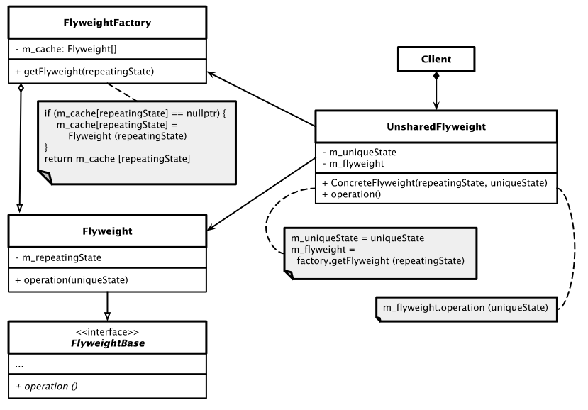

# Flyweight Pattern

## Wesentliche Merkmale

#### Kategorie: *Structural Pattern*

#### Ziel / Absicht:

Das *Flyweight Pattern* ist ein Entwurfsmuster aus der Kategorie der *Structural Pattern*,
das verwendet wird, um den Ressourcenverbrauch eines Programms mit einer sehr großen Anzahl von Objekten zu minimieren.
Beim Erzeugen von vielen tausend identischen Objekten können zustandslose "Flyweight"-Objekte
den in Anspruch genommen Speicher auf ein vertretbares Maß reduzieren.

#### Problem:

Manchmal arbeiten Programme mit einer großen Anzahl von Objekten, die dieselbe Struktur haben,
und einige Zustände dieser Objekte haben stets denselben Wert.
Wenn wir den klassischen Ansatz verwenden (Instanzen erstellen, Instanzvariablen schreiben),
können sich die Speicher- bzw. Speicherbereichsanforderungen inakzeptabel erhöhen.
Das *Flyweight Pattern* stellt eine Alternative in diesem Zusammenhang dar.

#### Beispiel:

Zum Verständnis des  *Flyweight* Entwurfsmusters spielen zwei Begriffe eine Rolle: *Intrinsischer* und *extrinsischer* Zustand.
Dazu ein Beispiel: Betrachten wir als Beispiel einen Texteditor. Pro Eingabe eines Zeichens wird ein Objekt einer Klasse `Character` erstellt.
Zu den Attributen der `Character`-Klasse zählen zum Beispiel `name` (welches Zeichen), `font` (welche Schriftart) und
`size` (welche Zeichengröße). Diese Informationen müssen wir nicht jedes Mal kopieren, wenn der Benutzer ein  Zeichen eingibt,
da sich der Buchstabe 'B' nicht von einem anderen 'B' unterscheidet. 
Wenn der Client erneut ein 'B' eingibt, geben wir einfach das Objekt zurück, das wir bereits zuvor erstellt haben.
All dies bezeichnen wir als *intrinsische* Zustände (Name, Schriftart, Größe), da sie von den verschiedenen Objekten gemeinsam genutzt werden können!

Jetzt fügen wir der Klasse `Character` weitere Attribute hinzu, zum Beispiel `row` (Zeile) und `col` (Spalte).
Sie geben die Position eines Zeichens im Dokument an. Diese Attribute können niemals dieselben sein, auch nicht für dieselben Zeichen,
da keine zwei Zeichen dieselbe Position in einem Dokument haben können.
Diese Zustände werden als *extrinsische* Zustände bezeichnet und können von den betrachteten Objekten nicht gemeinsam genutzt werden.

An Stelle der beiden Fachwörter *intrinsischer* und *extrinsischer* Zustand spricht
man auch von *repeatingState* und *uniqueState*.

#### Lösung:

Ein so genanntes *Flyweight* ist ein Objekt, das den Speicherbedarf minimiert,
indem so viele Daten wie möglich mit anderen ähnlichen Objekten geteilt werden.
Es gestattet, Objekte in großer Anzahl zu verwenden,
wenn eine einfache wiederholte Erzeugung entsprechender Objekte 
einen nicht akzeptablen Speicherbereich beanspruchen würde.
Für jedes Objekt, das gemeinsam genutzte Daten verwendet,
wird nur ein Verweis (Referenz, Pointer) auf ein gemeinsam genutztes Objekt gespeichert.

Das *Flyweight Pattern* verwendet häufig eine Variation des *Factory Method* Entwurfsmusters
für die Erzeugung der gemeinsam genutzten Objekte.
Die Fabrik erhält eine Anfrage für eine *Flyweight* Instanz.
Wenn bereits ein übereinstimmendes Objekt verwendet wird,
wird eine Referenz dieses Objekt zurückgegeben. Andernfalls ist ein neues *Flyweight* Objekt zu generieren.

#### Struktur (UML):

Das folgende UML-Diagramm beschreibt eine Implementierung des *Flyweight Patterns*.
Es besteht im Wesentlichen aus vier Teilen:

  * **Flyweight**: Beschreibt eine Klasse *Flyweight*, die den Teil des Status des zu betrachtenden Objekts enthält, der von mehreren Objekten gemeinsam genutzt werden kann.
    Dieses Objekt kann mehrfach verwendet werden. Der im *Flyweight* Objekt gespeicherte Zustand wird als "intrinsisch" oder "repeating" bezeichnet.
    Der Zustand, der an die Methoden des *Flyweight* Objekt übergeben wird, wird als "extrinsisch" bezeichnet.
    Ein Flyweight-Objekt muss "gemeinsam nutzbar" (*sharable*) sein.
    Jeder Zustand, den dieses Objekt speichert, muss intrinsisch sein.
  * **FlyweightBase**: Abstraktion der Klasse *Flyweight* zu einem Schnittstellentyp.
  * **UnsharedFlyweight**: Nicht alle *Flyweight* Objekte können gemeinsam genutzt werden.
    Die `UnsharedFlyweight`-Klasse enthält den extrinsischen Status, der für alle `UnsharedFlyweight`-Objekte eindeutig (*unique*) ist.
    Wenn ein `UnsharedFlyweight`-Objekt mit einem `Flyweight`-Objekt gepaart wird,
    repräsentiert es den vollständigen Status des zu betrachtenden Objekts.
  * **FlyweightFactory**: Die *FlyweightFactory* (Fabrik) erstellt und verwaltet *Flyweight* Objekte.
    Darüber hinaus verwaltet die Fabrik einen Pool unterschiedlicher *Flyweight* Objekte.
    Die Fabrik gibt bei einer entsprechenden Anforderung ein Objekt aus dem Pool zurück,
    falls es bereits erstellt wurde,
    oder fügt dem Pool ein Neues hinzu und gibt dieses zurück, falls dies der Anforderung entspricht.

Abbildung 1: Schematische Darstellung des *Flyweight Patterns*.

#### Conceptual Example:

[Quellcode 1](../ConceptualExample01.cpp)

[Quellcode 2](../ConceptualExample02.cpp)

Die Anregungen zum konzeptionellen Beispiel finden Sie unter

[https://refactoring.guru/design-patterns](https://refactoring.guru/design-patterns/flyweight)

und

[https://www.codeproject.com](https://www.codeproject.com/Articles/438922/Design-Patterns-2-of-3-Structural-Design-Patterns#Flyweight)

vor.

## Literaturhinweise

*Hinweise*:

---

[Zurück](../../../Resources/Readme_05_Catalog.md)

---
