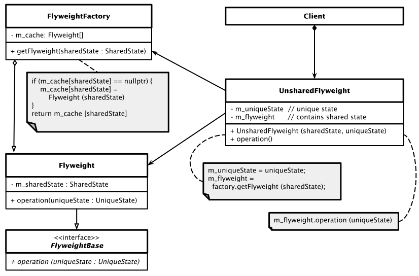

# Flyweight Pattern

[Zurück](../../../Resources/Readme_05_Catalog.md)

---


<sup>(Credits: [Blog von Vishal Chovatiya](https://vishalchovatiya.com/pages/start-here/))</sup>

---

## Wesentliche Merkmale

#### Kategorie: *Structural Pattern*

#### Ziel / Absicht:

###### In einem Satz:

&bdquo;Um Redundanzen beim Speichern von Daten zu vermeiden.&rdquo;

Das *Flyweight Pattern* ist ein Entwurfsmuster aus der Kategorie der *Structural Pattern*,
das verwendet wird, um den Ressourcenverbrauch eines Programms mit einer sehr großen Anzahl von Objekten zu minimieren.
Beim Erzeugen von vielen tausend identischen Objekten können zustandslose &bdquo;Flyweight&rdquo;-Objekte
den in Anspruch genommen Speicher auf ein vertretbares Maß reduzieren.

#### Problem:

Manchmal arbeiten Programme mit einer großen Anzahl von Objekten, die dieselbe Struktur haben,
und einige Zustände dieser Objekte haben stets denselben Wert.
Wenn wir den klassischen Ansatz verwenden (Instanzen erstellen, Instanzvariablen schreiben),
können sich die Speicher- bzw. Speicherbereichsanforderungen inakzeptabel erhöhen.
Das *Flyweight Pattern* stellt eine Alternative in diesem Zusammenhang dar.

#### Beispiel:

Zum Verständnis des  *Flyweight* Entwurfsmusters spielen zwei Begriffe eine Rolle: *Intrinsischer* und *extrinsischer* Zustand.
Dazu ein Beispiel: Betrachten wir als Beispiel einen Texteditor. Pro Eingabe eines Zeichens wird ein Objekt einer Klasse `Character` erstellt.
Zu den Attributen der `Character`-Klasse zählen zum Beispiel `name` (welches Zeichen), `font` (welche Schriftart) und
`size` (welche Zeichengröße). Diese Informationen müssen wir nicht jedes Mal kopieren, wenn der Benutzer ein  Zeichen eingibt,
da sich der Buchstabe 'B' nicht von einem anderen 'B' unterscheidet. 
Wenn der Client erneut ein 'B' eingibt, geben wir einfach das Objekt zurück, das wir bereits zuvor erstellt haben.
All dies bezeichnen wir als *intrinsische* Zustände (Name, Schriftart, Größe), da sie von den verschiedenen Objekten gemeinsam genutzt werden können!

Jetzt fügen wir der Klasse `Character` weitere Attribute hinzu, zum Beispiel `row` (Zeile) und `col` (Spalte).
Sie geben die Position eines Zeichens im Dokument an. Diese Attribute können niemals dieselben sein, auch nicht für dieselben Zeichen,
da keine zwei Zeichen dieselbe Position in einem Dokument haben können.
Diese Zustände werden als *extrinsische* Zustände bezeichnet und können von den betrachteten Objekten nicht gemeinsam genutzt werden.

An Stelle der beiden Fachwörter *intrinsischer* und *extrinsischer* Zustand spricht
man auch von *repeatingState* und *uniqueState*.

#### Lösung:

Ein so genanntes *Flyweight* ist ein Objekt, das den Speicherbedarf minimiert,
indem so viele Daten wie möglich mit anderen ähnlichen Objekten geteilt werden.
Es gestattet, Objekte in großer Anzahl zu verwenden,
wenn eine einfache wiederholte Erzeugung entsprechender Objekte 
einen nicht akzeptablen Speicherbereich beanspruchen würde.
Für jedes Objekt, das gemeinsam genutzte Daten verwendet,
wird nur ein Verweis (Referenz, Pointer) auf ein gemeinsam genutztes Objekt gespeichert.

Das *Flyweight Pattern* verwendet häufig eine Variation des *Factory Method* Entwurfsmusters
für die Erzeugung der gemeinsam genutzten Objekte.
Die Fabrik erhält eine Anfrage für eine *Flyweight* Instanz.
Wenn bereits ein übereinstimmendes Objekt verwendet wird,
wird eine Referenz dieses Objekt zurückgegeben. Andernfalls ist ein neues *Flyweight* Objekt zu generieren.

#### Struktur (UML):

Das folgende UML-Diagramm beschreibt eine Implementierung des *Flyweight Patterns*.
Es besteht im Wesentlichen aus vier Teilen:

  * **Flyweight**: Beschreibt eine Klasse *Flyweight*, die den Teil des Status des zu betrachtenden Objekts enthält, der von mehreren Objekten gemeinsam genutzt werden kann.
    Dieses Objekt kann mehrfach verwendet werden. Der im *Flyweight* Objekt gespeicherte Zustand wird als &bdquo;intrinsisch&rdquo; oder &bdquo;repeating&rdquo; bezeichnet.
    Der Zustand, der an die Methoden des *Flyweight* Objekt übergeben wird, wird als &bdquo;extrinsisch&rdquo; bezeichnet.
    Ein Flyweight-Objekt muss &bdquo;gemeinsam nutzbar&rdquo; (*sharable*) sein.
    Jeder Zustand, den dieses Objekt speichert, muss intrinsisch sein.
  * **FlyweightBase**: Abstraktion der Klasse *Flyweight* zu einem Schnittstellentyp.
  * **UnsharedFlyweight**: Nicht alle *Flyweight* Objekte können gemeinsam genutzt werden.
    Die `UnsharedFlyweight`-Klasse enthält den extrinsischen Status, der für alle `UnsharedFlyweight`-Objekte eindeutig (*unique*) ist.
    Wenn ein `UnsharedFlyweight`-Objekt mit einem `Flyweight`-Objekt gepaart wird,
    repräsentiert es den vollständigen Status des zu betrachtenden Objekts.
  * **FlyweightFactory**: Die *FlyweightFactory* (Fabrik) erstellt und verwaltet *Flyweight* Objekte.
    Darüber hinaus verwaltet die Fabrik einen Pool unterschiedlicher *Flyweight* Objekte.
    Die Fabrik gibt bei einer entsprechenden Anforderung ein Objekt aus dem Pool zurück,
    falls es bereits erstellt wurde,
    oder fügt dem Pool ein Neues hinzu und gibt dieses zurück, falls dies der Anforderung entspricht.




*Abbildung* 1: Schematische Darstellung des *Flyweight Patterns*.

---

#### Conceptual Example:

[Quellcode](../ConceptualExample.cpp)

---

#### Erstes 'Real-World' Beispiel:

Wir betrachten als Anwendung eine Spiele-Applikation, in der viele Bäume zu dekorativen Zwecken platziert sind.
Einen solchen Baum (Klasse `Tree`) gibt es  stilistisch in den drei Varianten &bdquo;Palme&rdquo;, &bdquo;Zypresse&rdquo; oder &bdquo;Gartenbaum&rdquo;
mit jeweils eine Höhe von 30 Pixel.

Ein `Tree`-Objekt hat die folgenden Attribute:

  * *Style* - Stil des Baums. In unserem Beispiel entweder &bdquo;palm&rdquo;, &bdquo;cypress&rdquo; oder &bdquo;garden&rdquo;.
  * *Height* - Die Höhe des Baums ist immer 30 Pixel.
  * *Position* - Die Koordinate (*x,y*) des Baums in der Spielebene.


*Abbildung* 2: Viele identische `Tree`-Objekte werden in einer Anwendung verwendet.

Nehmen wir nun an, wir wollen 12.000 Bäume
(jeweils die Stile &bdquo;palm&rdquo; &ndash;, &bdquo;cypress&rdquo; &ndash; und &bdquo;garden&rdquo; &ndash; zu 4000 Stück) im Spiel platzieren
und den Bedarf des Speicherverbrauchs ermitteln,
der erforderlich ist, um diese Baumobjekte im Speicher abzulegen.

| Attribut | Größe | Beschreibung |
| :---- | :---------- | :---- |
| *Style* | 40 Bytes | `std::string`-Objekt, bei den drei Zeichenketten `"palm"`, `"cypress"` und `"garden"` kommt SSO zum Einsatz, folglich 40 Bytes pro Objekt (Visual C++). |
| *Height* | 4  Bytes | 4 Bytes zum Speichern einer `int`-Zahl. |
| *Position* | 8 Bytes | 4 Bytes pro `x`- und `y`-Koordinate zum Speichern einer `int`-Zahl. |
| **Total** | 52 Bytes | |

*Tabelle* 1: Speicherbedarf eines `Tree`-Objekts.

Wir benötigen insgesamt 52 Bytes, um ein `Tree`-Objekt im Speicher abzulegen. Also brauchen wir
624.000 Byte (624 KB) zum Speichern von 12.000 Baumobjekten im Speicher.
Aber wenn wir genau hinsehen, speichern wir in allen Objekten denselben Stil und dieselbe Höhe.

Wir verschwenden insgesamt 480.000 Bytes (480 KB) für den Stil und 48.000 Bytes (48 KB) für die Höhe,
um doppelte Werte zu speichern.
Die einzigen Daten, die variieren, sind die Position der Baumobjekte.

Nun identifizieren wir die intrinsischen und extrinsischen Zustände in diesem Beispiel:

  * Der *intrinsische* Zustand bezieht sich auf den Zustand, der zum *Flyweight*-Objekt gehört.
    Der intrinsische Zustand ist unveränderlich, in unserem Beispiel sind dies Stil und Höhe eines Baums.
  * Der *extrinsische* Zustand variiert für jedes Objekt und wird außerhalb des Objekts gespeichert.
    Der extrinsische Zustand ist veränderlich, wie zum Beispiel die Position eines Baums.

Damit legen wir folgende Realisierung im Beispiel zu Grunde:

  * *Flyweight*-Klasse `Tree` mit den intrinsischen Zuständen *Stil* und *Höhe*.
  * Klasse `TreePosition`, um den extrinsischen Zustand *Position* eines *Flyweight*-Objekts zu speichern.
  * Klasse `TreeFactory` mit einer einzigen Methode `getTree(std::string style)`, die das `Tree`-Objekt
    mit dem angegebenen Stil erstellt. Die `TreeFactory`-Klasse verwaltet intern einen Cache,
    um die erstellten *Flyweight*-Objekte zu speichern.
  * Kontextklasse `Game`, die die *Flyweight*-Objekte und ihren extrinsischen Zustand verwaltet.
  * Klasse `Client`, die für die Erstellung der `Tree`-Objekte verantwortlich ist,
    indem Sie die extrinsische Zustände (hier: `Position`) an das `Game`-Objekt übergibt.


---

#### Zweites 'Real-World' Beispiel:


Wir betrachten als Beispiel eine *Paint-Brush*-Anwendung.

Der Anwender kann Pinsel-Objekte in drei Stärken benutzen: *THICK*, *THIN* and *MEDIUM*.
Alle dicken (dünnen oder mittleren) Pinsel zeichnen den Inhalt auf genau dieselbe Weise &ndash; nur ist
eben die Inhaltsfarbe anders.

Worauf kommt es an:
  * Die Pinselfarbe ist ein extrinsisches Attribut, das vom Aufrufer bereitgestellt wird,
  ansonsten bleibt für den Pinsel alles gleich.
  * Im Wesentlichen erstellen wir also nur dann einen Stift mit einer bestimmten Größe, wenn die Farbe anders ist.
  Sobald ein anderer Client diese Stiftgröße und -farbe benötigt,
  verwenden wir sie wieder.

Wir testen die Flyweight-Pen-Objekte in einem Beispielprogramm.
Der Client erstellt hier zwei *THICK*-Stifte und einen *THIN*-Stift,
aber zur Laufzeit sind es nur zwei Stiftobjekte,
die in Aktion treten:

*Ausgabe*:

```
Drawing THICK content in color : YELLOW
Drawing THICK content in color : YELLOW
Drawing THICK content in color : BLUE

00000238DF950180      //same object
00000238DF950180      //same object
00000238DF950BA0
```

[Quellcode](../PaintBrush.cpp)


---

## FAQs

*Frage*: Unterschied zwischen Singleton- und Flyweight Pattern?

Das Singleton-Pattern hilft uns, nur ein Objekt im System zu verwalten.
Mit anderen Worten, sobald das erforderliche Objekt erstellt ist, können wir keine weiteren erstellen.
Wir müssen das vorhandene Objekt in allen Teilen der Anwendung wiederverwenden.

Das Flyweight-Pattern wird verwendet, wenn wir eine große Anzahl ähnlicher Objekte erstellen müssen,
die sich basierend auf dem vom Client bereitgestellten extrinsischen Attribut unterscheiden.

---

## Literaturhinweise

Die Anregungen zum konzeptionellen Beispiel finden Sie unter

[https://refactoring.guru/design-patterns](https://refactoring.guru/design-patterns/flyweight)

und

[https://www.codeproject.com](https://www.codeproject.com/Articles/438922/Design-Patterns-2-of-3-Structural-Design-Patterns#Flyweight)

vor.

Das *PaintBrush*-Beispiel ist an [Flyweight Design Pattern](https://howtodoinjava.com/design-patterns/structural/flyweight-design-pattern) angelehnt (Abruf: 15.07.2022).

Die Simulation eines Spiels mit vielen Bäumen wieder an [Flyweight Design Pattern](https://www.scaler.com/topics/design-patterns/flyweight-design-pattern) (Abruf: 21.01.2023).

---

[Zurück](../../../Resources/Readme_05_Catalog.md)

---
