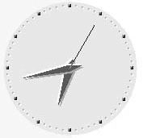
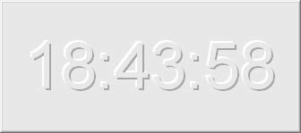
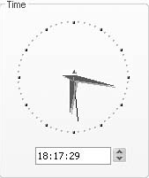
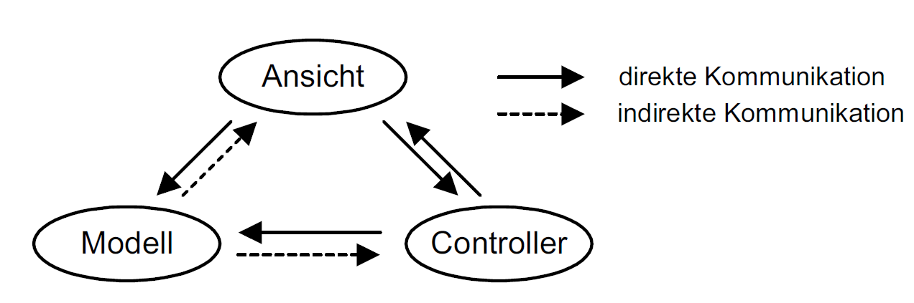
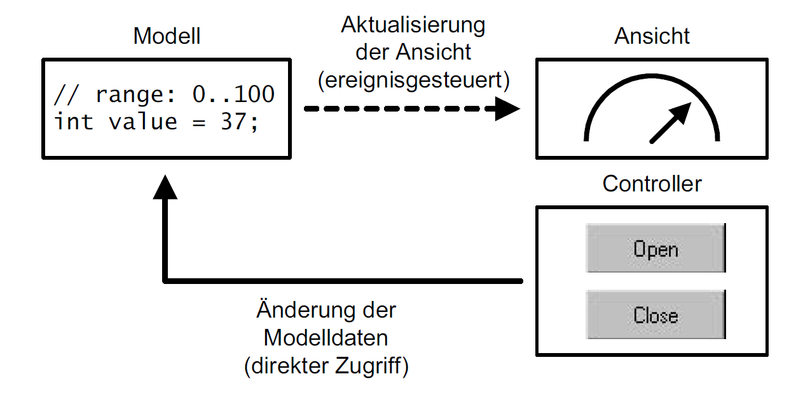

# Model View Controller Paradigma

[Zurück](../../../Resources/Readme_05_Catalog.md)

---

## Historie / Einordnung

Das *Model-View-Controller* Paradigma (kurz: MVC-Paradigma) hat seinen Ursprung in der Smalltalk-Programmierumgebung
und ist eine Richtlinie für die Architektur oberflächenbasierter Steuerelemente. Im
Gegensatz zur Wahrnehmung eines Steuerelements als homogene Einheit besteht eine auf dem MVC-Design
entwickelte Komponente aus den drei Einheiten *Modell*, *Ansicht* und *Controller*. Bestandteil des Entwurfsmusters 
sind auch die Kommunikationswege innerhalb dieser Architektur.

## Wesentliche Merkmale

Nach dem *Model-View-Controller* Paradigma ist eine Komponente in die folgenden drei Bestandteile zu unterteilen:

  * *Modell* (*Model*): Im Modell werden die Daten der Komponente gespeichert und Methoden zum Datenzugriff
bereitgestellt. Es informiert die Ansicht(en) über seinen Zustand und kann Zustandsänderungswünsche
vom Controller oder anderen Objekten ausführen.

  * *Ansicht* (*View*): Die Ansicht stellt einzelne oder alle Daten des Modells grafisch dar. Sie weiß nichts oder
nur sehr wenig über das Datenmodell.

  * *Controller*: Der Controller reagiert auf Benutzereingaben von Maus, Tastatur oder anderen Ereignisquellen
und veranlasst das Modell zu einer Änderung seiner Zustandsdaten.

Ein *Modell* ist ausschließlich für die Daten eines Steuerelements verantwortlich und stellt üblicherweise
Methoden bereit, die auf die Daten lesend und schreibend zugreifen können. Ein auf der MVC-Architektur
basierendes Uhr-Steuerelement würde beispielsweise die aktuelle Tageszeit (Stunde, Minute, Sekunde) in
geeigneten Variablen ablegen und Methoden für den Zugriff anbieten.

Eine *Ansicht* ist eine grafische Visualisierung des Modells. Um wieder beim Beispiel der Uhr zu bleiben: Zur
Darstellung der Uhrzeit könnte ein Steuerelement mit GDI-Hilfsmitteln das Ziffernblatt einer Uhr mit Stunden-
und Minutenzeiger visualisieren, siehe *Abbildung* 1. Bei anderen Modellen ist es vorstellbar, dass auf
Grund der Komplexität des Modells nur eine Teilmenge der Daten zur Ansicht gelangt.

*Abbildung* 1: Grafische Ansicht einer Uhrzeit.

Der Datentransfer vom Modell in Richtung Ansicht ist ausschließlich ereignisgesteuerter Natur: Tritt im
Modell eine Änderung der Daten ein, so ist dieses dafür verantwortlich, ein Ereignis an alle registrierten
Ansichten zu senden. Die Ansichten sind damit von der lästigen &ndash; und vor allem auch ineffizienten &ndash; Aufgabe
befreit, sich beim Modell in regelmäßigen Abständen nach Änderungen des Datenbestands erkundigen
zu müssen.

Ein herausragendes Merkmal MVC-basierter Steuerelemente ist ihre Eigenschaft, dass typischerweise mehrere,
zum Teil gänzlich unterschiedliche Ansichten zu einem Modell existieren. Selbst an einem so einfachen
Beispiel wie der Anzeige einer Uhrzeit lässt sich dieses Merkmal demonstrieren: Neben einer grafischen
Ansicht wie der aus *Abbildung* 1 eignet sich auch eine digitale Darstellung (*Abbildung* 2) für die Visualisierung
der Uhrzeit. Das zugrunde liegende Modell der Komponente ist von den unterschiedlichen Darstellungsvarianten
seines Datenbestands völlig entkoppelt, es verwaltet ausschließlich die Daten der aktuellen
Uhrzeit.

*Abbildung* 2: Eine alternative Ansicht für Uhrzeiten.

Ein Controller behandelt Eingaben des Benutzers und wandelt diese in entsprechende Methodenaufrufe für
das Modell um. Am Beispiel der Uhr betrachtet hieße das, dass Tastatur- oder Mausereignisse in einem Steuerelement
zu verarbeiten sind, die entsprechend aufbereitet zu Änderungen am Modell führen. In *Abbildung* 3
erkennen wir beispielsweise ein NumericUpDown-Steuerelement, das auf der Basis einer entsprechenden
Selektion in dem links davon befindlichen Textfeld entweder die Stunden, Minuten oder Sekunden
ändert.

*Abbildung* 3: Ein NumericUpDown-Steuerelement kann als Controller eines Uhrzeit-Steuerelements fungieren.

*Bemerkung*:

Es gibt Steuerelemente, die auf der MVC-Architektur aufsetzen und die für die Ansicht(en) und den (die)
Controller eine gemeinsame Oberfläche besitzen. Betrachten wir dieses Mal das Beispiel eines Editors wie
etwa den Notepad oder auch Microsoft Word: Zum einen wird im Hauptfenster der aktuelle Text des
Modells dargestellt (View-Funktionalität), zum anderen wird im selben Fenster der Text bearbeitet bzw. neu
eingegeben (Controller-Funktionalität). Ansicht und Controller verschmelzen damit zu einer einzigen UIKomponente,
die im MVC-Jargon auch *UI-Delegierte* (*User Interface Delegierte*) genannt wird.

Die strikte Trennung der Einheiten in der MVC-Architektur bringt eine Reihe gewichtiger Vorteile mit sich:

  * Das Modell muss sich nicht um seine grafische Repräsentation kümmern.
  * Es können für ein Modell vielerlei unterschiedliche Ansichten entwickelt werden, die die Informationen
    im Modell auf ihre spezifische Art und Weise darstellen.
  * Das konkrete Aussehen einer Ansicht kann verändert werden, ohne dass am zugrunde liegenden Modell
Anpassungen vorzunehmen sind.
  * Die Trennung des Controllers von der Ansicht ermöglicht die Berücksichtigung unterschiedlichster Eingabegeräte
   (Maus, Tastatur, Anbindung einer Netzwerkschnittstelle oder eines Sensors, usw.).

## Kommunikationswege

In einer MVC-Komponente gibt es zwischen den drei Einheiten Modell, Ansicht und Controller folgende
Kommunikationswege (siehe dazu auch *Abbildung* 4):

  * Modell &rarr; Ansicht: Eine Änderung von Modellzuständen führt zu einer Änderung der Ansicht(en),
    wobei dies durch das Versenden eines Ereignisses ausgelöst wird.
  * Ansicht &rarr; Modell: Zum Aufbau der Ansicht ist es möglich, dass diese direkt auf die Zustandsdaten des
    Modells zugreift &ndash; vorzugsweise nur in der Initialisierungsphase des Steuerelements.
  * Controller &rarr; Modell: Die primäre Aufgabe des Controllers besteht darin, infolge von Benutzereingaben
    die beabsichtigten Änderungen an den Zustandsdaten des Modells vorzunehmen.
  * Modell &rarr; Controller: Als Folge einer Zustandsdatenänderung des Modells kann es sein, dass die Oberfläche
    des Controllers zu ändern ist. Denken Sie beispielsweise an eine Schaltfläche, die in Abhängigkeit
    vom Modell zu aktivieren oder deaktivieren ist.
  * Controller &rarr; Ansicht: Ein Controller darf neben dem Modell auch die Repräsentation einer Ansicht
    beeinflussen, zum Beispiel durch benutzerspezifische Anpassungen wie das Einstellen eines Zeichensatzes
    oder das Setzen der Vorder- und Hintergrundfarbe. Eine Änderung des Modellzustands ist hier konzeptionell
    nicht vorgesehen.
  * Ansicht &rarr; Controller: In Abhängigkeit vom Zustand der Ansicht ist es denkbar, dass die Oberfläche des Controllers ebenfalls anzupassen ist.

*Abbildung* 4: Die Kommunikationswege im MVC-Modell können direkt oder indirekt (ereignisgesteuert) erfolgen.

## Eine Ventilsteuerung mit MVC-Architektur

Lassen Sie uns das Model-View-Controller Paradigma am Beispiel eines Ventils betrachten (siehe dazu auch
*Abbildung* 5). Ein Ventil, so wie wir es beispielsweise im Maschinenbau vorfinden, kann als Zustand entweder
&bdquo;offen&rdquo;, &bdquo;geschlossen&rdquo; oder möglicherweise auch &bdquo;zu einem gewissen Grad geöffnet&rdquo; besitzen. Neben
diesem (passiven) Verhalten ist es auch möglich, aktiv über das Auslösen von Funktionen den Zustand des
Modells zu beeinflussen, das Ventil kann (teilweise) geöffnet oder (teilweise) geschlossen werden

*Abbildung* 5: Ein Ventil unter dem Aspekt des Model-View-Controller Paradigmas betrachtet.

---

#### Conceptual Example:

[Quellcode](../ConceptualExample.cpp) &ndash; Umsetzung des Ventilsteuerungs-Beispiels

---

[Zurück](../../../Resources/Readme_05_Catalog.md)

---
