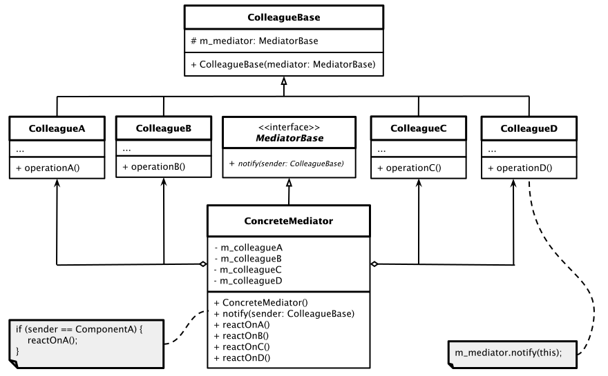

# Mediator Pattern

[Zurück](../../../Resources/Readme_05_Catalog.md)

---


<sup>(Credits: [Blog von Vishal Chovatiya](https://vishalchovatiya.com/pages/start-here/))</sup>

---

## Wesentliche Merkmale

#### Kategorie: *Behavioral Pattern*

#### Ziel / Absicht:

###### In einem Satz:

> &bdquo;Das Mediator Pattern kapselt die Kommunikation zwischen mehreren Objekten in einem zentralen Vermittler, sodass die Objekte nicht direkt voneinander abhängen müssen.&rdquo;

In objektorientierten Systemen entstehen mit der Zeit oft viele Objekte, die stark miteinander verflochten sind,
weil jedes Objekt direkt mit mehreren anderen kommuniziert.
Diese Vielzahl an Punkt-zu-Punkt-Verbindungen führt zu einem engen Kopplungsgrad, der Code schwer wartbar und erweiterbar macht &ndash; jede
Änderung an einem Objekt kann Auswirkungen auf viele andere haben.

Das *Mediator Pattern* löst dieses Problem, indem es die gesamte Kommunikationslogik in ein zentrales *Mediator*-Objekt auslagert.
Die beteiligten Objekte (in C++ oft als &bdquo;Colleague&rdquo;-Klassen umgesetzt) kennen fortan nur noch den Mediator, nicht mehr einander.

Möchte ein Colleague-Objekt mit einem anderen interagieren, informiert es stattdessen den Mediator,
der die Anfrage an die passenden Empfänger weiterleitet oder entsprechend reagiert.

Dadurch wird aus einem dichten Netz von Abhängigkeiten ein übersichtlicher Stern, in dessen Zentrum der Mediator steht.

Das erleichtert nicht nur das Verständnis und die Wartung des Systems, sondern auch die Wiederverwendung einzelner Colleague-Klassen,
da diese nicht mehr an konkrete andere Klassen gebunden sind.

Ein bekanntes Alltagsbeispiel ist ein Fluglotse (Mediator), der die Kommunikation zwischen Flugzeugen (Colleagues) koordiniert,
statt dass jedes Flugzeug direkt mit jedem anderen kommuniziert.

Fazit: Der zentrale Punkt des Patterns ist es, weniger direkte Abhängigkeiten zwischen Objekten zu haben.

#### Struktur (UML):

Das folgende UML-Diagramm beschreibt eine Implementierung des *Mediator Patterns*.
Es besteht im Wesentlichen aus vier Teilen:

  * **ColleagueBase**: Abstrakte Klasse (oder Schnittstelle) für alle konkreten Komponenten, auch im Jargon dieses Musters als "*Kollegen*" bezeichnet.
   *Kollegen* sind Klassen, die Geschäftslogik enthalten. Jede Komponente hat einen geschützten (`protected`) Verweis auf einen Mediator,
   der mit dem Typ der Mediatorschnittstelle deklariert ist (`MediatorBase`).
   Der *Kollege* kennt folglich die tatsächliche Klasse des Mediators nicht.
   Sie können die Komponente (Kollege) daher in anderen Programmen wiederverwenden,
   indem Sie sie mit einem anderen Mediator verknüpfen.
  * **ConcreteColleague**: Eine Implementierung der `ColleagueBase`-Klasse. Konkrete Kollegen sind Klassen,
   die miteinander kommunizieren. *Kollegen*
   sollten keine anderen Komponenten kennen. Wenn innerhalb oder mit einer Komponente etwas Wichtiges passiert,
   muss diese nur den Mediator benachrichtigen.
   Wenn der Mediator die Benachrichtigung erhält, kann er den Absender leicht identifizieren, 
   was ausreichend sein sollte,
   um zu entscheiden, welche Komponente(n) im Gegenzug zu aktivieren ist (sind) &ndash; Aufruf einer Methode.
  * **MediatorBase**: Abstrakte Klasse (Schnittstelle) für das `Mediator`-Objekt.
   Diese Klasse enthält Methoden, die von Kollegen verwendet werden können.
   Die Mediator-Schnittstelle deklariert Kommunikationsmethoden für Komponenten,
   in der Regel sind dies nur wenige Benachrichtigungsmethoden.
   Komponenten können jeden Kontext als Argument dieser Methode übergeben,
   einschließlich eines Verweises auf sich selbst (`this`),
   jedoch ist dabei zu beachten, dass keine Kopplung zwischen einer empfangenden Komponente und der Klasse des Absenders entsteht.
  * **ConcreateMediator**: Implementierung der Methoden der `MediatorBase`-Klasse.
   Diese Klasse enthält Verweise auf alle Kollegen, die miteinander kommunizieren wollen.
   Konkrete Mediatoren kapseln die Beziehungen zwischen verschiedenen Kollegen.



*Abbildung* 1: Schematische Darstellung des *Mediator Patterns*.

---

#### Conceptual Example:

*Hinweis*:

Das *Conceptual Example* liegt in drei Varianten vor:

  * Variante 1: Modern C++, mit `std::shared_ptr` Objekten und `std::enable_shared_from_this<>` Mechanismus.
  * Variante 2: Prinzipiell wie Variante 1, nur: Die Entscheidung, welche empfangende Komponente
    aufzurufen ist, wird dieses Mal über das Absenderobjekt getroffen (und nicht über eine Parameterkennung).

[Quellcode 1](../ConceptualExample01.cpp)<br />
[Quellcode 2](../ConceptualExample02.cpp)

---

#### &bdquo;Real-World&rdquo; Example:

Wir betrachten als reale Anwendung dieses Entwurfsmusters die (triviale) Realisierung eines Chatraums.

Die zentrale Komponente &ndash; also der *Mediator* &ndash; ist in diesem Beispiel
eine Instanz der Klasse `ChatRoom`.
Jede Person im Chatraum hat eine Referenz oder einen Verweis auf dieses Objekt (hier: `std::weak_ptr<ChatRoomBase>`).
Daher kommunizieren sie alle ausschließlich über diesen Knotenpunkt und damit eben nicht direkt.

Die Clients haben keine direkten Referenzen voneinander.

Sie können aber trotzdem Nachrichten an einen bestimmten Client senden,
wie die Methode `postMessage` demonstriert.
In diesem Fall wird der Name einer Person als eine Art von Schlüssel für die eigentliche Nachrichtenübermittlung verwendet.
Der Chatraum ist der eigentliche Vermittler, er kümmert sich um die Details der Nachrichtenzustellung.

##### Zuordnung der Klassen:

  * Klasse `ChatRoomBase` &ndash; Klasse `MediatorBase` 
  * Klasse `PersonBase` &ndash; Klasse `ColleagueBase` 
  * Klasse `Person` &ndash; Klasse `ConcreteColleague` 
  * Klasse `ChatRoom` &ndash; Klasse `ConcreteMediator` 

[ChatRoom](../ChatRoom.cpp) &ndash; Anwendungsfall zum *Mediator* Pattern.

*Hinweis*: In der Realisierung des Chatraums sind zwei Implementierungsdetails zu beachten:

  * Einsatz von Klasse `std::weak_ptr`
  * `std::enable_shared_from_this<ChatRoom>` und `shared_from_this()`

*Ausgabe*:

```
[John's chat session] my_room: "John joins the chat"
[John's chat session] my_room: "Jane joins the chat"
[Jane's chat session] my_room: "Jane joins the chat"
[Jane's chat session] John: "Hi anybody ..."
[John's chat session] Jane: "Oh, hello John"
[John's chat session] my_room: "Simon joins the chat"
[Jane's chat session] my_room: "Simon joins the chat"
[Simon's chat session] my_room: "Simon joins the chat"
[John's chat session] Simon: "Hi everyone!"
[Jane's chat session] Simon: "Hi everyone!"
[Simon's chat session] Jane: "Glad you found us, simon!"
```

---

## FAQs

*Frage*: *Mediator*- versus *Observer*-Pattern?

  * *Mediator*-Pattern &ndash; Many-to-many Relationship.

  * *Observer*-Pattern &ndash; One-to-many Relationship.

---

## Literaturhinweise

Die Anregungen zum konzeptionellen Beispiel finden Sie unter

[https://refactoring.guru/design-patterns](https://refactoring.guru/design-patterns/mediator/cpp/example#lang-features)

und

[https://www.codeproject.com](https://www.codeproject.com/Articles/455228/Design-Patterns-3-of-3-Behavioral-Design-Patterns#Mediator)

vor.

Das *Real*-*World*-Beispiel kann [hier](https://vishalchovatiya.com/posts//mediator-design-pattern-in-modern-cpp/) im Original nachgelesen werden.

---

[Zurück](../../../Resources/Readme_05_Catalog.md)

---
