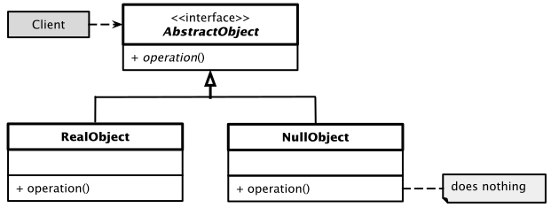

# *Null Object* Entwurfsmuster

## Wesentliche Merkmale

Das *Null Object Pattern* ist ein Entwurfsmuster, das sich der Thematik von Null-Referenzen annimmt.
Null-Referenzen gibt es in anderen Programmiersprachen sehr wohl, in C++ sind sie per Definition nicht existent.
Wir sprechen daher besser von so genannten *Null*-Objekten, also Objekten, die keinerlei Funktionalität haben.

Der Sinn des Musters besteht darin, einer Referenz ein Objekt zuzuweisen, das keine Aktionen ausführt.
Dadurch wird erreicht, dass die Referenz zu jedem Zeitpunkt auf ein gültiges Objekt verweist,
was Behandlungen von Sonderfällen (das Nichtvorhandensein) erübrigt.

#### Kategorie: *Behavioural Pattern*

#### Ziel / Absicht:

Objekte ohne Funktionalität stellen natürlich einen Sonderfall dar.
Sie können Sinn ergeben, wenn reale Daten - zum Beispiel in einem Testszenario - nicht verfügbar sind,
man aber das Standardverhalten der Software trotzdem bereitstellen möchte.
Das Null-Objekt spiegelt folglich eine "*Do-Nothing*"-Beziehung wieder.

#### Problem:

Das *Null Object* Entwurfsmuster befreit uns von der Pflicht, zur Laufzeit Abfragen bzgl. gewisser Zustände vornehmen zu müssen.
Überall im Quellcode, wo Überprüfungen auf Nullwerte erforderlich wären (was in C++ bei Referenzen ohnehin nicht möglich ist),
kommen Nullobjektklassen zum Einsatz.

#### Lösung:

Im *Null Object* Entwurfsmuster erstellen wir zunächst eine abstrakte Klasse,
die die verschiedenen auszuführenden Operationen definiert.

Davon leiten wir reale Klassen ab, die die eigentliche Funktionalität implementieren und schließlich eine Null-Objekt Klasse,
die *keine* Implementierung der Basisklasse bereitstellt. Um es anderes zu formulieren: Streng genommen stellt auch die
Null-Objekt Klasse eine Implementierung der Basisklasse dar, aber eben mit leeren Methodenrümpfen.

Nun kann man die Null-Objekt Klasse überall dort einsetzen, wo aus welchen Gründen auch immer,
eine Klasse mit einer realen
Realisierung (temporär) nicht anwendbar ist.

##### *Hinweis*: Abgrenzung von *Null*-Objekten zu *Mock*-Objekten

*Null*-Objekte sind nicht mit *Mock*-Objekten zu verwechseln bzw. gleichzusetzen.
Ein *Mock*-Objekt (auch als *Attrappe* bezeichnet, von englisch *to mock*: etwas vortäuschen)
ist in der Softwareentwicklung ein Objekt,
das zur Durchführung von Modultests als Platzhalter für echte Objekte verwendet wird.

Es ist nicht immer möglich oder erwünscht, ein einzelnes Objekt vollkommen isoliert zu testen.
Soll die Interaktion eines Objektes mit seiner Umgebung überprüft werden,
muss vor dem eigentlichen Test die Umgebung nachgebildet werden.
Das kann umständlich, zeitaufwändig oder teilweise auch nur eingeschränkt
oder eigentlich überhaupt nicht möglich sein.

In diesen Fällen helfen *Mock*-Objekte.
*Mock*-Objekte implementieren die Schnittstellen, über die das zu testende Objekt auf seine Umgebung zugreift.
Sie stellen sicher, dass die erwarteten Methodenaufrufe vollständig, mit den korrekten Parametern und in der erwarteten Reihenfolge durchgeführt werden.
Das *Mock*-Objekt liefert keine Echtdaten zurück, sondern vorher zum Testfall passend festgelegte Werte.
Das *Mock*-Objekt kann somit dazu verwendet werden, ein bestimmtes Verhalten nachzustellen.
Im Gegensatz zu *Null*-Objekten, die keinerlei Implementierung besitzen,
weisen *Mock*-Objekte eine Implementierung auf, die das Ziel besitzt,
dass sich das *Mock*-Objekt quasi täuschend echt im Vergleich zum eigentlichen realen Objekt verhält.

#### Struktur (UML):

Abbildung 1: Schematische Darstellung des *Null Object* Entwurfsmusters.

#### Conceptual Example:

[Quellcode](../ConceptualExample.cpp)

## Literaturhinweise:1

Die Anregungen zu den Beispielen zum *Null Object Pattern* stammen aus

[Null Object Design Pattern in C++](https://iq.opengenus.org/null-object-design-pattern-cpp/) (abgerufen am 15.05.2020).

und

[Dmitri Nesteruk "Design Patterns in Modern C++](https://github.com/Apress/design-patterns-in-modern-cpp) (abgerufen am 14.05.2020).

---

[Zurück](../../../Resources/Readme_05_Catalog.md)

---
