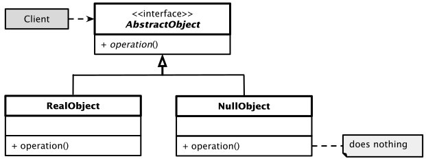

# *Null Object* Entwurfsmuster

[Zurück](../../../Resources/Readme_05_Catalog.md)

---

## Wesentliche Merkmale

#### Kategorie: *Behavioral Pattern*

#### Ziel / Absicht:

###### In einem Satz:

> &bdquo;Das Null Object Pattern ersetzt ein fehlendes oder nicht benötigtes Objekt durch ein spezielles, funktionsloses Objekt, sodass auf nullptr-Prüfungen und Sonderbehandlungen verzichtet werden kann.&rdquo;

Das *Null Object Pattern* ist ein Entwurfsmuster, bei dem anstelle eines fehlenden Objekts ein spezielles &bdquo;Null-Objekt&rdquo; verwendet wird.
Dieses Objekt implementiert dieselbe Schnittstelle wie ein reguläres Objekt, führt bei seinen Operationen jedoch bewusst keine
oder eine neutrale Aktion aus. Dadurch kann der aufrufende Code mit dem Objekt arbeiten, ohne zunächst prüfen zu müssen,
ob überhaupt ein konkretes Objekt vorhanden ist.

Insbesondere lassen sich dadurch zahlreiche `nullptr`-Prüfungen und damit verbundene Sonderfälle vermeiden.

Das Null-Objekt kapselt die Behandlung des &bdquo;Nichts-tun&rdquo;-Falls und hält diese damit aus dem eigentlichen Anwendungscode heraus.
Der Client kann dadurch einheitlich mit regulären und &bdquo;leeren&rdquo; Objekten umgehen.

Das Pattern eignet sich insbesondere dann, wenn das Fehlen eines Objekts einen definierten, harmlosen Standardfall darstellt.

In C++ basiert das Muster meist auf einer gemeinsamen abstrakten Basisklasse oder Schnittstelle,
von der sowohl die &bdquo;echten&rdquo; Klassen als auch das Null-Objekt erben.
Aufrufender Code kann so einheitlich mit dem Objekt arbeiten, unabhängig davon, ob es sich um eine reale Instanz oder das Null-Objekt handelt.

In C++ lässt sich dies zum Beispiel über eine abstrakte Klasse mit virtuellen Methoden realisieren,
wobei die Null-Objekt-Klasse diese Methoden mit leerem oder neutralem Verhalten überschreibt.

Der wesentliche Vorteil liegt in der Reduktion von Fallunterscheidungen und in saubererem, robusterem Code,
da *NullPointerException*-artige Fehler (bzw. Undefined Behavior durch Dereferenzierung eines Nullzeigers)
von vornherein vermieden werden.

Ein Nachteil kann sein, dass fehlerhafte oder unerwartete Zustände dadurch stillschweigend &bdquo;verschluckt&rdquo; werden,
statt frühzeitig aufzufallen &ndash; hier ist Abwägung gefragt, je nach Anwendungsfall.

##### *Hinweis*: Abgrenzung von *Null*-Objekten zu *Mock*-Objekten

*Null*-Objekte sind nicht mit *Mock*-Objekten zu verwechseln bzw. gleichzusetzen.
Ein *Mock*-Objekt (auch als *Attrappe* bezeichnet, von englisch *to mock*: etwas vortäuschen)
ist in der Softwareentwicklung ein Objekt,
das zur Durchführung von Modultests als Platzhalter für echte Objekte verwendet wird.

Es ist nicht immer möglich oder erwünscht, ein einzelnes Objekt vollkommen isoliert zu testen.
Soll die Interaktion eines Objektes mit seiner Umgebung überprüft werden,
muss vor dem eigentlichen Test die Umgebung nachgebildet werden.
Das kann umständlich, zeitaufwändig oder teilweise auch nur eingeschränkt
oder eigentlich überhaupt nicht möglich sein.

In diesen Fällen helfen *Mock*-Objekte.
*Mock*-Objekte implementieren die Schnittstellen, über die das zu testende Objekt auf seine Umgebung zugreift.
Sie stellen sicher, dass die erwarteten Methodenaufrufe vollständig, mit den korrekten Parametern und in der erwarteten Reihenfolge durchgeführt werden.
Das *Mock*-Objekt liefert keine Echtdaten zurück, sondern vorher zum Testfall passend festgelegte Werte.
Das *Mock*-Objekt kann somit dazu verwendet werden, ein bestimmtes Verhalten nachzustellen.
Im Gegensatz zu *Null*-Objekten, die keinerlei Implementierung besitzen,
weisen *Mock*-Objekte eine Implementierung auf, die das Ziel besitzt,
dass sich das *Mock*-Objekt quasi täuschend echt im Vergleich zum eigentlichen realen Objekt verhält.

#### Struktur (UML):

*Abbildung* 1: Schematische Darstellung des *Null Object* Entwurfsmusters.

---

#### Conceptual Example:

[Quellcode](../ConceptualExample.cpp)

---

## Literaturhinweise:

Die Anregungen zu den Beispielen zum *Null Object Pattern* stammen aus

[Null Object Design Pattern in C++](https://iq.opengenus.org/null-object-design-pattern-cpp/) (abgerufen am 15.05.2020).

und

[Dmitri Nesteruk "Design Patterns in Modern C++](https://github.com/Apress/design-patterns-in-modern-cpp) (abgerufen am 14.05.2020).

---

[Zurück](../../../Resources/Readme_05_Catalog.md)

---
