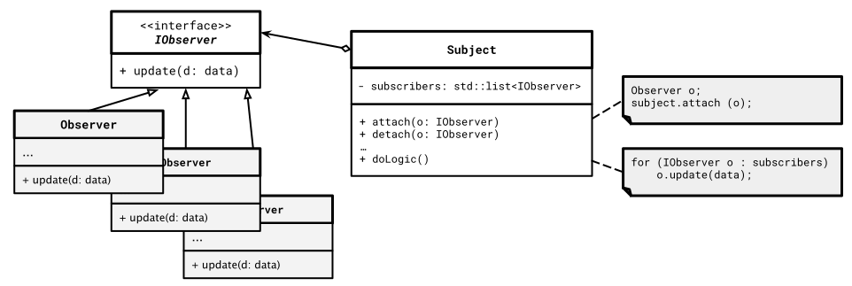

# Observer Pattern

[Zurück](../../../Resources/Readme_05_Catalog.md)

---


<sup>(Credits: [Blog von Vishal Chovatiya](https://vishalchovatiya.com/pages/start-here/))</sup>

---

## Wesentliche Merkmale

#### Kategorie: *Behavioral Pattern*

#### Ziel / Absicht:

###### In einem Satz:

&bdquo;Um Benachrichtigungen zu erhalten, wenn Ereignisse eintreten.&rdquo;

Das *Observer Pattern* ist ein Entwurfsmuster aus der Kategorie der *Behavioral Pattern*,
mit dem Sie einen Mechanismus für Benachrichtigungen definieren,
um Objekte über Ereignisse zu informieren, die in einem beobachteten Objekt auftreten.

#### Problem:

Betrachten wir als Szenario ein Beispiel mit zwei Arten von Objekten:
mehrere Kunden und ein Geschäft. Der Kunde ist an einem bestimmten Produkt interessiert,
das bald erhältlich sein soll.

Der Kunde kann das Geschäft jeden Tag aufsuchen oder die entsprechende WebSite konsultieren,
um die Verfügbarkeit des Produkts zu überprüfen.
Solange das Produkt aber noch gefertigt wird oder sich auf dem Versand zum Geschäft befindet,
sind all diese Nachfragen sinnlos.

Auf der anderen Seite könnte der Laden genau dann, wenn das Produkt abholbereit ist,
dem oder den interessierten Kunden eine Nachricht zukommen lassen. Auf diese Weise
ist die Information über die Verfügbarkeit am effizientesten gegeben.


#### Lösung:

Das Objekt, das den bereitzustellenden Status besitzt, wird häufig als &bdquo;*Subject*&rdquo; oder auch
&bdquo;*Publisher*&rdquo; bezeichnet. Diejenigen Objekte, die die Änderungen am Status des *Publishers* verfolgen,
werden als &bdquo;*Subscriber*&rdquo; oder auch &bdquo;*Observer*&rdquo; bezeichnet. Das Pendant eines &bdquo;*Observers*&rdquo;
kann man auch als &bdquo;*Observable*&rdquo; bezeichnen.

Das *Observer Pattern* sieht vor, dass das &bdquo;*Subject*&rdquo; einen Benachrichtigungsmechanismus der Gestalt aufweist, 
dass einzelne Objekte (*Subscriber*) sich für das Benachrichtigen von Ereignissen
an- und abmelden können.

Typischerweise lässt sich diese Funktionalität mit einer Liste (`std::list` oder ähnliches)
zum Speichern von Verweisen auf *Subscriber*-Objekte realisieren.
Dazu gehören dann meist zwei Methoden (zum Beispiel `register` und `unregister`, `add` und `remove` oder `attach` und `detach`),
um *Subscriber* zu dieser Liste hinzuzufügen und aus dieser wieder zu entfernen.


#### Struktur (UML):


*Abbildung* 1: Schematische Darstellung des *Observer Pattern Musters*: An- und Abmelden.


*Abbildung* 2: Schematische Darstellung des *Observer Pattern Musters*: Benachrichtigungen.



*Abbildung* 3: Schematische Darstellung des *Observer Pattern Musters*: Abstraktion des Observers mittels Schnittstelle `IObserver`. 

---

#### Conceptual Example:

Das *Conceptual Example* liegt in drei Varianten vor:

  * Variante 1: klassisch - d.h. mit &bdquo;raw&rdquo;-Zeigern.
  * Variante 2: Mit `std::shared_ptr`- und `std::weak_ptr`-Objekten.
  * Variante 3: Wie Variante 2, aber mit `std::enable_shared_from_this<>` Mechanismus.
  * Variante 4: Mit `std::function<>`.


[Quellcode 1](../ConceptualExample01.cpp)<br />
[Quellcode 2](../ConceptualExample02.cpp)<br />
[Quellcode 3](../ConceptualExample03.cpp)<br />
[Quellcode 4](../ConceptualExample04.cpp)

---

#### Realisierung mit Smart-Pointern

Im &bdquo;*Subject*&rdquo; ist &ndash; wie beschrieben &ndash; eine Liste mit
den *Beobachtern* zu verwalten. Hier sollte man beachten,
dass eine Liste mit `std::weak_ptr`-Zeigern die bessere Wahl
im Vergleich zu `std::shared_ptr`-Objekten ist.

---

#### `std::weak_ptr`-Objekte in einem `std::list`-Container

Verwaltet man `std::weak_ptr`-Objekte in einem `std::list`-Container,
kann es zu extrem unverständlichen Übersetzungsfehlern kommen,
zum Beispiel, wenn man ein `std::weak_ptr`-Objekt aus der Liste entfernen möchte
(Aufruf von `remove`):

```
binary '==': 'const _Ty' does not define this operator or a conversion to a type acceptable to the predefined operator
```

Die Ursache des Fehlers liegt darin begründet,
dass der `==`-Operator für `std::weak_ptr`-Objekte nicht vorhanden ist.

Eine Lösung des Problems besteht darin, von der `remove`- zur  `remove_if`-Methode
zu wechseln und eine geeignete Lambda-Funktion zu realisieren,
zum Beispiel so:

```cpp
void detach(std::weak_ptr<IObserver> observer) override {
    m_list_observers.remove_if([&](std::weak_ptr<IObserver> wp) {
        return !observer.owner_before(wp) && !wp.owner_before(observer);
        }
    );
}
```

Die Klasse `std::weak_ptr` besitzt eine `owner_before` Methode,
die eine Eigentümer-basierte Reihenfolge von `std::weak_ptr`-Zeigern implementiert.

Eine detailliertere Beschreibung kann man unter
&bdquo;[Removing item from list of weak_ptrs](https://stackoverflow.com/questions/10120623/removing-item-from-list-of-weak-ptrs) &rdquo;
nachlesen.

---

Die Anregung zum konzeptionellen Beispiel finden Sie unter

[https://refactoring.guru/design-patterns](https://refactoring.guru/design-patterns/observer/cpp/example#example-0)

vor.

---

**Hinweis** zu `shared_from_this`:

In Variante 2 wird prinzipiell ohne &bdquo;raw&rdquo;-Zeiger gearbeitet, also so,
wie man es der &bdquo;reinen Lehre&rdquo; nach machen sollte. Dabei stellt sich aber eine Frage:
Wie erhalte ich von einem Objekt einen `std::shared_ptr`, desses Objekterzeugung
außerhalb meines Wirkungskreises liegt. Die Frage lautet also gewissermaßen:

```cpp
std::shared_ptr<IObserver> me = this;
```

Das geht so nicht, wie zu erwarten war. Es gibt aber den folgenden Weg:

```cpp
class Observer : public IObserver, public std::enable_shared_from_this<Observer> {
    ...
}
```

Die Klasse `Observer` leitet sich von einer Standard-Klasse `std::enable_shared_from_this<>` ab,
die genau zu diesem Zweck realisiert wurde.
Damit vererbt sie eine Methode `shared_from_this` an die Kindklasse.
Auf diese Weise kann man dann beispielsweise eine Methode `removeMeFromTheList`
wie folgt implementieren:

```cpp
void removeMeFromTheList() {
    std::shared_ptr<Observer> me = shared_from_this();
    m_subject->detach(me);
    std::cout << "Observer \"" << m_number << "\" removed from the list.";
}
```

**Achtung**: Der Aufruf `shared_from_this` ist aber nur dann zulässig,
wenn es von dem Objekt (hier: Klasse `Observer`) bereits einen Shared Pointer gibt!
Das muss nicht immer der Fall sein!
Deshalb ist in der vorliegenden Fallstudie zumindest eine Methode im Stile von `removeMeFromTheList` realisierbar,
aber nicht ein entsprechendes Gegenstück zum Anmelden. Weitere Details der Realisierung
entnehmen Sie bitte der dritten Variante des *Conceptual Example*.

---

[Zurück](../../../Resources/Readme_05_Catalog.md)

---
