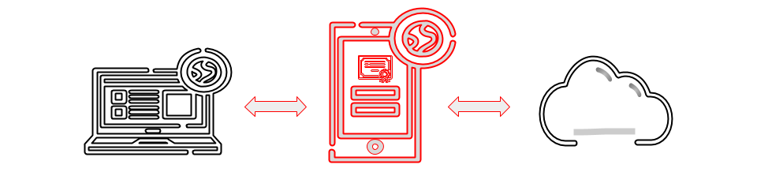

# Proxy Pattern

[Zurück](../../../Resources/Readme_05_Catalog.md)

---



<sup>(Credits: [Blog von Vishal Chovatiya](https://vishalchovatiya.com/pages/start-here/))</sup>

---

## Wesentliche Merkmale

#### Kategorie: *Structural Pattern*

#### Ziel / Absicht:

###### In einem Satz:

&bdquo;Bereitstellung eines Platzhalters (Stellvertreters) für ein anderes Objekt.&rdquo;

Das *Proxy Pattern* ist ein strukturelles Entwurfsmuster,
das für ein anderes Objekt (Ressource) eine Art Ersatz oder Platzhalter bereitstellt.

#### Problem:

Ein Proxy-Objekt kann zum Beispiel dann verwendet werden,
wenn aus bestimmten Gründen nicht direkt auf die Ressource zugegriffen werden kann
oder wenn nicht alle Methoden des ursprünglichen Objekts offen gelegt werden sollen.
Es ist auch denkbar, dass ein Proxy-Objekt dem ursprünglichen Objekt
zusätzliche Funktionen hinzufügt.
Die Verwendung von Proxys ist hilfreich, wenn die Ressource schwer zu instanziieren
oder sehr ressourcensensitiv ist (Beispiel: XML-Parser).

#### Struktur (UML):

Das folgende UML-Diagramm beschreibt eine Implementierung des *Proxy Patterns*.
Es besteht im Wesentlichen aus drei Teilen:

  * **SubjectBase**: Schnittstelle (oder abstrakte Klasse), die von der `RealSubject`-Klasse implementiert wird und deren Dienste in Form
    von abstrakten (virtuellen) Methoden beschreibt. Die Schnittstelle muss auch von der Proxy-Klasse implementiert werden,
    so dass das Proxy-Objekt überall dort verwendet werden kann,
    wo das `RealSubject`-Objekt sonst in Erscheinung treten würde.
  * **RealSubject**: Repräsentiert eine aus welchen Gründen auch schwer zugängliche oder ressourcensensitive Klasse,
    die man einfacher oder effektiver verwenden möchte.
  * **Proxy**: Dreh- und Angelpunkt dieses Entwurfsmusters: Es kapselt eine Referenz (Zeiger) auf das `RealSubject`-Objekt.
    Die Client-Anwendung ruft Methoden an der `Proxy`-Klasse auf,
    die an entsprechende Methoden des `RealSubject`-Objekts transferiert werden.


*Abbildung* 1: Schematische Darstellung des *Proxy Patterns*.

---

#### Conceptual Example:

[Quellcode](../ConceptualExample.cpp)

---

#### &bdquo;Real-World&rdquo; Beispiel: `std::unique_ptr<>` und `std::shared_ptr<>`

Ein sehr ansprechendes Beispiel aus der STL für das Proxy Design Pattern
sind die beiden Smart Pointer Klassen `std::unique_ptr<>` und `std::shared_ptr<>`:

```cpp
std::unique_ptr<int> ptr{ std::make_unique<int>(123) };
*ptr = 5; 
```

oder

```cpp
std::unique_ptr<MyClass> ptr{ std::make_unique<MyClass>() };
ptr->doSomething();
```

Wenn wir die beiden Code-Snippets sehen, können wir nicht entscheiden,
ob `ptr` ein Raw-Zeiger oder ein Smart Pointer ist.

---

#### &bdquo;Real-World&rdquo; Beispiel: Property Proxy

In anderen Programmiersprachen wie C# gibt es das sprachliche Konstrukt der *Properties*:
Hierunter versteht man &ndash; in C# &ndash; eine private Instanzvariable
inklusive *getter*- und *setter*-Methode für diese Variable. 

```cpp
01: template<typename T>
02: class Property
03: {
04: private:
05:     T m_value;
06: 
07: public:
08:     Property(const T initialValue) { *this = initialValue; }
09:     operator T() { return m_value; }
10:     T operator= (T newValue) { return m_value = newValue; }
11: };
12: 
13: struct Rectangle
14: {
15:     Property<size_t> m_top{ 10 };
16:     Property<size_t> m_left{ 5 };
17:     Property<size_t> m_width{ 20 };
18:     Property<size_t> m_height{ 30 };
19: };
```

Der Vorteil dieser *Properties* &ndash; samt der vorgestellten Realisierung in C++ &ndash; liegt
darin, dass man auf diese Weise 
den (schreibenden und/oder lesenden) Zugriff auf derartige Instanzvariable &bdquo;abfangen&rdquo; bzw. &bdquo;mitloggen&rdquo; kann.

---

#### &bdquo;Real-World&rdquo; Beispiel: Virtual Proxy &ndash; Eager vs. Lazy Proxy

Ein sogenanntes virtuelles *Proxy*-Objekt vermittelt den Anschein,
als würden Sie mit einem Objekt arbeiten, so wie Sie es gewohnt sind,
obwohl das Objekt möglicherweise noch nicht einmal erstellt wurde.

Studieren Sie zu diesem Zweck den Beispielcode genau:

```cpp
01: struct Image {
02:     virtual void draw() = 0;
03: };
04: 
05: class EagerBitmap : public Image
06: {
07: private:
08:     std::string m_filename;
09: 
10: public:
11:     EagerBitmap(const std::string& filename) : m_filename{ filename } {
12:         std::cout << "loading image from " << m_filename << std::endl;
13:         // steps to load the image ...
14:     }
15: 
16:     void draw() { 
17:         std::cout << "drawing image " << m_filename << std::endl;
18:     }
19: };
20: 
21: class LazyBitmap : public Image
22: {
23: private:
24:     std::unique_ptr<EagerBitmap>   m_bmp{ nullptr };
25:     std::string                    m_filename;
26: 
27: public:
28:     LazyBitmap(const std::string& filename) : m_filename{ filename } {}
29: 
30:     void draw() {
31:         if (! m_bmp) {
32:             m_bmp = std::make_unique<EagerBitmap>(m_filename);
33:         }
34: 
35:         m_bmp->draw();
36:     }
37: };
```

Es gibt dabei zwei Varianten zu betrachten: Klasse `EagerBitmap` und Klasse `LazyBitmap`.

Vergleichen Sie die Ausgaben in der Konsole:

```
loading image from image_1.png
loading image from image_2.png
drawing image image_1.png
```

versus

```
loading image from image_1.png
drawing image image_1.png
```

---

## Pro / Kontra:

###### Pros:

  * Das zugrunde liegende Objekt ist für den Client vollständig transparent.
  * Der Proxy kann Anfragen direkt beantworten, ohne sich an den Client zu wenden.
  * Der Proxy kann transparent erweitert oder durch einen anderen Proxy ersetzt werden.

###### Kontras:

  * Die Trennung von Proxy-Objekt und Ziel-Objekt trägt nicht zur Vereinfachung des Quellcodes bei.
  * Die weitergeleiteten Proxy-Aufrufe können leistungskritisch sein (Performanz).

---

## FAQs

*Frage*: Unterschied zwischen *Proxy*- und *Decorator*-Pattern?

  * Das *Proxy*-Pattern stellt im Wesentlichen dieselbe oder sogar eine verfeinfachte Schnittstelle dar.

  * Das *Decorator*-Pattern bewirkt eine Verfeinerung in der Ausgestaltung einer Schnittstelle.

---

## Literaturhinweise

Die Anregungen zum konzeptionellen Beispiel finden Sie unter

[https://refactoring.guru/design-patterns](https://refactoring.guru/design-patterns/proxy/cpp/example#example-0)

und 

[https://www.codeproject.com](https://www.codeproject.com/Articles/438922/Design-Patterns-2-of-3-Structural-Design-Patterns#Proxy)

vor.

Die beiden Beispiele &bdquo;Property Proxy&rdquo; und &bdquo;Virtual Proxy&rdquo;
stammen aus dem [Blog von Vishal Chovatiya](https://vishalchovatiya.com/posts//proxy-design-pattern-in-modern-cpp/).

---

[Zurück](../../../Resources/Readme_05_Catalog.md)

---
