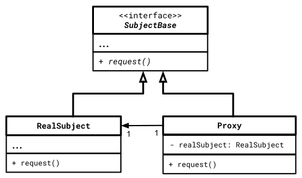

# Proxy Pattern

## Wesentliche Merkmale

#### Kategorie: *Structural Pattern*

#### Ziel / Absicht:

Das *Proxy Pattern* ist ein strukturelles Entwurfsmuster,
das für ein anderes Objekt (Ressource) einen Art Ersatz oder Platzhalter bereitstellt.
Ein Proxy-Objekt kann zum Beispiel dann verwendet werden,
wenn aus bestimmten Gründen nicht direkt auf die Ressource zugegriffen werden kann
oder wenn nicht alle Methoden des ursprünglichen Objekt offen gelegt werden sollen.
Es ist auch denkbar, dass ein Proxy-Objekt dem ursprünglichen Objekt
zusätzliche Funktionen hinzufügt.
Die Verwendung von Proxys ist hilfreich, wenn die Ressource schwer zu instanziieren
oder sehr ressourcensensitiv ist (Beispiel: XML-Parser)

#### Problem:

#### Lösung:

#### Struktur (UML):

Das folgende UML-Diagramm beschreibt eine Implementierung des *Proxy Patterns*.
Es besteht im Wesentlichen aus drei Teilen:

  * **SubjectBase**: Schnittstelle (oder abstrakte Klasse), die von der `RealSubject`-Klasse implementiert wird und deren Dienste in Form
    von abstrakten (virtuellen) Methoden beschreibt. Die Schnittstelle muss auch von der Proxy-Klasse implementiert werden,
    so dass das Proxy-Objekt überall dort verwendet werden kann,
    wo das `RealSubject`-Objekt sonst in Erscheinung treten würde.
  * **RealSubject**: Repräsentiert eine aus welchen Gründen auch schwer zugängliche oder ressourcensensitive Klasse,
    die man einfacher oder effektiver verwenden möchte.
  * **Proxy**: Dreh- und Angelpunkt dieses Entwurfsmusters: Es kapselt eine Referenz (Zeiger) auf das `RealSubject`-Objekt.
    Die Client-Anwendung ruft Methoden an der `Proxy`-Klasse aus,
    die an entsprechende Methoden des `RealSubject`-Objekts transferiert werden.

Abbildung 1: Schematische Darstellung des *Proxy Patterns*.

#### Conceptual Example:

[Quellcode](../ConceptualExample.cpp)

Die Anregungen zum konzeptionellen Beispiel finden Sie unter

[https://refactoring.guru/design-patterns](https://refactoring.guru/design-patterns/proxy/cpp/example#example-0)

und 

[https://www.codeproject.com](https://www.codeproject.com/Articles/438922/Design-Patterns-2-of-3-Structural-Design-Patterns#Proxy)

vor.

---

[Zurück](../../../Resources/Readme_05_Catalog.md)

---
