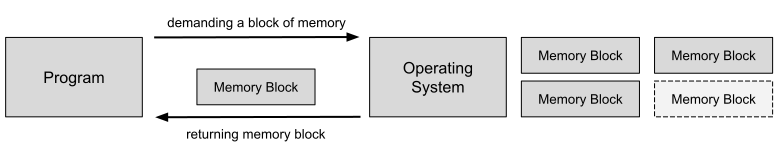
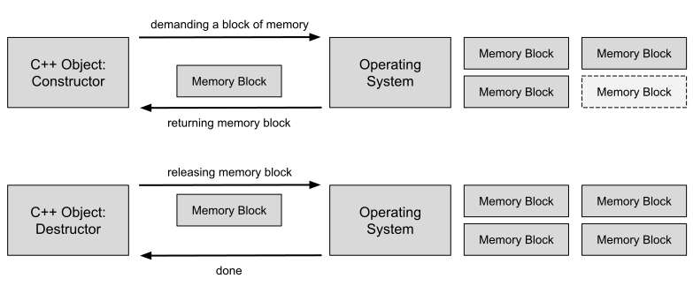

# RAII Idiom

## Wesentliche Merkmale

#### Ziel / Absicht:

**RAII** (*Resource Acquisition Is Initialization*) ist ein Programmieridiom (Paradigma), das auf 
Bjarne Stroustrup und Andrew Koenig zurückzuführen ist. Die Idee ist, eine Ressource
(Speicherbereich auf der Halde (*Heap Memory*), Datei, Socket, Mutex, ...) an ein Objekt zu binden
und den Mechanismus der Objektkonstruktion und -destruktion  (Konstruktor, Destruktor) zu nutzen,
um  Ressourcen in einem Programm automatisch zu verwalten.

#### Prinzip:

Jedes Mal, wenn wir eine Ressource erwerben wollen, tun wir dies, indem wir ein Objekt erstellen,
das diese Ressource besitzt. Wann immer das Objekt den Gültigkeitsbereich verlässt, wird die Ressource
automatisch freigegeben.

#### Lösung:

Wir betrachten das Prinzip einer RAII-verwalteten Ressource an Hand einer Folge von Code-Beispielen:

##### 1. Eine RAII-konforme Klasse:

```cpp
template <typename T>
class RAII {
public:
    explicit RAII(T* p) : m_p(p) {}
    ~RAII() { delete m_p; };

    // grant access to pointer inside RAII object
    T* operator->() { return m_p; }
    const T* operator->() const { return m_p; }
    T& operator&() { return *m_p; }
    const T* operator&() const { return *m_p; }

private:
    T* m_p;
};
```

---

##### 2. Einfache Anwendung eines RAII-Objekts (*Compound-Statement* / *Block*):

```cpp
void test() 
{
    {
        RAII<Dummy> p(new Dummy(1));
    }

    std::cout << "Done." << std::endl;
}
```

###### Ausgabe:

```
c'tor Dummy [1]
d'tor Dummy [1]
Done.
```

---

##### 3. Zugriff auf die Ressource (Überladener `->` und `&` Operator):

```cpp
void test() 
{
    {
        RAII<Dummy> p(new Dummy(2));
        p->sayHello();
        int value = p->getValue();
        std::cout << "Value " << value << " inside Dummy object." << std::endl;

        Dummy& dRef = p.operator&();
        dRef.sayHello();
        value = dRef.getValue();
        std::cout << "Value " << value << " inside Dummy object." << std::endl;
    }

    std::cout << "Done." << std::endl;
}
```

###### Ausgabe:

```
c'tor Dummy [2]
Hello Dummy [2]
Value 2 inside Dummy object.
Hello Dummy [2]
Value 2 inside Dummy object.
d'tor Dummy [2]
Done.
```

---

##### 4. Vorzeitiges Verlassen einer Wiederholungsschleife:

```cpp
void test()
{

    // test RAII idiom upon a loop break
    do {
        RAII<Dummy> p(new Dummy(3));
        break;
    } while (false);

    std::cout << "Done." << std::endl;
}
```

###### Ausgabe:

```
c'tor Dummy [3]
d'tor Dummy [3]
Done.
```

---

##### 5. Verhalten des RAII-Idioms bei Eintreten einer Ausnahme (*Exception*):

```cpp
void test_04()
{

    // test RAII idiom upon exception being thrown
    try {
        RAII<Dummy> p(new Dummy(4));
        throw 99;
    }
    catch (int n) {
        std::cout << "Exception " << n << " occurred!" << std::endl;
    }

    std::cout << "Done." << std::endl;
}
```

###### Ausgabe:

```
c'tor Dummy [4]
d'tor Dummy [4]
Exception 99 occurred!
Done.
```

---

##### 6. Reihenfolge bei der Freigabe mehrere RAII-verwalteter Ressourcen:

```cpp
void test_05() {

    // test RAII idiom with two encapsulated resources:
    // Note order of destructor calls

    RAII<Dummy> p1(new Dummy(1));

    RAII<Dummy> p2(new Dummy(2));

    std::cout << "Done." << std::endl;
}
```

###### Ausgabe:

```
c'tor Dummy [1]
c'tor Dummy [2]
Done.
d'tor Dummy [2]
d'tor Dummy [1]
```

---

##### 7. RAII-verwalteter Ressource als Instanzvariable eines Objekts

```cpp
class RAIIContainer
{
public:
    RAIIContainer(Dummy* p) : m_rp(p) {}

private:
    RAII<Dummy> m_rp;
};

void test_06()
{
    {
        RAIIContainer cont(new Dummy(5));
    }

    std::cout << "Done." << std::endl;
}
```

---

###### Ausgabe:

```
c'tor Dummy [5]
d'tor Dummy [5]
Done.
```

#### Struktur:

Die folgenden beiden Abbildungen beschreiben konzeptionell die Allokation
einer Ressource mit und ohne RAII-Idiom:



Beachten Sie in Abbildung 1: Es ist offen bzw. Pflicht für den Verwender des Speicherbereichs,
diesen nach Gebrauch mit dem `delete`-Operator wieder freizugeben.

Abbildung 1: Klassische Anforderung für einen Speicherbereich.



Abbildung 2: Anforderung eines Speicherbereichs mit dem RAII-Idiom.

In Abbildung 2 können Sie erkennen, dass der Destruktor des RAII-Objekts den allokierten Speicherbereich wieder freigibt.


#### Conceptual Example:

Die Anregung zum konzeptionellen Beispiel sind teilweise entnommen aus

[Design Patterns with C++](https://www.amazon.de/-/en/Fedor-G-Pikus/dp/1788832566)


#### 'Real-World' Example:

In der Datei *RAII_Ofstream.cpp* finden Sie eine Funktion `writeToFile` vor,
die das RAII-Idiom verwendet.

Es ist zu beachten, dass der Standard-C++-Klasse `std::ofstream` dieser Mechanismus ebenfalls zu Grunde liegt.
Diese Eigenschaft ist in der offiziellen Dokumentation leider nur sehr versteckt erwähnt:

In [std::basic_ofstream<CharT,Traits>::close](https://en.cppreference.com/w/cpp/io/basic_ofstream/close)
heißt es in den Erläuterungen zur Methode `close`:

*"This function is called by the destructor of basic_ofstream when the stream object goes out of scope
and is not usually invoked directly."*

und

*"Note that any open file is automatically closed when the ofstream object is destroyed."*

---

[Zurück](../../../Resources/Readme_05_Catalog.md)

---
