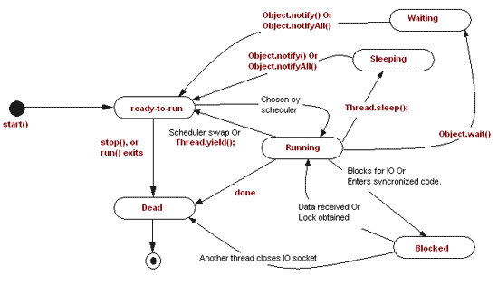

# State Pattern

## Wesentliche Merkmale

#### Kategorie: *Behavioral Pattern*

#### Ziel / Absicht:

Das *State Pattern* ist ein Entwurfsmuster aus der Kategorie der *Behavioral Pattern*.

Das Muster beschreibt, wie ein Objekt sein Verhalten in Abhängigkeit
von seinem aktuellen internen Zustand vollständig ändern kann.
Es scheint, als hätte das Objekt seine Klasse geändert.

#### Problem:

Dass sich der Zustand eines Objekts verändert, ist zunächst einmal eine grundlegende Eigenschaft der OO-Programmierung.
Klassen besitzen einen Zustand, über das Verhalten (Methoden) der Klasse ändert sich dieser Zustand.
Was ist nun das Besondere am *State Pattern* Entwurfsmuster?

Manchmal ändert sich ein Zustand eines Objekts so grundlegend, dass man sich wünschen würde, man hätte ein Objekt einer anderen Klasse.
Und genau das leistet dieses Muster: Wenn sich der Zustand ändert, wird das Objekt ausgetauscht, genauer der Teil, der den Zustand abbildet.

Ein gerne zitiertes Beispiel für dieses Muster ist ein Objekt der Java-Klasse `Thread`.
Dieses kann eine Reihe sehr unterschiedlicher Zustände annehmen:

Abbildung 2: Der Lebenszyklus eines `Thread`-Objekts.

Zu Beginn ist ein `Thread`-Objekt noch nicht gestartet (*ready_to_run*). Danach wird es gestartet (*running*) und der Thread läuft,
bis er sein natürliches Ende erreicht (*dead*). Es kann auch vorkommen, dass der Thread angehalten (*blocked* oder *sleeping*) und wieder fortgesetzt wird (*waiting*).
Es wird deutlich, dass ein Thread, der gerade inaktiv ist, sich völlig anders verhält als ein Thread, der läuft oder sich schon beendet hat.
Die klassische Herangehensweise an ein derartiges Problem  wäre die Festlegung einer Reihe von Zustandsvariablen. 
Und eine Menge von `if`- und/oder `switch`-Anweisungen, die zerstreut in der Klasse vorliegen und versuchen,
die Komplexität in den Griff zu bekommen.

#### Lösung:

Nicht so bei diesem Muster: Das *State Pattern* trennt das eigentliche Objekt und das Objekt, das seinen Zustand verkörpert.
Ändert sich der Zustand, wird dieses Zustandsobjekt ausgetauscht.
Da hinter jedem Zustandsobjekt eine Klasse steckt, wird der Code für jeden Zustand fein säuberlich von dem Code der anderen Zustände getrennt.

Das Verhalten ist zur Laufzeit änderbar, ohne dass die für den Zugriff auf das Objekt
verwendete bzw. vorhandene Schnittstelle sich ändert.
Die Änderungen sind im Kontext des Objekts verborgen.

Dieses Muster ist sehr nützlich beim Erstellen von Software Zustandsautomaten,
bei denen sich die Funktionalität eines Objekts je nach Status grundlegend ändert.

#### Struktur (UML):

Das folgende UML-Diagramm beschreibt eine Implementierung des *State Patterns*.
Es besteht im Wesentlichen aus drei Teilen:

  * **Context**: Diese Klasse hat Zugriff auf das konkrete Statusobjekt,
    das das Verhalten gemäß seinem aktuellen Status bereitstellt. Ohne dieses Entwurfsmuster würde die Klasse `Context` die gesamte Funktionalität realisieren müssen.
  * **StateBase**: Abstrakte Klasse für konkrete Zustandsklassen.
    Sie definiert die Schnittstelle, die von der `Context`-Klasse verwendet wird und die in irgendeiner Form mit den Zuständen zu tun hat.
  * **ConcreteState**: Konkrete Implementierung der `StateBase`-Klasse.
    Die Funktionalität dieser Objekte wird von der `Context`-Klasse genutzt.

Abbildung 2: Schematische Darstellung des *State Patterns*.

#### Conceptual Example:

*Hinweis*:

Das *Conceptual Example* liegt in drei Versionen vor:

  * Ein einfaches Beispiel - mit *raw*-Zeigern 
  * Dasselbe Beispiel - mit `std::shared_ptr`-Zeigern
  * Ein zweites einfaches Beispiel

Die Anregung zum konzeptionellen Beispiel finden Sie unter

[https://refactoring.guru/design-patterns](https://refactoring.guru/design-patterns/state/cpp/example#example-0)

und 

[https://www.codeproject.com](https://www.codeproject.com/Articles/455228/Design-Patterns-3-of-3-Behavioral-Design-Patterns#State)

vor.

#### 'Real-World' Example:

Im Buch [Entwurfsmuster: Das umfassende Handbuch](https://www.amazon.de/Entwurfsmuster-umfassende-Handbuch-Matthias-Geirhos/dp/3836227622)
von Matthias Geirhos findet sich zu diesem Entwurfsmuster ein Beispiel zur Modellierung eines Bewerbungsprozesses vor.
Einem Bewerbungsprozess können in naheliegender Weise Zustände wie *Eingegangen*, *Eingeladen* usw. zugeordnet werden.
Sehen Sie die detaillierte Beispielbeschreibung ab Seite 336 an.

Schreiben Sie den Beispielcode aus dem Buch in ein C++-Programm um. Verwenden Sie hierzu die Klassennamen aus Abbildung 3:

Abbildung 3: Ein Bewerbungsprozess modelliert mit dem *State Pattern*.

Erstellen Sie eine Testmethode, die exemplarisch eine Bewerbung vom Status *Received* (*Eingegangen*) bis zum Status *Hired* (*Eingestellt*) verfolgt.

---

[Zurück](../../../Resources/Readme_05_Catalog.md)

---
