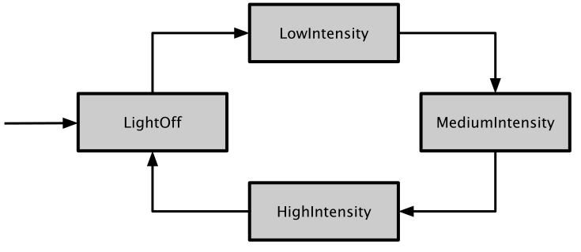

# State Pattern

[Zurück](../../../Resources/Readme_05_Catalog.md)

---


<sup>(Credits: [Blog von Vishal Chovatiya](http://www.vishalchovatiya.com/category/design-patterns/))</sup>

---

## Wesentliche Merkmale

#### Kategorie: *Behavioral Pattern*

#### Ziel / Absicht:

###### In einem Satz:

&bdquo;Um das durch seinen Zustand bestimmte Verhalten des Objekts zu implementieren.&rdquo;

Das Muster beschreibt, wie ein Objekt sein Verhalten in Abhängigkeit
von seinem aktuellen internen Zustand vollständig ändern kann.
Es scheint, als hätte das Objekt seine Klasse geändert.

#### Problem:

Dass sich der Zustand eines Objekts verändert, ist zunächst einmal eine grundlegende Eigenschaft der OO-Programmierung.
Klassen besitzen einen Zustand, über das Verhalten (Methoden) der Klasse ändert sich dieser Zustand.
Was ist nun das Besondere am *State Pattern* Entwurfsmuster?

Manchmal ändert sich ein Zustand eines Objekts so grundlegend, dass man sich wünschen würde, man hätte ein Objekt einer anderen Klasse.
Und genau das leistet dieses Muster: Wenn sich der Zustand ändert, wird das Objekt ausgetauscht, genauer der Teil, der den Zustand abbildet.

Ein gerne zitiertes Beispiel für dieses Muster ist ein Objekt der Java-Klasse `Thread`.
Dieses kann eine Reihe sehr unterschiedlicher Zustände annehmen:


*Abbildung* 2: Der Lebenszyklus eines `Thread`-Objekts.

Zu Beginn ist ein `Thread`-Objekt noch nicht gestartet (*ready_to_run*). Danach wird es gestartet (*running*) und der Thread läuft,
bis er sein natürliches Ende erreicht (*dead*). Es kann auch vorkommen, dass der Thread angehalten (*blocked* oder *sleeping*) und wieder fortgesetzt wird (*waiting*).
Es wird deutlich, dass ein Thread, der gerade inaktiv ist, sich völlig anders verhält als ein Thread, der läuft oder sich schon beendet hat.
Die klassische Herangehensweise an ein derartiges Problem  wäre die Festlegung einer Reihe von Zustandsvariablen. 
Und eine Menge von `if`- und/oder `switch`-Anweisungen, die zerstreut in der Klasse vorliegen und versuchen,
die Komplexität in den Griff zu bekommen.

#### Lösung:

Nicht so bei diesem Muster: Das *State Pattern* trennt das eigentliche Objekt und das Objekt, das seinen Zustand verkörpert.
Ändert sich der Zustand, wird dieses Zustandsobjekt ausgetauscht.
Da hinter jedem Zustandsobjekt eine Klasse steckt, wird der Code für jeden Zustand fein säuberlich von dem Code der anderen Zustände getrennt.

Das Verhalten ist zur Laufzeit änderbar, ohne dass die für den Zugriff auf das Objekt
verwendete bzw. vorhandene Schnittstelle sich ändert.
Die Änderungen sind im Kontext des Objekts verborgen.

Dieses Muster ist sehr nützlich beim Erstellen von Software Zustandsautomaten,
bei denen sich die Funktionalität eines Objekts je nach Status grundlegend ändert.

#### Struktur (UML):

Das folgende UML-Diagramm beschreibt eine Implementierung des *State Patterns*.
Es besteht im Wesentlichen aus drei Teilen:

  * **Context**: Diese Klasse hat Zugriff auf das konkrete Statusobjekt,
    das das Verhalten gemäß seinem aktuellen Status bereitstellt. Ohne dieses Entwurfsmuster würde die Klasse `Context` die gesamte Funktionalität realisieren müssen.
  * **StateBase**: Abstrakte Klasse für konkrete Zustandsklassen.
    Sie definiert die Schnittstelle, die von der `Context`-Klasse verwendet wird und die in irgendeiner Form mit den Zuständen zu tun hat.
  * **ConcreteState**: Konkrete Implementierung der `StateBase`-Klasse.
    Die Funktionalität dieser Objekte wird von der `Context`-Klasse genutzt.


*Abbildung* 3: Schematische Darstellung des *State Patterns*.

---

#### Conceptual Example:

*Hinweis*:

Das *Conceptual Example* liegt in drei Versionen vor:

  * Ein einfaches Beispiel - mit *raw*-Zeigern 
  * Dasselbe Beispiel - mit `std::shared_ptr`-Zeigern
  * Ein zweites einfaches Beispiel

[Quellcode 1 / .cpp](../ConceptualExample01.cpp)<br/>
[Quellcode 1 / .h](../ConceptualExample01.h)

[Quellcode 2 / .cpp](../ConceptualExample02.cpp)<br/>
[Quellcode 2 / .h](../ConceptualExample02.h)

[Quellcode 3 / .cpp](../ConceptualExample03.cpp)

---

#### Erstes 'Real-World' Beispiel:

Das State Pattern steht offensichtlich eng in Zusammenhang mit *Finite State Machines*,
zu deutsch *endlichen Automaten*:

> Eine endliche Zustandsmaschine stellt ein Modell dar,
  das über eine endliche Anzahl von Zuständen verfügt,
  in denen es sich zu einem bestimmten Zeitpunkt befinden kann.
  Es kann Eingaben verarbeiten,
  um Übergänge von einem Zustand in einen anderen durchzuführen.
  Ein endlicher Automat kann sich zu jedem Zeitpunkt nur in einem Zustand befinden.

Als Beispiel betrachten wir einen Lichtschalter, modelliert in C++.

Der Lichtschalter kann sich in einem von vier Zuständen befinden:

 * Aus
 * Niedrig
 * Mittel
 * Hoch

Das Licht ist zunächst aus. Durch Umschalten wechselt es in den nächsten Zustand und kehrt
schließlich in den Anfangszustand zurück:

 * Aus auf Niedrig
 * Niedrig auf Mittel
 * Mittel auf Hoch
 * Hoch auf Aus



*Abbildung* 4: Zustände eines Lichtschalters in unserem Beispiel.


Die einfache Natur dieses Beispiels erleichtert es uns,
das Entwurfsmuster mit einer endlichen Anzahl von Zuständen kennenzulernen,
ohne sich in irrelevanten Details zu verlieren.

*Bemerkung*:

Häufig werden die Zustandsübergänge eines endlichen Automaten
explizit mit Hilfe einer Zustandsübergangstabelle definiert.
Der Übergang von einem Zustand in einen anderen Zustand kann dann zum Beispiel
mit einer `std::map`-Datenstruktur dargestellt werden:

```cpp
01: enum class LightState {
02: 	Off,
03: 	Low,
04: 	Medium,
05: 	High
06: };
07: 
08: std::map<LightState, LightState> lightTransitions = {
09: 	{ LightState::Off,    LightState::Low },
10: 	{ LightState::Low,    LightState::Medium },
11: 	{ LightState::Medium, LightState::High },
12: 	{ LightState::High,   LightState::Off }
13: };
```

Zustandsübergangstabellen sind einfach, haben aber eine Einschränkung:
Was ist, wenn wir eine bestimmte Aktion ausführen möchten,
wenn wir den nächsten Zustand erreichen oder bevor wir den aktuellen Zustand verlassen?

Typischerweise sind derartige Maßnahmen, die wir vor und nach einem Zustandsübergang ergreifen möchten,
zustandsabhängig.
Das bedeutet, dass wir zunächst prüfen müssen, in welchem Zustand wir uns gerade befinden,
damit wir entsprechend handeln können, entweder mit einer `switch`-Anweisung
oder verketteten `if`-`else`-Bedingungen &ndash; beides
ist mit zunehmender Anzahl von Zuständen schwer aufrechtzuerhalten.

Die Idee des State Pattern liegt nun darin,
die Steuerung umzukehren und jeden Lichtzustand zu einer eigenen Klasse/Objekt zu machen!

Die Entscheidungsfindung wird auf diese Weise an den aktuellen Zustand delegiert,
in dem sich ein Licht befindet.

Die zentralen Code-Abschnitte des Beispiels sind:

```cpp
01: void Light::setState(LightState& newState)
02: {
03:     currentState -> exit(this);   // do something before we change state
04:     currentState = &newState;     // change state
05:     currentState -> enter(this);  // do something after we change state
06: }
07: 
08: void Light::toggle()
09: {
10:     // delegate the task of determining the next state to the current state!
11:     currentState->toggle(this);
12: }
```

Irgendwo innerhalb der `toggle`-Methode des aktuellen Status rufen wir
die `setState`-Methode des Lichts auf und übergeben den neuen Status,
in den wir wechseln möchten:

```cpp
01: void SomeLightState::toggle(Light* light)
02: {
03:     light->setState(SomeOtherLightState::getInstance());
04: }
```

In diesem Muster wird jeder Zustand als konkrete Klasse modelliert.
Wir benötigen also die folgenden vier Klassen (Zustände) für unseren Lichtschalter:

  * `LightOff`
  * `LowIntensity`
  * `MediumIntensity`
  * `HighIntensity`

Jede Klasse implementiert eine gemeinsame `ILightState`-Schnittstelle,
die die folgenden drei Methoden verfügbar macht:

  * `enter(Light*)`: Was sollen wir tun, wenn wir diesen Zustand betreten?
  * `toggle(Light*)`: In welchen Zustand sollten wir ggf. übergehen?
  * `exit(Light*)`: Was sollen wir tun, wenn wir diesen Zustand verlassen?

Alle drei Methoden akzeptieren einen Zeiger auf das Lichtobjekt, mit dem der Zustand verknüpft ist.
Wie erhalten sie Zugriff auf diesen Zeiger? Denken Sie daran, dass wir die Methode `toggle`
in unserer `Light`-Klasse folgendermaßen aufgerufen haben:


```cpp
01: void Light::toggle()
02: {
03: 	currentState->toggle(this);
04: }
```

*Bemerkung*:

Jede Zustandsklasse folgt in diesem Beispiel dem **Singleton**-Entwurfsmuster,
um unnötige Speicherzuweisungen und -freigaben zu vermeiden,
wenn wir von einem Zustand in einen anderen übergehen!


---

#### Zweites 'Real-World' Beispiel:

Im Buch [Entwurfsmuster: Das umfassende Handbuch](https://www.amazon.de/Entwurfsmuster-umfassende-Handbuch-Matthias-Geirhos/dp/3836227622)
von Matthias Geirhos findet sich zu diesem Entwurfsmuster als Beispiel die Modellierung eines Bewerbungsprozesses vor.
Einem Bewerbungsprozess können in naheliegender Weise Zustände wie *Eingegangen*, *Eingeladen* usw. zugeordnet werden.
Sehen Sie die detaillierte Beispielbeschreibung ab Seite 336 an.

Schreiben Sie den Beispielcode aus dem Buch in ein C++-Programm um. Verwenden Sie hierzu die Klassennamen aus *Abbildung* 5:


*Abbildung* 5: Ein Bewerbungsprozess modelliert mit dem *State Pattern*.

Erstellen Sie eine Testmethode, die exemplarisch eine Bewerbung vom Status *Received* (*Eingegangen*) bis zum Status *Hired* (*Eingestellt*) verfolgt.

###### Zusatzaufgabe:

Ergänzen Sie das Programm um einen weiteren Status `Assessment`. 
Im Zustandsdiagramm des Beispiels ist dieser Zustand zwischen die beiden Zustände *Eingeladen* (*Invited*) und *Eingestellt* (*Hired*) einzufügen.
Eine Einstellung erfolgt somit erst, wenn der Bewerber das Assessment Center erfolgreich durchlaufen hat.

---

#### Zweites 'Real-World' Beispiel mit modernen C++ Sprachelementen:

Das *State Pattern* ist ein Entwurfsmuster, das dabei helfen soll, das Verhalten eines Objekts zu ändern, 
wenn es intern seinen Zustand verändert.

Das Verhalten verschiedener Zustände sollte unabhängig voneinander sein,
so dass das Hinzufügen neuer Zustände sich auf die aktuellen Zustände nicht auswirkt!

Durch Anwendung des *State Patterns* kann neues Verhalten hinzugefügt werden,
indem neue Zustandsklassen eingeführt werden und die Zustandsübergänge zwischen ihnen definiert werden.

In diesem Abschnitt zeigen wir eine Möglichkeit, Zustände und eine Zustandsmachine zu implementieren,
die `std::variant` und `std::visit` verwendet.

In anderen Worten, wir bauen einen endlichen Zustandsautomaten, indem wir das *State*- und *Visitor Pattern*
in einem Ansatz verbinden.

Ein Ausschnitt aus der Umsetzung:

```cpp
01: class DepartmentStoreStateMachine {
02: public:
03:     template <typename Event>
04:     void processEvent(Event&& event) {
05:         m_state = std::visit(
06:             Overload{
07:                 [&] (const auto& state) requires std::is_same<
08:                 decltype(onEvent(state, std::forward<Event>(event))), State>::value {
09:                     return onEvent(state, std::forward<Event>(event));
10:                 },
11:                 [](const auto& unsupported_state) -> State {
12:                     throw std::logic_error{"Unsupported state transition"};
13:                 }
14:             },
15:             m_state);
16:     }
17: 
18: private:
19:     State m_state;
20: };
```

Ausgabe des Programms:

```
Item is temporarily out of stock
3 items available
1 items available
3 items available
Item is temporarily out of stock
Item is no more produced
```

---

## Literaturhinweise

Die Anregungen zum konzeptionellen Beispiel finden Sie unter

[https://refactoring.guru/design-patterns](https://refactoring.guru/design-patterns/state/cpp/example#example-0)

und 

[https://www.codeproject.com](https://www.codeproject.com/Articles/455228/Design-Patterns-3-of-3-Behavioral-Design-Patterns#State)

vor.

Das zweite Real-World Beispiel stammt aus dem Buch 
[Software Architecture with C++](https://www.amazon.de/Software-Architecture-effective-architecture-techniques/dp/1838554599)
von Adrian Ostrowski und Piotr Gaczkowski.

Das Beispiel zum Lichtschalter und entlichen Automaten kann man in dem Artikel
[&bdquo;Implementing a Finite State Machine in C++&rdquo;](https://www.aleksandrhovhannisyan.com/blog/implementing-a-finite-state-machine-in-cpp/)
nachlesen.

---

[Zurück](../../../Resources/Readme_05_Catalog.md)

---
