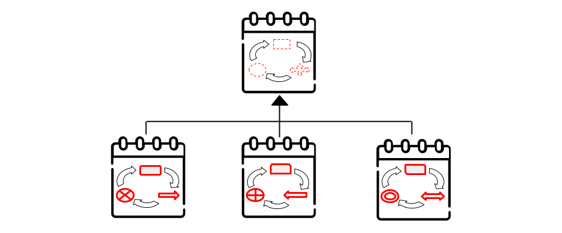
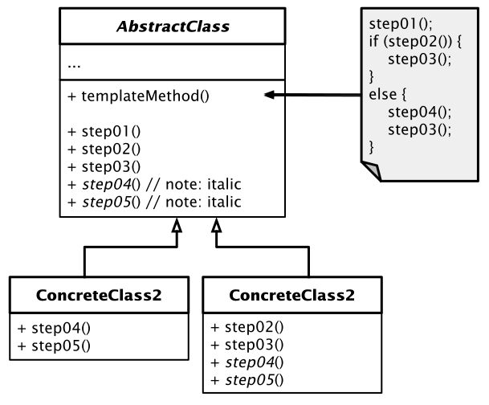

# Template Method Pattern

[Zurück](../../../Resources/Readme_05_Catalog.md)

---



<sup>(Credits: [Blog von Vishal Chovatiya](http://www.vishalchovatiya.com/category/design-patterns/))</sup>

---

## Wesentliche Merkmale

##### Kategorie: *Behavioral Pattern*

#### Ziel / Absicht:

###### In einem Satz:

&ldquo;Um einen Entwurf eines Algorithmus auf einer höheren Ebene bereitzustellen, der von seinen abgeleiteten Klassen zu vervollständigen ist.&rdquo;

Definiert das prinzipielle Grundgerüst eines Algorithmus in einer zentralen Methode.
Diese lagert einen oder vorzugsweise mehrere Teilschritte in Methoden abgeleiteter Klassen aus.
Änderungen an den Teilschritten haben keine Auswirkungen auf die Arbeitsweise (Realisierung)
der zentralen Methode.

Das *Template Method Pattern* ist ein Verhaltensentwurfsmuster,
das das Grundgerüst eines Algorithmus in einer Oberklasse definiert,
Unterklassen jedoch bestimmte Schritte des Algorithmus überschreiben lässt,
ohne dabei seine prinzipielle Struktur zu ändern.

#### Problem:

Es gibt eine Methode oder anders formuliert, eine Reihe von auszuführenden Schritten (Teilmethoden),
die auf einer höheren Abstraktionsebene
festgelegt sind (Reihenfolge der Ausführung, Bereitstellung von Parametern, ...).

In einer niedrigeren Abstraktionsebene (Detailebene) können die Teilmethoden eine unterschiedliche Implementierung haben.


#### Lösung:

Das *Template Method Pattern* hat zum Inhalt, dass Sie einen Algorithmus in eine Reihe von Schritten aufteilen,
diese Schritte in Methoden umwandeln und diese Methoden in einer einzigen &ldquo;Vorlagenmethode&rdquo; aufrufen,
daher auch der Name dieses Entwurfsmusters.
Die Schritte können entweder abstrakt sein oder eine Standardimplementierung aufweisen.
Um den Algorithmus zu verwenden, muss der Client eine eigene Unterklasse bereitstellen, alle abstrakten Schritte implementieren und bei Bedarf einige der optionalen Schritte überschreiben.
Die Vorlagenmethode sollte dabei nicht überschrieben oder verändert werden!

Das *Template Method Pattern* ermöglicht die Realisierung von variierenden Teilschritten, während ein konsistenter Grundprozess beibehalten wird.


#### Struktur (UML):



*Abbildung* 1: Schematische Darstellung des *Template Method Patterns*.


## Anwendungsbeispiel:

In Spezialisierungen der Oberklasse können bzw. sollten ein oder mehrere Teilmethoden überschrieben werden,
um die **Template Methode** in der Oberklasse zu vervollständigen. 

Die Skelett-Methode ist davon ausgenommen - die prinzipielle Struktur des Algorithmus ist beizubehalten,
also nicht zu verändern.

---

#### Conceptual Example:

[Quellcode](../ConceptualExample.cpp)

---

#### 'Real-World' Beispiel:

Im 'Real-World' Beispiel zu diesem Entwurfsmuster 
definiert die Template-Methode einen Algorithmus für die Arbeit mit einem sozialen Netzwerk.
Unterklassen, die einem bestimmten sozialen Netzwerk entsprechen,
implementieren diese Schritte gemäß der vom sozialen Netzwerk bereitgestellten API.

Die Klasse `SocialNetwork` repräsentiert die Basisklasse des sozialen Netzwerks.
Zwei weitere Klassen `Twitter` und `Facebook` stehen für konkrete Beispiele sozialer Netzwerke.

Die &ldquo;Vorlagenmethode&rdquo; ist in der Klasse `SocialNetwork` vorgegeben, sie lautet `post`:

```cpp
bool post(const std::string& message);
```

Ihre Implementierung darf nicht verändert werden, um dem Charakter des Entwurfsmusters gerecht zu werden.
Die Teilschritte, die zur Realisierung der `post`-Methode erforderlich sind, lauten in dem Beispiel
`logIn`, `logOut` und `sendData`. Diese drei Methoden sind geeignet von konkreten Social Media Klassen
zu überschreiben, siehe dazu auch *Abbildung* 2:


*Abbildung* 2: Das *Template Method Pattern* am Beispiel sozialer Netzwerke.

---

## FAQs

*Frage*: Was ist der Unterschied zwischen dem *Strategy*- und *Template Method*-Pattern?

  * Das *Template Method*-Pattern basiert auf **Vererbung**: Es werden Teile eines Algorithmus verändert, indem diese Teile in abgeleiteten Klassen erweitert werden.

  * *Strategy*-Pattern basiert auf der **Komposition**: Es werden Teile des Verhaltens eines Objekts verändert, indem es verschiedene Strategien erhält, die unterschiedlichem Verhalten entsprechen.

oder auch:

  * *Template Method*-Pattern: Funktioniert auf **Klassenebene**, es ist also ein statisches Konzept.

  * *Strategy*-Pattern: Funktioniert auf **Objektebene**, das Verhalten wird zur Laufzeit geändert.

---

## Literaturhinweise

Die Anregungen zum konzeptionellen Beispiel finden Sie unter

[https://refactoring.guru/design-patterns](https://refactoring.guru/design-patterns/template-method/cpp/example#example-0)

und

[https://www.codeproject.com](https://www.codeproject.com/Articles/455228/Design-Patterns-3-of-3-Behavioral-Design-Patterns#Template)

vor.

---

[Zurück](../../../Resources/Readme_05_Catalog.md)

---
