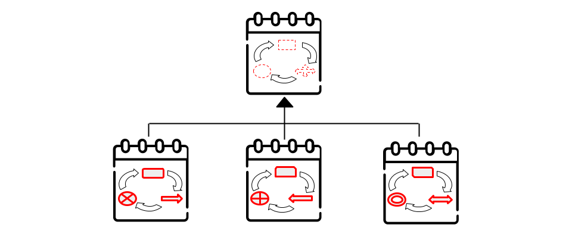
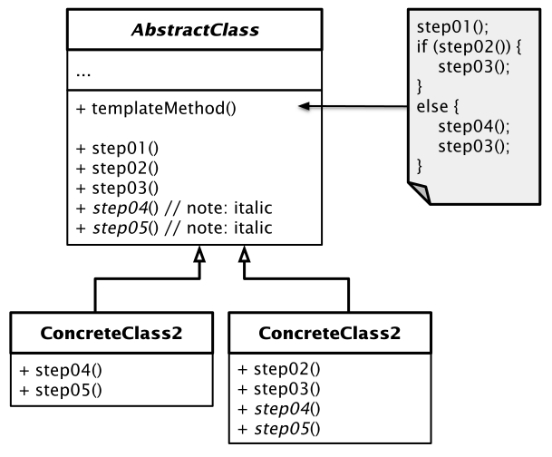
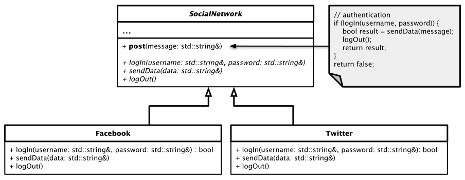

# Template Method Pattern

[Zurück](../../../Resources/Readme_05_Catalog.md)

---



<sup>(Credits: [Blog von Vishal Chovatiya](https://vishalchovatiya.com/pages/start-here/))</sup>

---

## Wesentliche Merkmale

##### Kategorie: *Behavioral Pattern*

#### Ziel / Absicht:

###### In einem Satz:

&bdquo;Das Template Method Pattern definiert das Grundgerüst eines Algorithmus in einer Basisklasse und überlässt es abgeleiteten Klassen, einzelne Schritte dieses Algorithmus zu überschreiben, ohne dabei dessen grundsätzlichen Ablauf zu verändern.&rdquo;

Das *Template Method Pattern* gehört zu den Verhaltensmustern (Behavioral Patterns) und wird eingesetzt,
wenn mehrere Algorithmen (beziehungsweise der grundlegende Ablauf eines Algorithmus) eine gemeinsame Struktur besitzen,
sich aber in einzelnen Schritten unterscheiden.

Die Basisklasse definiert dazu eine sogenannte &bdquo;Template Method&rdquo; &ndash; eine Methode,
die den festen Ablauf des Algorithmus als Sequenz von Teilschritten vorgibt.
Einzelne dieser Teilschritte werden als virtuelle Methoden deklariert, die in der Basisklasse
entweder eine Standardimplementierung besitzen oder rein abstrakt sind.

Abgeleitete Klassen überschreiben genau diese Schritte, um das Verhalten an ihre speziellen Bedürfnisse anzupassen,
während der übergeordnete Ablauf unangetastet bleibt.
Dadurch wird Code-Duplizierung vermieden, da der gemeinsame Steuerungsfluss nur einmal implementiert werden muss.

Gleichzeitig bleibt die Reihenfolge der Schritte konsistent, da sie zentral in der Basisklasse festgelegt
und nicht von den Subklassen beeinflusst wird.

Ein wesentlicher Vorteil des Patterns besteht darin, dass Änderungen am gemeinsamen Ablauf nur an einer Stelle vorgenommen werden müssen.

Dieses Prinzip wird häufig auch als &bdquo;Hollywood-Prinzip&rdquo; bezeichnet:
&bdquo;Don't call us, we'll call you&rdquo; &ndash; die Basisklasse ruft die spezialisierten Methoden der Subklasse auf,
nicht umgekehrt.

In C++ lässt sich das Pattern besonders elegant umsetzen, indem die *Template Method* als nicht-virtuelle
(oder finale) Methode implementiert wird, während die austauschbaren Schritte als virtuelle (ggf. protected) Methoden bereitgestellt werden.


#### Struktur (UML):



*Abbildung* 1: Schematische Darstellung des *Template Method Patterns*.

*Bemerkung*:<br />
Die *Template Methode* (Steuerungsfunktion) sollte `public` und nicht-virtuell sein.

Die überschreibbaren Methoden sollten idealerweise `private` sein. Abgeleitete Klassen in C++ können
private, virtualle Methoden problemlos überschreiben. Das kapselt die Erweiterungspunkte noch besser.


## Anwendungsbeispiel:

In Spezialisierungen der Oberklasse können bzw. sollten ein oder mehrere Teilmethoden überschrieben werden,
um die **Template Methode** in der Oberklasse zu vervollständigen. 

Die Skelett-Methode ist davon ausgenommen - die prinzipielle Struktur des Algorithmus ist beizubehalten,
also nicht zu verändern.

---

#### Conceptual Example:

[Quellcode](../ConceptualExample.cpp)

---

#### Hinweise zu Modern C++

##### Rule of Five / Slicing-Schutz:

Sobald eine Klasse polymorph ist (virtueller Destruktor), sollte man sich explizit zu Copy/Move äußern, sonst drohen Slicing-Bugs,
wenn jemand `AbstractClass` per Wert kopieren sollte:

```cpp
class AbstractClass {
public:
    virtual ~AbstractClass() = default;
    
    AbstractClass(const AbstractClass&) = delete;
    AbstractClass& operator=(const AbstractClass&) = delete;
    AbstractClass(AbstractClass&&) = delete;
    AbstractClass& operator=(AbstractClass&&) = delete;

protected:
    AbstractClass() = default; // // Base class should not be directly instantiable
    ...
};
```

Damit verhindert man auch versehentliches direktes Instanziieren der Basisklasse (falls das gewünscht ist).

---


#### &bdquo;Real-World&rdquo; Beispiel:

Im &bdquo;Real-World&rdquo; Beispiel zu diesem Entwurfsmuster 
definiert die Template-Methode einen Algorithmus für die Arbeit mit einem sozialen Netzwerk.
Unterklassen, die einem bestimmten sozialen Netzwerk entsprechen,
implementieren diese Schritte gemäß der vom sozialen Netzwerk bereitgestellten API.

Die Klasse `SocialNetwork` repräsentiert die Basisklasse des sozialen Netzwerks.
Zwei weitere Klassen `Twitter` und `Facebook` stehen für konkrete Beispiele sozialer Netzwerke.

Die &bdquo;Vorlagenmethode&rdquo; ist in der Klasse `SocialNetwork` vorgegeben, sie lautet `post`:

```cpp
bool post(const std::string& message);
```

Ihre Implementierung darf nicht verändert werden, um dem Charakter des Entwurfsmusters gerecht zu werden.
Die Teilschritte, die zur Realisierung der `post`-Methode erforderlich sind, lauten in dem Beispiel
`logIn`, `logOut` und `sendData`. Diese drei Methoden sind geeignet von konkreten Social Media Klassen
zu überschreiben, siehe dazu auch *Abbildung* 2:



*Abbildung* 2: Das *Template Method Pattern* am Beispiel sozialer Netzwerke.

---

Die Anwendungsfälle des *Template Method*-Pattern und des *Strategy*-Pattern sind ziemlich ähnlich.
Beide Muster ermöglichen es, Variationen eines Algorithmus bereitzustellen.
Das *Template Method*-Pattern basiert auf der Ebene von Klassen und der Bildung von Unterklassen,
das Strategiemuster auf der Ebene von Objekten und deren Komposition.

Das *Strategy*-Pattern erhält unterschiedliche Strategien in der Gestalt von Objekten
und kann somit zur Laufzeit seine Strategien austauschen.

Die *Template*-Methode kehrt den Kontrollfluss nach dem Hollywood-Prinzip um:
&bdquo;Don't call us, we call you&rdquo;.

Das *Strategy*-Pattern gleicht mehr einer Black Box.
Es ermöglicht, eine Strategie durch eine andere zu ersetzen, ohne deren Details zu kennen.

---


## FAQs

*Frage*: Was ist der Unterschied zwischen dem *Strategy*- und *Template Method*-Pattern?

  * Das *Template Method*-Pattern basiert auf **Vererbung**: Es werden Teile eines Algorithmus verändert, indem diese Teile in abgeleiteten Klassen erweitert werden.

  * *Strategy*-Pattern basiert auf der **Komposition**: Es werden Teile des Verhaltens eines Objekts verändert, indem es verschiedene Strategien haben kann, die unterschiedlichem Verhalten entsprechen.

oder auch:

  * *Template Method*-Pattern: Funktioniert auf **Klassenebene**, es ist also ein statisches Konzept.

  * *Strategy*-Pattern: Funktioniert auf **Objektebene**, das Verhalten wird zur Laufzeit geändert.

---

## Literaturhinweise

Die Anregungen zum konzeptionellen Beispiel finden Sie unter

[https://refactoring.guru/design-patterns](https://refactoring.guru/design-patterns/template-method/cpp/example#example-0)

und

[https://www.codeproject.com](https://www.codeproject.com/Articles/455228/Design-Patterns-3-of-3-Behavioral-Design-Patterns#Template)

vor.

---

[Zurück](../../../Resources/Readme_05_Catalog.md)

---
