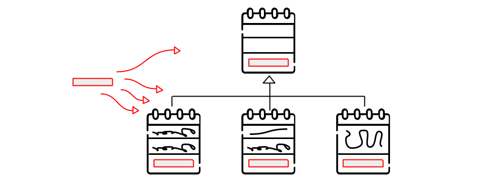
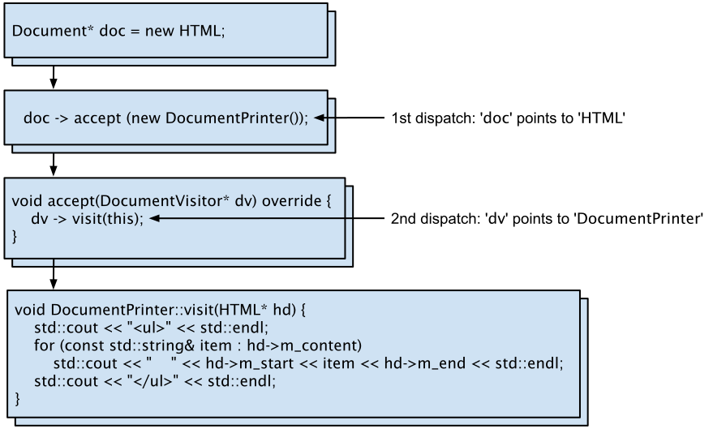

# Visitor Pattern

[Zurück](../../../Resources/Readme_05_Catalog.md)

---



<sup>(Credits: [Blog von Vishal Chovatiya](http://www.vishalchovatiya.com/category/design-patterns/))</sup>

---

## Wesentliche Merkmale

#### Kategorie: *Behavioral Pattern*

#### Ziel / Absicht:

###### In einem Satz:

&bdquo;Hinzufügen einer neuen Operation für eine Gruppe ähnlicher Objekte oder Hierarchien.&rdquo;

Das *Visitor Pattern* ist ein Entwurfsmuster aus der Kategorie der *Behavioral Pattern*,
das eine Menge strukturierter Daten von den Funktionen trennt,
die auf den Daten ausgeführt werden. Dies unterstützt zum einen das Prinzip der "losen Kopplung"
und es ermöglicht zum anderen das Hinzufügen zusätzlicher Operationen, ohne an den Datenklassen Änderungen vornehmen zu müssen.

Im Kern geht es darum, eine Hierarchie von Klassen und Operationen auf diesen Klassen voneinander zu trennen.

#### Prinzip:

Das Muster definiert eine Art Infrastruktur für den Zugriff auf komplexe dynamische Daten- und Objektstrukturen.
Dabei wird der dynamischen Struktur eine Methodenschnittstelle gegeben, die ein sogenanntes &bdquo;Besucher&rdquo;-Objekt entgegennimmt
und über alle Daten der Struktur schleust. Das &bdquo;Besucher&rdquo;-Objekt läuft also an allen Elementen der Struktur entlang
und wird von den Elementen über eine Methode &bdquo;akzeptiert&rdquo;.
Die Konvention besteht darin, diese Methode `accept` zu nennen.
Dabei ruft das Strukturelement eine Methode im &bdquo;Besucher&rdquo;-Objekt auf,
die speziell für den Typ des Strukturelements geschrieben wurde und eine Referenz oder einen Zeiger
auf das Strukturelement in ihrer Parameterliste hat.
Damit hat der Visitor wiederum die Chance, eine Operation auf dem Strukturelement auszuführen
und dabei auf dessen Typ zu reagieren.

Der Sinn des Visitors besteht darin, die eigentliche Operation auf den Daten von der Traver­sierung
der Verwaltungs­struktur zu trennen. Aus der Entkopplung dieser beiden Aspekte entstehen
Freiheitsgrade für Variationen dieses Entwurfsmusters.

#### Eine didaktische Herleitung in 4 Schritten:

##### Schritt 1: Ein &bdquo;aufdringlicher&rdquo; Besucher (*intrusive Visitor*)

Nehmen wir an, wir haben eine Hierarchie von Dokumentenobjekten der folgenden Gestalt:

```cpp
01: class Document
02: {
03: public:
04:     virtual void addToList(const std::string& line) = 0;
05: };
06: 
07: class Markdown : public Document
08: {
09: private:
10:     std::string m_start;
11:     std::list<std::string> m_content;
12: 
13: public:
14:     Markdown() : m_start{ "* " } {}
15: 
16:     virtual void addToList(const std::string& line) override {
17:         m_content.push_back(line);
18:     }
19: };
20: 
21: class HTML : public Document
22: {
23: private:
24:     std::string m_start;
25:     std::string m_end;
26:     std::list<std::string> m_content;
27: 
28: public:
29:     HTML() : m_start{ "<li>" }, m_end{ "</li>" } {}
30: 
31:     virtual void addToList(const std::string& line) override {
32:         m_content.push_back(line);
33:     }
34: };
```

Und nehmen wir nun ferner an,
dass wir einige neue Operationen auf dieser bestehenden Infrastruktur definieren müssen.
Zum Beispiel haben wir eine `Document`-Klasse wie oben gezeigt
und möchten jetzt, dass verschiedene Dokumente (z.B. `HTML` und `Markdown`) druckbar sind,
also eine Methode `print` bekommen.

Es gibt also eine neue Anforderung (*Concern*) 
und wir müssen diese auf irgendeine Weise durch die gesamte Klassenhierarchie propagieren,
indem wir jede einzelne `Document`-Klasse irgendwie unabhängig um eine `print`-Methode
ergänzen.

Was wir jetzt nicht tun wollen, ist, dass wir jedes Mal, wenn wir eine neue Anforderung (*Concern*) erhalten,
in den vorhandenen Code zurückkehren und jede Klasse in der Hierarchie (mit zusätzlichen virtuellen Funktionen) ändern.

Dies würde einen Verstoß gegen das *Open*-*Closed*-Prinzip darstellen!
Zum Zweiten gibt es auch noch das *Single*-*Responsibility*-Prinzip, an das wir uns halten wollen.
Kurz gesagt besagt dieses, dass wir für eine neue Anforderung eine separate Klasse zu erstellen haben.

Würden wir das jetzt alles Mal für einen kurzen Moment außer Acht lassen,
könnten wir folgende Realisierung betrachten:

```cpp
01: class Document
02: {
03: public:
04:     virtual void addToList(const std::string& line) = 0;
05:     virtual void print() = 0;
06: };
07: 
08: class Markdown : public Document
09: {
10: public:
11:     Markdown() : m_start{ "* " } {}
12: 
13:     virtual void addToList(const std::string& line) override {
14:         m_content.push_back(line);
15:     }
16: 
17:     virtual void print() override {
18:         for (const std::string& item : m_content) {
19:             std::cout << m_start << item << std::endl;
20:         }
21:     }
22: 
23: private:
24:     std::string            m_start;
25:     std::list<std::string> m_content;
26: };
27: 
28: class HTML : public Document
29: {
30: public:
31:     HTML() : m_start{ "<li>" }, m_end{ "</li>" } {}
32: 
33:     virtual void addToList(const std::string& line) override {
34:         m_content.push_back(line);
35:     }
36: 
37:     virtual void print() override {
38:         std::cout << "<ul>" << std::endl;
39:         for (const std::string& item : m_content) {
40:             std::cout << "    " << m_start << item << m_end << std::endl;
41:         }
42:         std::cout << "</ul>" << std::endl;
43:     }
44: 
45: private:
46:     std::string             m_start;
47:     std::string             m_end;
48:     std::list<std::string>  m_content;
49: };
50: 
51: static void clientCode()
52: {
53:     Document* d1 = new HTML;
54:     d1->addToList("This is line");
55:     d1->print();
56: 
57:     Document* d2 = new Markdown;
58:     d2->addToList("This is another line");
59:     d2->print();
60: 
61:     delete d1;
62:     delete d2;
63: }
```

Wie wir sehen, ist diese Vorgehensweise für zwei bis drei Klassen mit Schmerzen machbar,
auch wenn wir dabei gegen einige SOLID-Prinzipien verstoßen.
Aber stellen Sie sich vor, Sie haben es mit 20 oder mehr Klassen als Teil einer ganzen Hierarchie zu tun,
dann versagt diese Strategie.

Darüber hinaus wird dieser Ansatz umständlich, wenn es um mehr als ein *Concern* wie z.B.
Speichern (`save`), Verarbeiten (`process`) usw. geht.
Jedes *Concern* sollte in einer separaten Klasse abgehandelt werden,
um vor allem das *Single*-*Responsibility*-Prinzips zu beachten.


##### Schritt 2: Ein &bdquo;reflektierender&rdquo; Besucher (*reflective Visitor*)

```cpp
01: class Document
02: {
03: public:
04:     virtual void addToList(const std::string& line) = 0;
05: };
06: 
07: class Markdown : public Document
08: {
09: friend class DocumentPrinter;
10: 
11: public:
12:     Markdown() : m_start{ "* " } {}
13: 
14:     virtual void addToList(const std::string& line) override {
15:         m_content.push_back(line);
16:     }
17: 
18: private:
19:     std::string            m_start;
20:     std::list<std::string> m_content;
21: };
22: 
23: class HTML : public Document
24: {
25: friend class DocumentPrinter;
26: 
27: public:
28:     HTML() : m_start{ "<li>" }, m_end{ "</li>" } {}
29: 
30:     virtual void addToList(const std::string& line) override {
31:         m_content.push_back(line);
32:     }
33: 
34: private:
35:     std::string             m_start;
36:     std::string             m_end;
37:     std::list<std::string>  m_content;
38: };
39: 
40: class DocumentPrinter
41: {
42: public:
43:     static void print(Document* e) {
44:         if (auto md = dynamic_cast<Markdown*>(e)) {
45:             for (const std::string& item : md->m_content)
46:                 std::cout << md->m_start << item << std::endl;
47:         }
48:         else if (auto hd = dynamic_cast<HTML*>(e)) {
49:             std::cout << "<ul>" << std::endl;
50:             for (const std::string& item : hd->m_content) {
51:                 std::cout << "    " << hd->m_start << item << hd->m_end << std::endl;
52:             }
53:             std::cout << "</ul>" << std::endl;
54:         }
55:     }
56: };
57: 
58: static void clientCode() {
59:     Document* d1 = new HTML;
60:     d1->addToList("This is line");
61:     DocumentPrinter::print(d1);
62: 
63:     Document* d2 = new Markdown;
64:     d2->addToList("This is another line");
65:     DocumentPrinter::print(d2);
66: 
67:     delete d1;
68:     delete d2;
69: }
```

Wie bereits erwähnt, haben wir nun eine separate Klasse `DocumentPrinter` mit Druckfunktionalität
für die gesamte Klassenhierarchie erstellt.
Das *Single*-*Responsibility*-Prinzip wird so berücksichtigt.

Aber bei diesem Ansatz müssen wir Typen bestimmter Klassen identifizieren
(unter Verwendung von `dynamic_cast<>()`),
da wir unabhängig voneinander mit einzelnen Objekten in der Hierarchie arbeiten müssen.

Dies ist kein Ansatz, der sich effizient skalieren lässt.
Wenn Sie vor allem den Satz von Klassen erweitern wollen,
um deren Verarbeitung es geht, werden Sie am Ende eine lange Kaskade von `if`/`else`-`if`-Konstrukten
und unnötige Performanceaufwendungen für *RTTI* haben.


##### Schritt 3: Ein &bdquo;klassischer&rdquo; Besucher (*classic Visitor*)

Damit kommen wir nun auf die klassische Umsetzung des *Visitor* Patterns zu sprechen.
Diese wird weiter unten noch näher erläutert werden (begleitender Text und UML-Diagramm):

```cpp
01: /* --------- Generic Visitor Class ----------- */
02: class Markdown;
03: class HTML;
04: 
05: class DocumentVisitor
06: {
07: public:
08:     virtual void visit(Markdown*) = 0;
09:     virtual void visit(HTML*) = 0;
10: };
11: 
12: /* -------- Document Classes Hierarchy ---------- */
13: class Document
14: {
15: public:
16:     virtual void addToList(const std::string& line) = 0;
17:     virtual void accept(DocumentVisitor*) = 0;    // <<<<<
18: };
19: 
20: class Markdown : public Document
21: {
22: public:
23:     Markdown() : m_start{ "* " } {}
24: 
25:     virtual void addToList(const std::string& line) override { 
26:         m_content.push_back(line);
27:     }
28: 
29:     virtual void accept(DocumentVisitor* dv) override {  // <<<<<
30:         dv->visit(this);
31:     } 
32: 
33:     std::string m_start;
34:     std::list<std::string> m_content;
35: };
36: 
37: class HTML : public Document
38: {
39: public:
40:     HTML() : m_start{ "<li>" }, m_end{ "</li>" } {}
41: 
42:     virtual void addToList(const std::string& line) override {
43:         m_content.push_back(line);
44:     }
45: 
46:     virtual void accept(DocumentVisitor* dv) override {    // <<<<<
47:         dv->visit(this);
48:     } 
49: 
50:     std::string m_start;
51:     std::string m_end;
52:     std::list<std::string> m_content;
53: };
54: 
55: /* ------ Specific Printer Visitor Class -------- */
56: 
57: class DocumentPrinter : public DocumentVisitor
58: {
59: public:
60:     virtual void visit(Markdown* md) override;
61:     virtual void visit(HTML* hd) override;
62: };
63: 
64: void DocumentPrinter::visit(Markdown* md) {
65:     for (const std::string& item : md->m_content)
66:         std::cout << md->m_start << item << std::endl;
67: }
68: 
69: void DocumentPrinter::visit(HTML* hd) {
70:     std::cout << "<ul>" << std::endl;
71:     for (const std::string& item : hd->m_content)
72:         std::cout << "    " << hd->m_start << item << hd->m_end << std::endl;
73:     std::cout << "</ul>" << std::endl;
74: }
75: 
76: static void clientCode() {
77:     DocumentVisitor* dp = new DocumentPrinter();
78: 
79:     Document* d1 = new HTML;
80:     d1->addToList("This is line");
81:     d1->accept(dp);
82: 
83:     Document* d2 = new Markdown;
84:     d2->addToList("This is another line");
85:     d2->accept(dp);
86: 
87:     delete d1;
88:     delete d2;
89:     delete dp;
90: }
```

Wie Sie sehen können, haben wir es nun mit zwei Ebenen der Indirektion zu tun.
Damit wurden vor allem vermieden, die zwei Prinzipien
*Open*-*Closed-Principle* und *Single*-*Responsibility-Principle* zu verletzen.

Hierfür gibt es ein spezielles Schlagwort: *Double Dispatch*, siehe dazu auch *Abbildung* 1:



*Abbildung* 1: Schematische Darstellung des *Double Dispatch*&ndash;Idioms.

Über das Objekt `doc` rufen wir die Methode `accept()` auf:

```cpp
doc -> accept (new DocumentPrinter());
```

Diese delegiert auf Grund des virtuellen Methodenaufrufmechanismus den Aufruf an die Methode `HTML::accept`.
Im Kontext dieser Methode finden wir wiederum einen Aufruf

```cpp
dv->visit(this);
```

vor. Dieses Mal wird &ndash; auf Grund des virtuellen Methodenaufrufmechanismus &ndash; 
der Aufruf an die Methode `DocumentPrinter::visit(HTML*)` delegiert (unter Berücksichtigung
des Zeigertyps `HTML*`).

##### Schritt 4: Alternativer Ansatz für *Double Dispatch* in Modern C++ (`std::variant` und `std::visit`)

Man beachte vorab, dass die Dokumente Klassen `Markdown` und `HTML` nicht mehr einer Klassenhierarchie angehören:


```cpp
01: /* ------ Document Classes -------- */
02: class Markdown
03: {
04: private:
05:     std::string m_start;
06:     std::list<std::string> m_content;
07: 
08: public:
09:     Markdown() : m_start{ "* " } {}
10: 
11:     void addToList(const std::string& line) {
12:         m_content.push_back(line); 
13:     }
14: 
15:     std::string getStart() const { return m_start; }
16:     std::list<std::string> getContent() const { return m_content; }
17: };
18: 
19: class HTML
20: {
21: private:
22:     std::string m_start;
23:     std::string m_end;
24:     std::list<std::string> m_content;
25: 
26: public:
27:     HTML() : m_start{ "<li>" }, m_end{ "</li>" } {}
28: 
29:     void addToList(const std::string& line) {
30:         m_content.push_back(line); 
31:     }
32: 
33:     std::string getStart() const { return m_start; }
34:     std::string getEnd() const { return m_end; }
35:     std::list<std::string> getContent() const { return m_content; }
36: };
37: 
38: /* ------ Specific Printer Visitor Class -------- */
39: class DocumentPrinter
40: {
41: public:
42:     void operator() (const Markdown& md) {
43:         for (const std::string& item : md.getContent()) {
44:             std::cout << md.getStart() << item << std::endl;
45:         }
46:     }
47: 
48:     void operator() (const HTML& hd) {
49:         std::cout << "<ul>" << std::endl;
50:         for (const std::string& item : hd.getContent()) {
51:             std::cout << "    " << hd.getStart() << item << hd.getEnd() << std::endl;
52:         }
53:         std::cout << "</ul>" << std::endl;
54:     }
55: };
56: 
57: /* ------ std::variant & std::visit -------- */
58: static void clientCode() {
59:     HTML hd;
60:     hd.addToList("This is line");
61:     std::variant<Markdown, HTML> doc = hd;
62:     DocumentPrinter dp;
63:     std::visit(dp, doc);
64: 
65:     Markdown md;
66:     md.addToList("This is another line");
67:     doc = md;
68:     std::visit(dp, doc);
69: }
```

Wir setzen nun die *Modern C++* Klasse `std::variant` und die Funktion `std::visit` ein.

Die Zeile

```cpp
std::variant<Markdown, HTML> document;
```

besagt, dass wir der Variablen `document` entweder ein `Markdown`- oder ein `HTML`-Objekt
zuweisen können. 

Die `std::visit`-Methode wiederum akzeptiert ein *Callable*-Objekt,
d.h. in unserem Beispiel ein `DocumentPrinter`-Objekt,
das für alle möglichen Typen einen überladenen Funktionsoperator `operator()` &ndash;
auch als *Funktor* bezeichnet &ndash; bereitstellt.

#### Zusammenfassung:

Die Traver­sierung wird durch die erwähnte Infra­struktur aus Methoden übernommen.
Die durch den Visitor transpor­tierte Operation wird in einer Kindklasse der Visitor­schnitt­stelle implementiert.
Damit lassen sich beliebige Operationen definieren
und durch den allgemeinen Traversierungs­mechanismus in die Objekt­struktur tragen.
Mit dem Namen des Visitors wird das Verhalten des Musters gewürdigt.
Das Visitor­objekt geht die Objekte in der Objekt­struktur &bdquo;besuchen&rdquo;.

Das Ergebnis der Trennung von Objektstruktur und Funktionen (Algorithmen) ist ein Datenmodell
mit eingeschränkter Funktionalität und einer Gruppe von &bdquo;*Besuchern*&rdquo;,
die Operationen auf den Daten ausführen.
Ein weiterer Vorteil ist die Möglichkeit, einen neuen *Besucher* hinzufügen zu können,
ohne dabei die vorhandene Struktur ändern zu müssen. 
Die Daten-Klassen sind mit Attributen (Eigenschaften, *getter*/*setter*-Methoden) so zu erstellen,
dass diese vom &bdquo;Besucher&rdquo;-Objekt geeignet verwendet werden können.
Typischerweise wird das Datenobjekt als Parameter an eine Methode des &bdquo;Besucher&rdquo;-Objekts übergeben
(die Konvention besteht darin, diese Methode `visit` zu nennen).

#### Struktur (UML):

Das folgende UML-Diagramm beschreibt eine Implementierung des *Visitor Patterns*.
Es besteht im Wesentlichen aus sechs Teilen:

  * **Client**: Anwender des *Visitor Patterns*. Er verwaltet die Objektstruktur und weist die Objekte innerhalb der Struktur an,
    wann ein Besucher akzeptiert werden soll.
  * **ObjectStructure**: Dies ist eine Klasse, die alle Objekte enthält, die besucht werden können.
    Es bietet einen Mechanismus zum Traversieren aller Elemente.
    Diese Struktur muss nicht zwingend eine *Collection* sein, es kann irgend eine komplexe Struktur sein, beispielsweise ein *Composite Object*.
  * **ElementBase**: Stellt eine Abstraktionsschnittstelle dar, die die `accept`-Operation deklariert. Dies ist der Einstiegspunkt, an dem ein Objekt vom Besucherobjekt &bdquo;besucht&rdquo; werden kann.
    Jedes Objekt aus einer *Collection* sollte diese Abstraktionsschnittstelle implementieren, um besucht werden zu können.
  * **ConcreteElement**: Diese Klassen erben von der abstrakten Basisklasse `ElementBase` oder implementieren eine Schnittstelle
    und definieren eine `accept`-Operation. Das *Visitor*-Objekt wird durch die `accept`-Operation an dieses Objekt übergeben.
  * **VisitorBase**: Deklariert eine `visit`-Methode (Operation) für jede Klasse von `ConcreteElement` in der Objektstruktur.
    Der Name und die Signatur der Operation identifizieren die Klasse, die die Anforderung an den Visitor sendet.
    Auf diese Weise kann der Besucher die konkrete Klasse des besuchten Elements bestimmen.
    So kann der Besucher direkt über diese spezielle Schnittstelle auf die fraglichen Elemente zugreifen.
  * **ConcreteVisitor**: Implementiert jede von einem Visitor deklarierte Operation (Methode).
    Jede Operation implementiert ein Fragment eines Algorithmus, der für die entsprechende Klasse oder das entsprechende Objekt in der Objektstruktur definiert ist.
    `ConcreteVisitor` stellt den Kontext für den Algorithmus bereit und speichert seinen lokalen Status.
    Dieser Zustand sammelt häufig Ergebnisse während des Durchlaufens der Struktur.


*Abbildung* 2: Schematische Darstellung des *Visitor Patterns*.

---

#### Conceptual Example:

[Quellcode](../ConceptualExample.cpp)

*Hinweis*: Im konzeptionellen Beispiel ist der Aspekt `enable_shared_from_this` und `shared_from_this` 
mit abgehandelt.

---

#### Erstes 'Real-World' Beispiel:

Das *Visitor*-Entwurfsmuster lässt sich in *Modern C++* mit `std::variant` und `std::visit` sehr einfach umsetzen.

Hierbei gilt es eine Besonderheit zu betrachten:
Wir können mit der C++-Template-Technik die Realisierung so gestalten,
dass wir auf den virtuellen Methodenaufrufmechanismus **nicht** angewiesen sind!
Bei der klassischen Umsetzung des Musters ist dieser vorhanden.

Wir betrachten eine Buchhandlung (Klasse `Bookstore`), die Bücher und DVDs (Klassen `Book` und `Movie`) verkauft. 

```cpp
class Book
{
  ...
};

class Movie
{
  ...
};
```

1. *Frage*:
Wie ist die Schnittstelle eines Konstruktors für die `Bookstore`-Klasse zu definieren,
wenn dieser `Book`- und `Movie`-Objekte gemischt in einem `std::vector`-Objekt aufnehmen kann?

```cpp
Book cBook { "C", "Dennis Ritchie", 11.99, 12 };
Book javaBook{"Java", "James Gosling", 17.99, 21 };
Book cppBook{"C++", "Bjarne Stroustrup", 16.99, 4 };
Book csharpBook{"C#", "Anders Hejlsberg", 21.99, 8 };

Movie movieTarantino{ "Once upon a time in Hollywood", "Quentin Tarantino", 6.99, 3 };
Movie movieBond{ "Spectre", "Sam Mendes", 8.99, 6 };

using MyBookstore = Bookstore<Book, Movie>;

MyBookstore bookstore = MyBookstore {
    cBook, movieBond, javaBook, cppBook, csharpBook, movieTarantino
};
```

Entwerfen Sie drei rudimentäre Klassen `Book`, `Movie` und `Bookstore`,
um das gezeigte Code-Fragment übersetzen zu können.


2. *Frage*:
Wie ist in der Klasse `Bookstore` eine Methode `totalBalance` zu implementieren, um den Gesamtwert des Warenbestands in
der Buchhandlung zu berechnen? Hier könnten `std::variant` und `std::visit` zum Einsatz gelangen.

```cpp
double balance = bookstore.totalBalance();
std::cout << "Total value of Bookstore: " << balance << std::endl;
```

Noch ein Hinweis:

Die `std::visit`-Funktion hat als ersten Parameter ein *Callable* (Funktor, generisches Lambda),
um auf das `std::variant`-Objekt zugreifen zu können. Im `std::variant`-Objekt wiederum kann &ndash; in unserer Betrachtung &ndash;
ein `Book`- oder ein `Movie`-Objekt enthalten sein. Wenn diese Klassen
eine Methode desselben Namens (derselben Schnittstelle) enthalten,
wie zum Beispiel `getPrice` oder `getCount`, dann haben Sie das Ziel fast schon erreicht.

*Zusatzaufgabe*:
Realisieren Sie eine Methode `addMedia`, die ein beliebiges &bdquo;Media&rdquo;-Objekt einem `Bookstore`-Objekt hinzufügen kann.
Natürlich muss der Datentyp des &bdquo;Media&rdquo;-Objekts (also z.B. `Book` oder `Movie`) für das `Bookstore`-Objekt
bereits bekannt sein:

```cpp
Book csharpBook{ "C#", "Anders Hejlsberg", 21.99, 1 };
bookstore.addMedia(csharpBook);
```

---

#### Zweites 'Real-World' Beispiel:

Im Buch [Entwurfsmuster: Das umfassende Handbuch](https://www.amazon.de/Entwurfsmuster-umfassende-Handbuch-Matthias-Geirhos/dp/3836227622)
von Matthias Geirhos findet sich zu diesem Entwurfsmuster ein Beispiel aus der Welt des Onlinehandels vor.
Sagen wir, ein Onlinehändler würde Bücher, Spiele und Videos verkaufen.
Das ist nichts Neues, und ein Warenkorb mit Büchern, Spielen und Videos stellt auch keine große Herausforderung dar.

Nun aber kommen die Methoden ins Spiel. Mit den Elementen eines Warenkorbs kann man sehr unterschiedliche Dinge anstellen wie zum Beispiel:

  * Berechnung des Gesamtpreises aller Artikel im Warenkorb,
  * Zusammenstellung des Inhalts des Warenkorbs als HTML für die Website des Onlinehandels,
  * Erstellung einer Rechnung zum Inhalt des Warenkorbs als PDF,
  * ...

Und natürlich gibt es noch viele Methoden, die nur einzelnen Klassen (`Buch`, `Spiel`, ...) vorbehalten sind.

Damit sind wir im Zentrum des Musters angekommen: Es trennt die Klassenhierarchie von den Operationen, die
stattdessen in eine zweite Hierarchie wandern. Und anstatt die Operation direkt aufzurufen,
erstellen wir ein Objekt für diese auszuführende Operation (den so genannten *Visitor*) und übergeben es
dem Objekt der fachlichen Hierarchie (der so genannten *ObjectStructure*),
die dann die Operation aufruft.

Studieren Sie den Beispielcode aus dem Buch und führen Sie diesen in ein C++-Programm über. Betrachten Sie hierzu auch *Abbildung* 2:


*Abbildung* 3: Ein Onlinehandel modelliert mit dem *Visitor Pattern*.

Studieren Sie die Realisierung der zwei *Visitor*-Klassen, eine für die Berechnung des Gesamtpreises aller Artikel im Warenkorb und eine weitere
zur Darstellung des Inhalts des Warenkorbs in HTML.

Implementieren Sie zwei weitere *Visitor*-Klassen: Eine namens `CountVisitor`, die einfach die Anzahl aller Artikel im Warenkorb bestimmt.
Und eine zweite Klasse `TextVisitor`, die den Inhalt des Warenkorbs in textueller Form für eine Versandbestätigung zusammenstellt.

---

## Weiterarbeit:

Eng verwandt mit dem  *Visitor Pattern* ist das  *Double Dispatch* Pattern. Siehe hierzu

[Visitor and Double Dispatch](https://refactoring.guru/design-patterns/visitor-double-dispatch)

und 

[Double Dispatch in C++](http://www.vishalchovatiya.com/double-dispatch-in-cpp/)

---

## Literaturhinweise

Die Anregungen zum konzeptionellen Beispiel finden Sie unter

[https://refactoring.guru/design-patterns](https://refactoring.guru/design-patterns/visitor/cpp/example#example-0)

und 

[https://www.codeproject.com](https://www.codeproject.com/Articles/455228/Design-Patterns-3-of-3-Behavioral-Design-Patterns#Visitor)

vor.

---

[Zurück](../../../Resources/Readme_05_Catalog.md)

---
