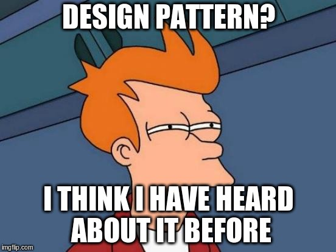

# C++ Design Patterns

Design Patterns (Entwurfsmuster) sind bewährte Lösungswege für wiederkehrende Entwurfsprobleme
in der Softwareentwicklung. Sie beschreiben die zentralen Entwurfsentscheidungen (Klassen, Objekte, deren Beziehungen zueinander).
Durch den Einsatz von Software Entwurfsmustern wird ein Entwurf flexibel, wiederverwendbar, erweiterbar, einfacher zu verwenden und 
stabiler im Falle von Änderungen.

Abbildung 1: *Relax*!

In den Entwurfsmustern manifestiert sich die jahrelange Entwicklungserfahrung vieler Softwareentwickler. 
Dieses Wissen lässt sich durch die Verwendung von Entwurfsmustern reaktivierbar und nutzbar machen,
ohne vorher den teuren Prozess der Entwurfsentwicklung erneut durchlaufen zu müssen.

Zeitgleich schulen Design Pattern die Fähigkeit zur effektiven objektorientierten Modellierung.

## [Geschichtlicher Überblick](Resources/Readme_01_History.md)

## [Was ist ein Entwurfsmuster?](Resources/Readme_02_Description.md)

## [Entwurfsprinzipien](Resources/Readme_03_Design_Principles.md)

## [Kritik](Resources/Readme_04_Criticism.md)

## [Katalog der Entwurfsmuster](Resources/Readme_05_Catalog.md)

## [Katalog der Anti-Pattern](Resources/Readme_06_Catalog_AntiPattern.md)

## [Literatur](Resources/Readme_07_Literature.md)

---
