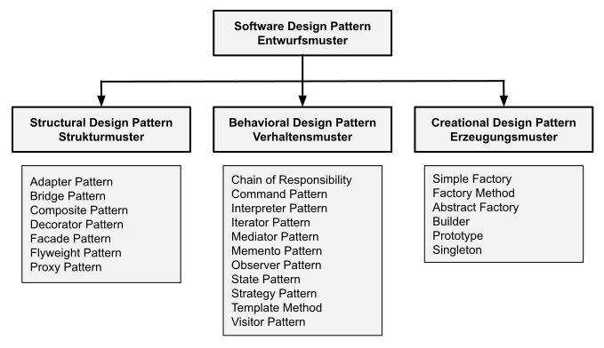
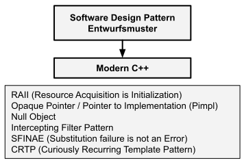
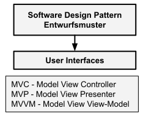

# Katalog der Entwurfsmuster

[Zurück](../Readme.md)

---

Historisch gesehen wurde eine erste Aufstellung für Software Entwurfsmuster
von den vier Autoren Erich Gamma, Richard Helm, Ralph Johnson und John Vlissides im Jahre 1994
in einem Buch mit dem Titel "Design Patterns - Elemente wiederverwendbarer objektorientierter Software" gegeben.

Diese Autoren, zusammen auch als "*Gang of Four*" ("*GOF*") bekannt,
nehmen hier eine Kategorisierung der von ihnen beschriebenen Entwurfsmuster
in die drei Kategorien Erzeugungs-, Struktur- und Verhaltensmuster
(*Creational*, *Structural* und *Behavioral Design Patterns*) vor. Eine Aufstellung 
der einzelnen Entwurfsmuster dieser Kategorien finden Sie nachstehend in *Abbildung* 1 vor:

*Abbildung* 1: Software Entwurfsmuster nach Erich Gamma, Richard Helm, Ralph Johnson und John Vlissides ("*GoF*").

Speziell im Umfeld von *Modern C++* haben sich folgende Entwurfsmuster etabliert (*Abbildung* 2):

*Abbildung* 2: *Modern C++* Entwurfsmuster.

Die drei Klassiker für Entwurfsmuster in Anwendungen mit Oberflächen sind in *Abbildung* 3 
zusammengestellt:

*Abbildung* 3: Entwurfsmuster für die Gestaltung von Oberflächen.

#### Entwurfsmuster nach Gamma, Helm, Johnson und Vlissides

##### Erzeugungsmuster

In der Softwareentwicklung sind Erstellungsmuster (so genannte *Creational Pattern*) Entwurfsmuster,
die sich mit Objekterstellungsmechanismen befassen und in Situationen verwendet werden,
in denen die klassischen Formen der Objekterzeugung zu Entwurfsproblemen führen
oder die Komplexität des Codes erhöhen.

| Muster | Kurzbeschreibung |
|:-------------- |----|
| [(Simple) Factory](../Patterns/Factory/Resources/Readme.md) | Ein **Simple Factory** Objekt wird typischerweise vom Client über eine statische Methode aufgerufen und gibt eines von mehreren Objekten zurück, die alle dasselbe übergeordnete Objekt erben bzw. im Falle einer Schnittstelle implementieren. |
| [Factory Method](../Patterns/FactoryMethod/Resources/Readme.md) | Das **Factory Method** Entwurfsmuster dient der Entkopplung des Clients von der konkreten Instanziierung einer Klasse. Die Klasse des erstellten Objekts kann elegant ausgetauscht werden. |
| [Abstract Factory](../Patterns/AbstractFactory/Resources/Readme.md) | Das **Abstract Factory** Design Pattern dient der Definition einer zusammenhängenden Familie aus Produkten. Die Familien können elegant ausgetauscht werden. |
| [Builder](../Patterns/Builder/Resources/Readme.md) | Ermöglicht schrittweises Erstellen komplexer Objekte. |
| [Prototype](../Patterns/Prototype/Resources/Readme.md) | Erstellen von Kopien vorhandener Objekte, ohne den Code von diesen Klassen abhängig zu machen. |
| [Singleton](../Patterns/Singleton/Resources/Readme.md) | Das **Singleton** Entwurfsmuster sorgt dafür, dass es von einer Klasse nur eine einzige Instanz gibt und diese global zugänglich ist. |

*Tabelle* 1: Erzeugungsmuster (*Creational Design Pattern*).

##### Strukturmuster

Strukturmuster beschreiben, wie sich Objekte und Klassen zu größeren Strukturen zusammensetzen lassen,
ohne dabei einen Verlust an Flexibilität und Effizient einzugehen.

| Muster | Kurzbeschreibung |
|:-------------- |----|
| [Adapter](../Patterns/AdapterPattern/Resources/Readme.md) | Ermöglicht die Interaktion von Objekten mit inkompatiblen Schnittstellen. |
| [Bridge](../Patterns/Bridge/Resources/Readme.md) | Aufteilung einer größeren Klasse oder einer Reihe eng verwandter Klassen in zwei separate Hierarchien - Abstraktion und Implementierung. |
| [Composite Pattern](../Patterns/CompositePattern/Resources/Readme.md) | Das **Composite** Entwurfsmuster ermöglicht es, eine verschachtelte (Baum)Struktur einheitlich zu behandeln, unabhängig davon, ob es sich um ein atomares Element oder um einen Behälter für weitere Elemente handelt. Der Client kann elegant mit der Struktur arbeiten. |
| [Decorator](../Patterns/DecoratorPattern/Resources/Readme.md) | Hinzufügen neuen Verhaltens zu Objekten, indem diese Objekte in speziellen Hüllen-Objekten platziert werden, die dieses Verhalten besitzen. |
| [Facade](../Patterns/Facade/Resources/Readme.md) | Bereitstellung einer vereinfachten Schnittstelle zu einer Bibliothek, einem Framework oder einer Menge von Objekten. |
| [Flyweight](../Patterns/Flyweight/Resources/Readme.md) | Ermöglicht es, Objekte ressourcenschonend anzulegen, indem diese gemeinsame Zustandsdaten zwischen mehreren Objekten teilen, anstatt derartige Zustandsdaten in jedem Objekt zu duplizieren. |
| [Proxy](../Patterns/Proxy/Resources/Readme.md) | Bereitstellung eines Platzhalters (Stellvertreters) für ein anderes Objekt. Das Proxy-Objekt steuert den Zugriff auf das ursprüngliche Objekt. Vor oder nach der Ausführung der eigentlichen Anforderung am ursprünglichen Objekt lassen sich zusätzliche Aktionen ergänzen. |

*Tabelle* 2: Strukturmuster (*Structural Design Pattern*).

##### Verhaltensmuster

Verhaltensentwurfsmuster betrachten Algorithmen und der Aufteilung von Verantwortlichkeiten zwischen Objekten.

| Muster | Kurzbeschreibung |
|:-------------- |----|
| [Chain of Responsibility](../Patterns/ChainOfResponsibility/Resources/Readme.md) | Ermöglicht das Weiterleiten von Anforderungen entlang einer Kette von Handlern. Nach Erhalt einer Anforderung entscheidet jeder Handler, die Anforderung entweder zu verarbeiten oder an den nächsten Handler in der Kette weiterzuleiten. |
| [Command Pattern](../Patterns/CommandPattern/Resources/Readme.md) | Das **Command** Entwurfsmuster ermöglicht die Modularisierung von Befehlen und Aufrufen. Auf elegante Weise können Befehle rückgängig gemacht, protokolliert oder in einer Warteschlange gelegt werden. |
| [Interpreter](../Patterns/InterpreterPattern/Resources/Readme.md) | Das **Interpreter** Entwurfsmuster definiert eine Repräsentation für die Grammatik einer Sprache und die Möglichkeit, Sätze dieser Sprache zu interpretieren. |
| [Iterator](../Patterns/IteratorPattern/Resources/Readme.md) | Ermöglicht das Traversieren (Durchlaufen) von Elementen einer listenartigen Datenstruktur, ohne die zugrunde liegende Darstellung (Liste, Array,  Stapel, Baum usw.) zu kennen. |
| [Mediator](../Patterns/Mediator/Resources/Readme.md) | Das **Mediator** Muster dient zum Steuern des kooperativen Verhaltens von Objekten, wobei Objekte nicht direkt kooperieren, sondern über einen Vermittler. |
| [Memento](../Patterns/Memento/Resources/Readme.md) | Das **Memento** Entwurfsmuster dient der Erfassung und Speicherung des internen Zustands eines Objektes. Hiermit kann man den vorherigen Status eines Objekts speichern und wiederherstellen, ohne Details der Implementierung preisgeben zu müssen. |
| [Observer](../Patterns/Observer/Resources/Readme.md) | Das **Observer** Entwurfsmuster ist für Situation geeignet, in denen ein oder mehrere Objekte benachrichtigt werden müssen, sobald sich der Zustand eines bestimmten Objekts ändert. |
| [State](../Patterns/StatePattern/Resources/Readme.md) | 	Das **State** Entwurfsmuster ermöglicht die elegante Modellierung vom zustandsabhängigen Verhalten eines Objekts. Je nach internem Zustand ändert sich das Verhalten des Objekts, es scheint, als hätte das Objekt seine Klasse geändert. |
| [Strategy Pattern](../Patterns/StrategyPattern/Resources/Readme.md) | Beschreibt eine Familie von Algorithmen, kapselt jeden einzelnen und macht sie austauschbar. Das Strategiemuster ermöglicht es, den Algorithmus unabhängig von ihn nutzenden Klienten zu variieren. |
| [Template Method](../Patterns/TemplatePattern/Resources/Readme.md) | Definiert das Grundgerüst eines Algorithmus in einer Oberklasse, lässt Unterklassen bestimmte Schritte des Algorithmus überschreiben, ohne dabei Änderungen an der prinzipiellen Algorithmusstruktur zu gestatten. |
| [Visitor Method](../Patterns/Visitor/Resources/Readme.md) | Befasst sich mit der Trennung von Algorithmen von den Objekten, mit denen sie arbeiten. |

*Tabelle* 3: Verhaltensmuster (*Behavioral Design Pattern*).

#### Weitere Entwurfsmuster

Neben diesen klassischen Entwurfsmustern finden sich in verschiedenen Publikationen weitere
Gruppierungen von Entwurfsmustern. In Büchern über "Modern C++" stößt man häufig auf folgende Entwurfsmuster:

| Muster | Kurzbeschreibung |
|:-------------- |----|
| [RAII (Resource Acquisition Is Initialization)](../Patterns/RAII_Idiom/Resources/Readme.md) | *Resource Acquisition Is Initialization* |
| [Opaque Pointer / Pimpl](../Patterns/Pimpl/Resources/Readme.md) | *Pointer to implementation* |
| [Null Object](../Patterns/NullObject/Resources/Readme.md) | Null Objekt |
| [Intercepting Filter Pattern](../Patterns/InterceptingFilterPattern/Resources/Readme.md) | *Intercepting Filter Pattern* |
| SFINAE | *Substitution failure is not an error* |
| CRTP | *Curiously recurring template pattern* |

*Tabelle* 4: Weitere Softwaremuster (*Modern C++*)

Für den Entwurf von Oberflächen gibt es im Prinzip drei "Klassiker"

| Muster | Kurzbeschreibung |
|:-------------- |----|
| [MVC ](../Patterns/MVC/Resources/Readme.md) | Model-View-Controller |
| MVP | Model-View-Presenter |
| MVVM | Model View View-Model |

*Tabelle* 5: Entwurfsmuster für Oberflächen

In einem weiteren Buch von [Robert Nystrom](https://gameprogrammingpatterns.com/),
aktuell bei der Fa. Google in der Entwicklung der Programmiersprache *Dart* beschäftigt,
finden sich weitere interessante Entwurfsmuster vor:

| Muster | Kurzbeschreibung |
|:-------------- |----|
| Double Buffer | Vermeintliche Ausführung einer Reihe von aufeinanderfolgenden (sequentiellen) Vorgängen (quasi) unverzüglich oder (quasi) gleichzeitig. |
| Game Loop | Entkopplung des Spieleverlaufs (Ablauf der Anwendung) von Benutzereingaben und Prozessorgeschwindigkeit. |
| Update Method | Simulation des Anstoßes einer Aktivität bei einer Anzahl unabhängiger Objekte (Ausführung eines *Frames* in regelmäßigen Abständen). |

*Tabelle* 6: Sequencing Patterns
    
sowie

| Muster | Kurzbeschreibung |
|:-------------- |----|
| Bytecode | Schaffung von Flexibilität für die Daten, indem Sie sie als Anweisungen für eine virtuelle Maschine codieren. |
| Subclass Sandbox | Definieren Sie das Verhalten in einer Unterklasse mithilfe einer Reihe von Operationen, die von der Basisklasse bereitgestellt werden. |
| Type Object | Ermöglicht die flexible Erstellung neuer *Klassen*, indem Sie eine einzelne Klasse erstellen, von der jede Instanz einen anderen Objekttyp darstellt. |

*Tabelle* 7: Behavioral Patterns

und

| Muster | Kurzbeschreibung |
|:-------------- |----|
| Component | Ermöglicht einer einzelnen Entität, mehrere Domänen zu umfassen, ohne die Domänen miteinander zu koppeln. |
| Event Queue | Entkoppelt die Verarbeitung einer Nachricht oder ein Ereignisses vom Zeitpunkt, zu dem sie gesendet (bzw. empfangen) wird. |
| Service Locator | Stellt einen globalen Zugriffspunkt auf einen Dienst bereit, ohne Benutzer an eine konkrete Klasse zu koppeln, die den Service implementiert. |

*Tabelle* 8: Decoupling Patterns

und

| Muster | Kurzbeschreibung |
|:-------------- |----|
| Data Locality | Beschleunigen Sie den Speicherzugriff, indem Sie Daten so anordnen, dass das CPU-Caching genutzt wird. |
| Dirty Flag | Vermeiden Sie unnötige Rechenzeit, indem Sie diese verschieben, bis das Ergebnis benötigt wird. |
| Object Pool | Verbesserung von Rechenleistung und Speichernutzung, indem Objekte aus einem festen Pool wiederverwendet werden, anstatt sie einzeln anzufordern und freizugeben. |
| Spatial Partition | Effizienter Zugriff auf Objekte, indem diese in einer nach ihren Positionen geordneten Datenstruktur gespeichert werden. |

*Tabelle* 9: Optimization Patterns

---

#### `std::enable_shared_from_this`

Das Thema `std::enable_shared_from_this` wird in einigen Mustern speziell angesprochen:

  * [Mediator](../Patterns/Mediator/Resources/Readme.md) 
  * [Composite Pattern](../Patterns/CompositePattern/Resources/Readme.md) 
  * [State](../Patterns/StatePattern/Resources/Readme.md) 
  * [Observer](../Patterns/Observer/Resources/Readme.md) 
  * [Visitor Method](../Patterns/Visitor/Resources/Readme.md) 

---

[Zurück](../Readme.md)

---
