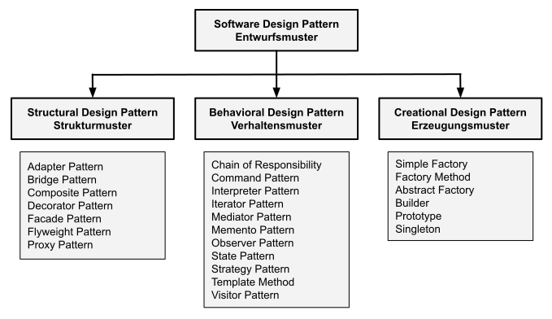
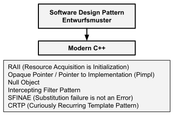
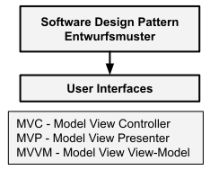

# Katalog der Entwurfsmuster

[Zurück](../Readme.md)

---

Historisch gesehen wurde eine erste Aufstellung für Software Entwurfsmuster
von den vier Autoren Erich Gamma, Richard Helm, Ralph Johnson und John Vlissides im Jahre 1994
in einem Buch mit dem Titel "Design Patterns - Elemente wiederverwendbarer objektorientierter Software" gegeben.

Diese Autoren, zusammen auch als "*Gang of Four*" ("*GOF*") bekannt,
nehmen hier eine Kategorisierung der von ihnen beschriebenen Entwurfsmuster
in die drei Kategorien Erzeugungs-, Struktur- und Verhaltensmuster
(*Creational*, *Structural* und *Behavioral Design Patterns*) vor. Eine Aufstellung 
der einzelnen Entwurfsmuster dieser Kategorien finden Sie nachstehend in *Abbildung* 1 vor:

*Abbildung* 1: Software Entwurfsmuster nach Erich Gamma, Richard Helm, Ralph Johnson und John Vlissides ("*GoF*").

Speziell im Umfeld von *Modern C++* haben sich folgende Entwurfsmuster etabliert (*Abbildung* 2):

*Abbildung* 2: *Modern C++* Entwurfsmuster.

Die drei Klassiker für Entwurfsmuster in Anwendungen mit Oberflächen sind in *Abbildung* 3 
zusammengestellt:

*Abbildung* 3: Entwurfsmuster für die Gestaltung von Oberflächen.

#### Entwurfsmuster nach Gamma, Helm, Johnson und Vlissides

##### Erzeugungsmuster

Erstellungsmuster (*Creational Pattern*) beschäftigen sich damit, wie **Objekte erzeugt** werden,
und kapseln bzw. flexibilisieren den Erzeugungsprozess.
Ziel ist, die konkrete Erstellung von Objekten möglichst von ihrer Verwendung zu entkoppeln

| Muster | Kurzbeschreibung |
|:-------------- |----|
| [Simple Factory](../Patterns/SimpleFactory/Resources/Readme.md) | Das *Simple Factory* Pattern kapselt die Erzeugung von Objekten, sodass der aufrufende Code nicht selbst entscheiden muss, welche konkrete Klasse instanziiert wird. |
| [Factory Method](../Patterns/FactoryMethod/Resources/Readme.md) | Das *Factory Method* Pattern kapselt die Erzeugung von Objekten, indem es Unterklassen die Entscheidung darüber überlässt, welche konkrete Produktklasse instanziiert wird. |
| [Abstract Factory](../Patterns/AbstractFactory/Resources/Readme.md) | Das *Abstract Factory* Pattern kapselt die Erzeugung zusammengehöriger Objekte einer Produktfamilie, ohne dass der Client deren konkrete Klassen kennen muss. |
| [Builder](../Patterns/Builder/Resources/Readme.md) | Das *Builder* Pattern trennt die schrittweise Konstruktion eines komplexen Objekts von seiner Repräsentation, sodass derselbe Konstruktionsprozess unterschiedliche Ausprägungen des Objekts erzeugen kann. |
| [Prototype](../Patterns/Prototype/Resources/Readme.md) | Das Prototype Pattern ermöglicht es, neue Objekte durch das Klonen eines vorhandenen Objekts zu erzeugen, ohne dessen konkrete Klasse direkt kennen zu müssen. |
| [Singleton](../Patterns/Singleton/Resources/Readme.md) | Das *Singleton* Pattern stellt sicher, dass von einer Klasse genau eine Instanz existiert und diese global zugänglich ist. |

*Tabelle* 1: Erzeugungsmuster (*Creational Design Pattern*).

##### Strukturmuster

Strukturmuster beschreiben, wie sich **Objekte und Klassen zu größeren Strukturen zusammensetzen** lassen,
ohne dabei einen **Verlust an Flexibilität und Effizienz** einzugehen.

| Muster | Kurzbeschreibung |
|:-------------- |----|
| [Adapter](../Patterns/AdapterPattern/Resources/Readme.md) | Das Adapter Pattern konvertiert die Schnittstelle einer bestehenden Klasse in eine andere Schnittstelle, die von einem Client erwartet wird, sodass Klassen mit inkompatiblen Schnittstellen zusammenarbeiten können. |
| [Bridge](../Patterns/Bridge/Resources/Readme.md) | Das Bridge Pattern trennt eine Abstraktion von ihrer Implementierung, sodass beide unabhängig voneinander variiert und weiterentwickelt werden können. |
| [Composite Pattern](../Patterns/CompositePattern/Resources/Readme.md) | Das Composite Pattern ermöglicht es, einzelne Objekte und aus diesen zusammengesetzte Objektstrukturen einheitlich zu behandeln. |
| [Decorator](../Patterns/DecoratorPattern/Resources/Readme.md) | Das Decorator Pattern ermöglicht es, einem Objekt zur Laufzeit zusätzliche Funktionalitäten zu verleihen, ohne dessen Klasse zu verändern. |
| [Facade](../Patterns/Facade/Resources/Readme.md) | Das Facade Pattern stellt eine vereinfachte, einheitliche Schnittstelle vor ein komplexes Subsystem aus mehreren Klassen, sodass Clients dieses Subsystem nutzen können, ohne seine innere Struktur und Zusammenhänge kennen zu müssen. |
| [Flyweight](../Patterns/Flyweight/Resources/Readme.md) | Das Flyweight Pattern reduziert den Speicherbedarf, indem es gemeinsame, unveränderliche Objektzustände zentral verwaltet und von mehreren Objekten wiederverwenden lässt. |
| [Proxy](../Patterns/Proxy/Resources/Readme.md) | Das Proxy Design Pattern stellt ein Stellvertreterobjekt für ein anderes Objekt bereit, das dieselbe Schnittstelle wie das andere Objekt implementiert und ermöglicht es, den Zugriff auf dieses Objekt kontrolliert zu steuern. |

*Tabelle* 2: Strukturmuster (*Structural Design Pattern*).

##### Verhaltensmuster

Verhaltensentwurfsmuster regeln, **wie Objekte miteinander kommunizieren** und **Aufgaben bzw. Verantwortlichkeiten verteilen**.
Im Mittelpunkt stehen also Interaktionen, Algorithmen und die Steuerung des Verhaltens von Objekten.

| Muster | Kurzbeschreibung |
|:-------------- |----|
| [Chain of Responsibility](../Patterns/ChainOfResponsibility/Resources/Readme.md) | Das Chain-of-Responsibility-Pattern leitet eine Anfrage entlang einer Kette von Objekten weiter, bis eines dieser Objekte sie bearbeiten kann. |
| [Command Pattern](../Patterns/CommandPattern/Resources/Readme.md) | Das Command Pattern kapselt eine Anfrage (einen Methodenaufruf mit allen dazugehörigen Parametern) als eigenständiges Objekt, sodass sich Aufrufer und Ausführender entkoppeln lassen und Anfragen sich parametrisieren, in Warteschlangen einreihen, protokollieren oder rückgängig machen lassen. |
| [Interpreter](../Patterns/InterpreterPattern/Resources/Readme.md) | Das Interpreter Pattern definiert für eine einfache Grammatik eine Klassenhierarchie, mit der sich Sätze dieser Sprache als Objektbaum darstellen und durch rekursives Auswerten dieses Baums interpretieren lassen. |
| [Iterator](../Patterns/IteratorPattern/Resources/Readme.md) | Das Iterator Pattern stellt eine einheitliche Möglichkeit bereit, die Elemente einer Sammlung nacheinander zu durchlaufen, ohne deren interne Struktur (Array, Liste, Baum, ...) offenzulegen. |
| [Mediator](../Patterns/Mediator/Resources/Readme.md) | Das Mediator Pattern kapselt die Kommunikation zwischen mehreren Objekten in einem zentralen Vermittler, sodass die Objekte nicht direkt voneinander abhängen müssen. |
| [Memento](../Patterns/Memento/Resources/Readme.md) | Das Memento Pattern ermöglicht es, den Zustand eines Objekts zu speichern und später wiederherzustellen, ohne dessen interne Implementierung nach außen offenzulegen. |
| [Observer](../Patterns/Observer/Resources/Readme.md) | Das Observer Pattern ermöglicht es einem Objekt, mehrere interessierte Objekte automatisch über Änderungen seines Zustands zu informieren, ohne deren konkrete Implementierungen kennen zu müssen. |
| [State](../Patterns/StatePattern/Resources/Readme.md) | Das State Pattern ermöglicht es einem Objekt, sein Verhalten abhängig von seinem aktuellen Zustand zu verändern, ohne dass die Zustandslogik in einer großen bedingten Anweisung zusammengefasst werden muss. |
| [Strategy Pattern](../Patterns/StrategyPattern/Resources/Readme.md) | Das Strategy Pattern kapselt unterschiedliche Algorithmen bzw. Verhaltensweisen hinter einer gemeinsamen Schnittstelle, sodass sie unabhängig voneinander ausgetauscht werden können. |
| [Template Method](../Patterns/TemplatePattern/Resources/Readme.md) | Das Template Method Pattern definiert den grundlegenden Ablauf eines Algorithmus in einer Basisklasse und überlässt einzelne Schritte davon den abgeleiteten Klassen. |
| [Visitor Method](../Patterns/Visitor/Resources/Readme.md) | Das Visitor Pattern ermöglicht es, neue Operationen auf einer bestehenden Objektstruktur hinzuzufügen, ohne die Klassen dieser Struktur selbst verändern zu müssen. |

*Tabelle* 3: Verhaltensmuster (*Behavioral Design Pattern*).

#### Weitere Entwurfsmuster

Neben diesen klassischen Entwurfsmustern finden sich in verschiedenen Publikationen weitere
Gruppierungen von Entwurfsmustern. In Büchern über "Modern C++" stößt man häufig auf folgende Entwurfsmuster:

| Muster | Kurzbeschreibung |
|:-------------- |----|
| [RAII](../Patterns/RAII_Idiom/Resources/Readme.md) | *Resource Acquisition Is Initialization* |
| [Opaque Pointer / Pimpl](../Patterns/Pimpl/Resources/Readme.md) | *Pointer to implementation* |
| [Null Object](../Patterns/NullObject/Resources/Readme.md) | Null Objekt |
| [Intercepting Filter Pattern](../Patterns/InterceptingFilterPattern/Resources/Readme.md) | *Intercepting Filter Pattern* |
| [Type Erasure](../Patterns/TypeErasure/Resources/Readme.md) | *Type Erasure* |
| [Policy-Based Design](../Patterns/PolicyBasedDesign/Resources/Readme.md) | *Policy-Based Design* |
| SFINAE | *Substitution failure is not an error* |
| CRTP | *Curiously recurring template pattern* |

*Tabelle* 4: Weitere Softwaremuster (*Modern C++*)

In der Softwareentwicklung beschreiben *Concurrency Pattern* jene Arten von Entwurfsmustern,
die sich mit dem Multithreading-Programmierparadigma befassen:

| Muster | Kurzbeschreibung |
|:-------------- |----|
| Active Object | *Active Object* Entwurfsmuster |
| Monitor Object | *Monitor Object* Entwurfsmuster |

*Tabelle* 5: *Concurrency Pattern*

Für den Entwurf von Oberflächen gibt es im Prinzip drei "Klassiker"

| Muster | Kurzbeschreibung |
|:-------------- |----|
| [MVC](../Patterns/MVC/Resources/Readme.md) | Model-View-Controller |
| MVP | Model-View-Presenter |
| MVVM | Model View View-Model |

*Tabelle* 6: Entwurfsmuster für Oberflächen

In einem weiteren Buch von [Robert Nystrom](https://gameprogrammingpatterns.com/),
aktuell bei der Fa. Google in der Entwicklung der Programmiersprache *Dart* beschäftigt,
finden sich weitere interessante Entwurfsmuster vor:

| Muster | Kurzbeschreibung |
|:-------------- |----|
| Double Buffer | Vermeintliche Ausführung einer Reihe von aufeinanderfolgenden (sequentiellen) Vorgängen (quasi) unverzüglich oder (quasi) gleichzeitig. |
| Game Loop | Entkopplung des Spieleverlaufs (Ablauf der Anwendung) von Benutzereingaben und Prozessorgeschwindigkeit. |
| Update Method | Simulation des Anstoßes einer Aktivität bei einer Anzahl unabhängiger Objekte (Ausführung eines *Frames* in regelmäßigen Abständen). |

*Tabelle* 7: Sequencing Patterns
    
sowie

| Muster | Kurzbeschreibung |
|:-------------- |----|
| Bytecode | Schaffung von Flexibilität für die Daten, indem Sie sie als Anweisungen für eine virtuelle Maschine codieren. |
| Subclass Sandbox | Definieren Sie das Verhalten in einer Unterklasse mithilfe einer Reihe von Operationen, die von der Basisklasse bereitgestellt werden. |
| Type Object | Ermöglicht die flexible Erstellung neuer *Klassen*, indem Sie eine einzelne Klasse erstellen, von der jede Instanz einen anderen Objekttyp darstellt. |

*Tabelle* 8: Behavioral Patterns

und

| Muster | Kurzbeschreibung |
|:-------------- |----|
| Component | Ermöglicht einer einzelnen Entität, mehrere Domänen zu umfassen, ohne die Domänen miteinander zu koppeln. |
| Event Queue | Entkoppelt die Verarbeitung einer Nachricht oder ein Ereignisses vom Zeitpunkt, zu dem sie gesendet (bzw. empfangen) wird. |
| Service Locator | Stellt einen globalen Zugriffspunkt auf einen Dienst bereit, ohne Benutzer an eine konkrete Klasse zu koppeln, die den Service implementiert. |

*Tabelle* 9: Decoupling Patterns

und

| Muster | Kurzbeschreibung |
|:-------------- |----|
| Data Locality | Beschleunigen Sie den Speicherzugriff, indem Sie Daten so anordnen, dass das CPU-Caching genutzt wird. |
| Dirty Flag | Vermeiden Sie unnötige Rechenzeit, indem Sie diese verschieben, bis das Ergebnis benötigt wird. |
| Object Pool | Verbesserung von Rechenleistung und Speichernutzung, indem Objekte aus einem festen Pool wiederverwendet werden, anstatt sie einzeln anzufordern und freizugeben. |
| Spatial Partition | Effizienter Zugriff auf Objekte, indem diese in einer nach ihren Positionen geordneten Datenstruktur gespeichert werden. |

*Tabelle* 10: Optimization Patterns

---

#### `std::enable_shared_from_this`

Das Thema `std::enable_shared_from_this` wird in einigen Mustern speziell angesprochen:

  * [Mediator](../Patterns/Mediator/Resources/Readme.md) 
  * [Composite Pattern](../Patterns/CompositePattern/Resources/Readme.md) 
  * [State](../Patterns/StatePattern/Resources/Readme.md) 
  * [Observer](../Patterns/Observer/Resources/Readme.md) 
  * [Visitor Method](../Patterns/Visitor/Resources/Readme.md) 

---

[Zurück](../Readme.md)

---
