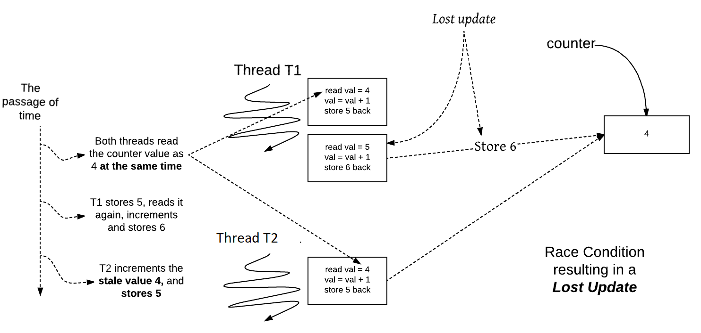

# Katalog der Anti-Pattern

## Überblick

[Zurück](../Readme.md)

---

Neben Entwurfsmustern gibt es auch so genannte Anti-Entwurfsmuster: Hierunter verstehen wir offensichtlich
(bekannte) Vorgehensweisen in der Software-Entwicklung, denen bereits zu Beginn des Entwicklungsprozesses
schlechte Aussichten auf eine qualitativ gelungene Architektur bescheinigt werden kann:


| Anti-Pattern | Kurzbeschreibung |
|:-------------- |----|
| [The Blob (a.k.a. God Object)](#God-Object) | Steht für eine einzelne Klasse, die die Verarbeitung monopolisiert und andere sekundäre Klassen, die letzten Endes nur Daten kapseln. |
| Continuous Obsolescence | Kontinuierliche Veralterung / Beschreibt eine Technologie, die sich so schnell ändert, dass Entwickler Probleme haben, mit den aktuellen Softwareversionen Schritt zu halten und Kombinationen von Produktversionen zu finden, die zusammenarbeiten. |
| Lava Flow | Das *Lava Flow* Anti Pattern ist häufig in Systemen zu finden, die aus der Forschung heraus entstanden sind, aber in der Produktion gelandet sind. Es ist gekennzeichnet durch lavaartige "Flüsse" früherer Entwicklungsversionen, die über die Codelandschaft verstreut sind und sich nun zu einer basaltartigen, unbeweglichen, im Allgemeinen nutzlosen Codemasse verhärtet haben, an die sich niemand mehr erinnern kann. |
| Ambiguous Viewpoint | Objektorientierte Analyse- und Entwurfsmodelle (OOA&D) werden häufig dargestellt, ohne den vom Modell dargestellten Gesichtspunkt zu klären (Geschäfts-, Spezifikations- oder Implementierungsstandpunkt). |
| Functional Decomposition | Resultat von nicht objektorientierten Entwicklern, die eine Anwendung in einer objektorientierten Sprache entwerfen und implementieren. |
| Poltergeists | Poltergeister sind Klassen mit begrenzten Verantwortlichkeiten und Rollen, die im System benötigt werden. Daher ist ihr effektiver Lebenszyklus recht kurz. Poltergeister überladen Software-Design und erzeugen unnötige Abstraktionen. Sie sind übermäßig komplex, schwer zu verstehen und schwer zu pflegen. |
| Boat Anchor | Unter einem „*Bootsanker*“ („*Boat Anchor*“) versteht man Software (oder Hardware), die im aktuellen Projekt keinen nützlichen Zweck erfüllt. Oft ist der „*Bootsanker*“ eine kostspielige Anschaffung, was den Kauf noch ironischer macht. |
| Golden Hammer | Eine vertraute Technologie oder ein bekanntes Konzept, das zwanghaft auf (zu viele) Softwareprobleme angewendet wird. |
| Dead End | Die direkte Änderung von kommerzieller Software oder wiederverwendbarer Software führt zu erheblichen Aufwendungen in der Wartung eines Softwaresystems. Das „*Dead End*“ wird durch Ändern einer wiederverwendbaren Komponente erreicht, wenn die geänderte Komponente nicht mehr vom Lieferanten gewartet und unterstützt wird. |
| Spaghetti Code | Ad-hoc-Softwarestrukturen machen es schwierig, die Software zu erweitern und den Code zu optimieren. „*Spaghetti-Code*“ zeugt von Software, die nur sehr wenig Softwarestruktur enthält. Codierung und progressive Erweiterungen beeinträchtigen die Softwarestruktur in einem solchen Ausmaß, dass die Struktur selbst für den ursprünglichen Entwickler nicht klar genug ist, wenn dieser für längere Zeit von der Software entfernt ist. |
| [Input Kludge](#Input-Kludge) | Ein *Input Kludge* - zu Deutsch etwa "Eingabe-Flickschusterei, -Behelfslösung" ist eine Art von Fehler in der Software (ein Anti-Pattern), bei dem einfache Benutzereingaben nicht richtig behandelt werden. |
| Walking through a Minefield | Der Gebrauch von Software, die zum Kunden ausgeliefert wurde, kann mit dem Gehen durch ein Minenfeld verglichen werden. Dieses Mini-Anti-Muster ist auch bekannt als *Nothing Works* oder *Do You Believe in Magic*? In freigegebenen Softwareprodukten treten zahlreiche Fehler auf. Experten schätzen, dass der ursprüngliche Quellcode zwei bis fünf Fehler pro Codezeile enthält. Dies bedeutet, dass der Code zwei oder mehr Änderungen pro Zeile erfordert, um alle Fehler zu beseitigen. |
| [Copy-and-Paste Programming](#Copy-and-Paste-Programming) | Durch das Kopieren von Quellanweisungen wiederverwendeter Code führt zu erheblichen Wartungsproblemen. |
| Mushroom Management | In einigen Software-Architekturkreisen gibt es eine explizite Richtlinie, die besagt, dass Systementwickler von den Endbenutzern des Systems zu isolieren sind. Anforderungen werden aus zweiter Hand von Vermittlern weitergeleitet, einschließlich Architekten, Managern oder Anforderungsanalysten. „*Mushroom Management*“ legt zugrunde, dass die Anforderungen sowohl vom Endbenutzer als auch von den Entwicklern gut verstanden werden. Ferner wird davon ausgegangen, dass die Anforderungen stabil sind. |
| [Interface Bloat](#Interface-Bloat) | *Interface Bloat* sind Interfaces (Zusammenfassung mehrerer Methodenschnittstellen), die zu viele Methoden in einer einzigen Schnittstelle integrieren. |
| [Race Conditions](#Race-Conditions) | Unter einer "Race-Condition" versteht man im Ablauf eines multi-threading / multi-processing Programms eine Situation, die auftritt, wenn versucht wird, zwei oder mehr Funktionen/Methoden gleichzeitig ("parallel") auszuführen. |
| [Circular Dependencies](#Circular-Dependencies) | In der Softwareentwicklung ist eine zirkuläre Abhängigkeit eine Beziehung zwischen zwei oder mehreren Modulen, die entweder direkt oder indirekt voneinander abhängig sind. Solche Module werden auch als „*gegenseitig rekursiv*“ (*mutually recursiv*) bezeichnet. |

Tabelle 1. Anti-Pattern


## Einige Antipattern im Detail

#### God Object

##### Beschreibung

Gefunden in Entwürfen, in denen eine Klasse die Verarbeitung monopolisiert:

  * Konzentration zu vieler Funktionen (Methoden) in einem Teil des Designs (Klasse)
  * Weiß typischerweise alles darüber, was in der Anwendung passiert, und weiß, wie man mit allen Daten in der Anwendung interagiert
  * Oft wird es im Laufe der Zeit unglaublich schwierig, die *God Object* Klasse zu warten, da Änderungen weitreichende Nebenwirkungen haben
  * Übermäßig kompliziert, weil es den Status eines Großteils der Anwendung verwaltet - und wird damit zum Mediator aller Abläufe in der Anwendung
  * Das Muster wird häufig in Mikrocontroller-Software verwendet, bei denen die zentrale Steuerung wichtiger ist als Eleganz und einfache Wartbarkeit der Software


##### Abhilfe

Zerlegen Sie die *God Object* Klasse und verteilen Sie die Verantwortlichkeiten neu.


#### Input Kludge 

##### Beschreibung

Ein *Input Kludge* - zu Deutsch etwa "Eingabe-Flickschusterei, -Behelfslösung" ist eine Art von Fehler in der Software (Anti-Pattern),
bei dem einfache Benutzereingaben nicht richtig behandelt werden.
Dies kann zu Abstürzen beim Pufferüberlauf führen.

##### Identifizierung

Eine offensichtliche *Code Geruchsbelästigung*, die auf dieses Muster hinweisen kann, sind Ad-hoc-Routinen zur Validierung von Eingaben.

*Beispiel*:

  * JavaScript-Validierungsfunktionen, die direkt in der Webseite oder in der View definiert sind.
  * Serverseitige Validierungsroutinen, die im Presentation Layer oder im Controller definiert ist.

###### Beispiel

```javascript
$('form').on('submit', function(event) {
    if (!(/^.*@.*\.(com|edu|net|org)$/g.exec($('#email').val()))) {
        alert('You must enter a valid email address.');
        return false;
    }
})
```

Unser erster Hinweis, dass es ein Problem geben könnte, besteht darin,
dass die Validierungsroutine (in diesem Fall `regex`) für diese bestimmte Eingabe ad-hoc definiert ist.
Dies bedeutet nicht sofort, dass ein Problem vorliegt, aber dies ist eine *Code Geruchsbelästigung*, die bedeutet,
dass wir diese Code-Passagen mit einem größeren Augenmerk unterziehen sollten.

Bei näherer Betrachtung wird es ziemlich schnell klar, dass dies definitiv ein *Input Kludge* ist.
Alle gültigen E-Mail-Adressen mit einem weniger gebräuchlichen Domain-Suffix (z. B. `email@ddress.us`) werden abgelehnt.

Außerdem würden ungültige E-Mail-Adressen akzeptiert (zum Beispiel `@.com`).


###### Lösung

Die Lösung für dieses Problem (und die meisten Eingabeprobleme) besteht darin,
eine gemeinsam genutzte, weit verbreitete und gründlich getestete Bibliothek für Standardvalidierungen zu verwenden.

Hier ist unser Beispiel, das mithilfe einer fiktiven Validierungsbibliothek überarbeitet wurde (die natürlich gründlich getestet wurde):

```javascript
$('form').on('submit', function(event) {
    if (!$.isValid.email($('#email').val())) {
        alert('You must enter a valid email address.');
        return false;
    }
})
```


Weitere bekannte Vertreter für mögliche *Input Kludge* ´Schwachstellen:

  * CRT (C-Runtime-Library)

```cpp
strcpy 
```

  * SQL Injection

```cpp
<form action=‘index.php’ method="post">
    <input type="email" name="email" required="required"/>
    <input type="password" name="password"/>
    <input type="checkbox" name="remember_me" value="Remember me"/>
    <input type="submit" value="Submit"/>
</form>
```

Siehe eine Beschreibung hier:

[SQL Injection Tutorial](https://www.guru99.com/learn-sql-injection-with-practical-example.html)


#### Interface Bloat

##### Beschreibung

*Interface Bloat*, von Bjarne Stroustrup auch als *Fat Interfaces* und von Martin Fowler als *Refused Bequests* bezeichnet,
sind Interfaces (Zusammenfassung mehrerer Methoden), die zu viele Methoden in eine einzige Schnittstelle integrieren.
Wollte man eine derartige Schnittstelle implementieren, stellt man fest,
dass die meisten Klassen auf Grund der Komplexität der Schnittstelle
erhebliche Probleme haben, eine Realisierung bereitzustellen.

##### Identifizierung

  * Eine Schnittstelle wird immer wieder mit neuen Methoden erweitert, ohne dass es zu einer Trennung kommt, sodass Sie eine monolithische Implementierungs-Klasse erhalten, die nur noch schwer zu warten und zu verwenden ist.
  * Die in einer vorhandenen Schnittstelle deklarierten Methoden erhalten immer wieder neue Parameter zu ihren Signaturen, sodass Sie ständig aktualisieren müssen und Ihre vorhandenen Anwendungen nicht abwärtskompatibel sind.
  * Methoden in einer vorhandenen Schnittstelle werden immer wieder mit sehr ähnlichen Varianten überladen (*method overloading*), was zu Schwierigkeiten bei der Auswahl der zu verwendenden relevanten Methode führen kann.

##### Abhilfe

Folge dem "Interface Segregation" Prinzip: Das Prinzip besagt, dass im Bereich der Softwareentwicklung kein
Entwickler einer Klasse gezwungen werden sollte, Methoden zu implementieren, die er nicht verwendet/benötigt.

Das "Interface Segregation Principle" (ISP) teilt sehr große Schnittstellen in kleinere und spezifischere Schnittstellen auf,
sodass Clients nur die für sie interessanten Methoden kennen müssen.
Solche geschrumpften Schnittstellen werden auch Rollenschnittstellen (*role interfaces*) genannt.

Die Intention von ISP ist es, eine Menge von Klassen zu entkoppeln und somit flexibler interagieren zu können in Bezug auf
"Klassen umgestalten, ändern und neu bereitstellen".

ISP ist eines der fünf SOLID-Prinzipien des objektorientierten Designs!

##### Ein Beispiel

```cpp
#include <iostream>
#include <string>
#include <stdexcept>

/*
 * The ILog interface contains the declaration of the Log method
 * that logs a text to a file or a database.
 * It also contains two other methods -- the OpenConnection 
 * and the CloseConnection methods. Note that these methods are used
 * to open and close database connections while logging data to a database.
 * These methods are not needed when you need to log data in a file.
 */

class ILog
{
public:
    virtual void Log(std::string message) = 0;
    virtual void OpenConnection() = 0;
    virtual void CloseConnection() = 0;
};

/*
 * The FileLogger class implements the ILog interface and defines the Log method.
 */

class FileLogger : public ILog
{
public:
    virtual void Log(std::string message) override
    {
        // code to log to a file           
    }
};

/*
 * The DBLogger class implements the ILog interface and implements
 * all of the methods of the ILog interface
 */

class DBLogger : public ILog
{
public:
    virtual void Log(std::string message) override
    {
        // code to log data to a database
    }

    virtual void OpenConnection() override
    {
        // opens database connection
    }

    virtual void CloseConnection() override
    {
        // closes the database connection
    }
};

/*
 * When you compile the code, you'll see that the compiler flags errors
 * stating that the FileLogger class doesn't implement the interface members
 * ILog.OpenConnection() and ILog.CloseConnection().
 * To fix this, you are constrained to implement the
 * ILog.OpenConnection() and ILog.CloseConnection() methods 
 * in the FileLogger class even if you would never need them.
 * The modified version of the FileLogger class looks like this.
 */

class FileLogger2 : public ILog
{
public:
    virtual void Log(std::string message) override
    {
        // code to log to a file           
    }

    virtual void CloseConnection() override
    {
        throw std::exception("not implemented");
    }

    virtual void OpenConnection() override
    {
        throw std::exception("not implemented");
    }
};

// ====================================================

/*
 * Here is how you can segregate the interfaces and ensure 
 * that the Interface Segregation principle is adhered to.
*/

class ILogEx
{
public:
    virtual void Log(std::string message) = 0;
};

class IDBLogEx : public ILogEx
{
public:
    virtual void OpenConnection() = 0;
    virtual void CloseConnection() = 0;
};

class IFileLogEx : public ILogEx
{
public:
    virtual void CheckFileSize() = 0;
    virtual void GenerateFileName() = 0;
};

/*
* Note that two new interfaces have been introduced -- IDBLog and IFileLog.
* I've also introduced two new methods in the IFileLog interface -- these
* are specific to file logging operations.
* While the CheckFileSize method would be used to check the size
* of the log file -- this would be handy in case you would like to restrict
* the file size to a pre-defined limit and then rollover the file.
* The GenerateFileName method would be used to generate the new name
* for the log file if the current log file size has reached
* the maximum file size threshold.
*/

class FileLoggerEx : IFileLogEx
{
public:
    virtual void CheckFileSize() override
    {
        // code to check log file size
    }

    virtual void GenerateFileName() override
    {
        // code to generate a new file name
    }

    virtual void Log(std::string message) override
    {
        // code to log data to the log file
    }
};

class DBLoggerEx : public IDBLogEx
{
public:
    virtual void Log(std::string message) override
    {
        // code to log data to the database
    }

    virtual void OpenConnection() override
    {
        // code to open database connection
    }

    virtual void CloseConnection() override
    {
        // code to close database connection
    }
};
```

#### Race Conditions

##### Beschreibung

Unter einer "Race-Condition" versteht man im Ablauf eines Multi-Threading / Multi-Processing Programms eine Situation,
die auftritt, wenn versucht wird, zwei oder mehr Funktionen/Methoden gleichzeitig ("parallel") auszuführen.
Aufgrund der Art des Geräts oder Systems müssen die Vorgänge jedoch sequentiell ausgeführt werden,
um korrekt ausgeführt zu werden.

Ein Beispielszenario wird in *Abbildung* 1 dargestellt:



*Abbildung* 1: Konkurrierender Zugriff auf gemeinsame Daten.


##### Abhilfe

Sogenannte "Mutex"-Objekte:

Der Sinn eines Mutex-Objekts (*"Mutual Exclusion"*) besteht darin, zwei Threads zu synchronisieren.
Wenn zwei Threads versuchen, auf eine einzelne Ressource zuzugreifen, besteht das allgemeine Muster darin,
dass der erste Thread versucht, das Mutex-Objekt zu "setzen" (`lock`), bevor er die kritische Code-Passage ausführt. 
Wenn der zweite Thread versucht, dieselbe Code-Passage auszuführen, sieht er, dass das Mutex-Objekt gesetzt ist,
und wartet, bis der erste Thread vollständig diese Code-Passage verlassen hat. 
Unter anderem es bei Verlassen der Code-Passage zwingend erforderlich, das Mutex-Objekt "zurück zu setzen" (`unlock`).
Nun kann der zweite Thread mit demselben Regelwerk () die  kritische Code-Passage ausführen.

Prinzipiell wird die Funktionalität eines Mutex-Objekts auf der Ebene eines Betriebssystems realisiert und eben damit auch
zur Verfügung gestellt. In *Modern C++* gibt es eine Abstraktion von Mutex-Objekten in Gestalt mehrerer Klassen:

  * `std::mutex`
  * `std::lock_guard`
  * `std::unique_lock`
  * `std::scoped_lock`
 
Diese Klassen können zur Synchronisation von Threads in **einem** Prozess eingesetzt werden.
Für die Inter-Prozess-Kommunikation sind sie nicht verwendbar!


#### Circular Dependencies

##### Beschreibung

Zirkuläre Abhängigkeiten (auch als zyklische Abhängigkeiten bezeichnet) treten auf, wenn zwei oder mehr Module aufeinander verweisen.
Dies könnte eine direkte Referenz sein (z.B. *A* -> *B* -> *A*) oder indirekt (*A* -> *B* -> *C* -> *A*):

##### Abhilfe

Es gibt verschiedene Möglichkeiten, um zirkuläre Abhängigkeiten zu beseitigen. Bei einer längeren Kette, zum Beispiel *A* -> *B* -> *C* -> *D* -> *A*,
wird das zyklische Referenzmuster unterbrochen, wenn eine der Referenzen entfernt wird (z. B. die Referenz *D* -> *A*).
Dies mag manchmal ohne große Probleme machbar sein, in anderen Fällen wiederum nicht.

Für einfachere Muster wie *A* -> *B* -> *A* kann ein *Refactoring* erforderlich sein. Möglicherweise könnten die in *B* vorhandenen
Module nach *A* verschoben werden. Oder der erforderliche Code könnte in ein neues Modul *C* extrahiert werden,
auf das sowohl *A* als auch *B* verweisen.
Wenn die beiden Module ein ähnliches Verhalten aufweisen, könnten sie auch zu einem einzigen Modul kombiniert werden.


#### Copy-and-Paste Programming

##### Beschreibung

Dieses Anti-Pattern wird durch das Vorhandensein mehrerer ähnlicher - noch schlimmer: identischer - Codesegmente identifiziert,
die im gesamten Softwareprojekt verteilt sind.

###### Symptome und Folgen

  * Trotz vieler lokaler Korrekturen treten in der gesamten Software immer wieder dieselben Softwarefehler auf
  * Die Anzahl der "Lines of Code" erhöht sich, ohne die Gesamtproduktivität zu erhöhen
  * Code Reviews und Inspektionen werden unnötig verlängert und erschwert
  * Es wird schwierig, alle Fälle eines bestimmten Fehlers zu lokalisieren und zu beheben
  * Dieses Anti Pattern führt zu übermäßigen Softwarewartungskosten
  * Entwickler beheben Fehler mehrere Male, ohne die Ursache des Fehlers in einer Art Standardkorrektur zu beseitigen
  * Durch "Copy-and-Paste" Programmierung wird die Anzahl der entwickelten Codezeilen unnötigerweise erhöht, ohne dass diese mit anderen Formen der Wiederverwendung von Code zum Zwecke der damit verbundenen Wartungskosten gesenkt wird

Dies führt zu einer Codeduplizierung, die kurzfristig positive Konsequenzen haben kann, z.B.
das schnellere Erreichen des Entwicklungsziels, da die Maßnahmen zur Abhilfe der Codeduplizierungen
in der Regel mit zusätzlichem zeitlichem Aufwand verbunden sind.

In erster Linie sind es aber zwei wesentliche Nachteile, die die Qualität der Software beeinträchtigen:

  * Änderungen an einem derartigen Codesegment müssen mehrere Male im gesamten Projekt nachgezogen werden. Wird eine dieser Codeduplizierungen übersehen,
   kann dies fatale Folgen haben.
  * Fehler in einem derartigen Codesegment müssen mehrere Male im gesamten Projekt behoben werden. Wird eine dieser Codeduplizierungen übersehen,
   kann dies wiederum fatale Folgen haben.

##### Abhilfe

Die Behebung dieses Antipatterns zum Kopieren und Einfügen ist keine „*One and Done*“ Lösung.
Sobald ein und derselbe Codeblock mehrmals im Quellcode existiert, sollte jedes Auftreten in eine einzelne Funktion oder Methode abstrahieren werden.
Dann kann man statt des Codeblocks diese neue Funktion verwenden.
Schließlich lassen sich alle vorhandenen Codeblöcke in eine neu implementierte und getestete Funktion oder Methode umwandeln.

---

## Weiterarbeit

Ein interessantes Anti-Pattern zu einfachen Datenstrukturen findet sich unter

[Simple data structures](https://arne-mertz.de/2018/12/simple-data-structures/) (Abruf am 20.07.2020)

---

[Zurück](../Readme.md)

---
