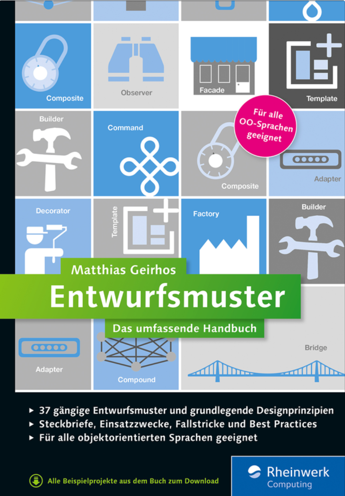
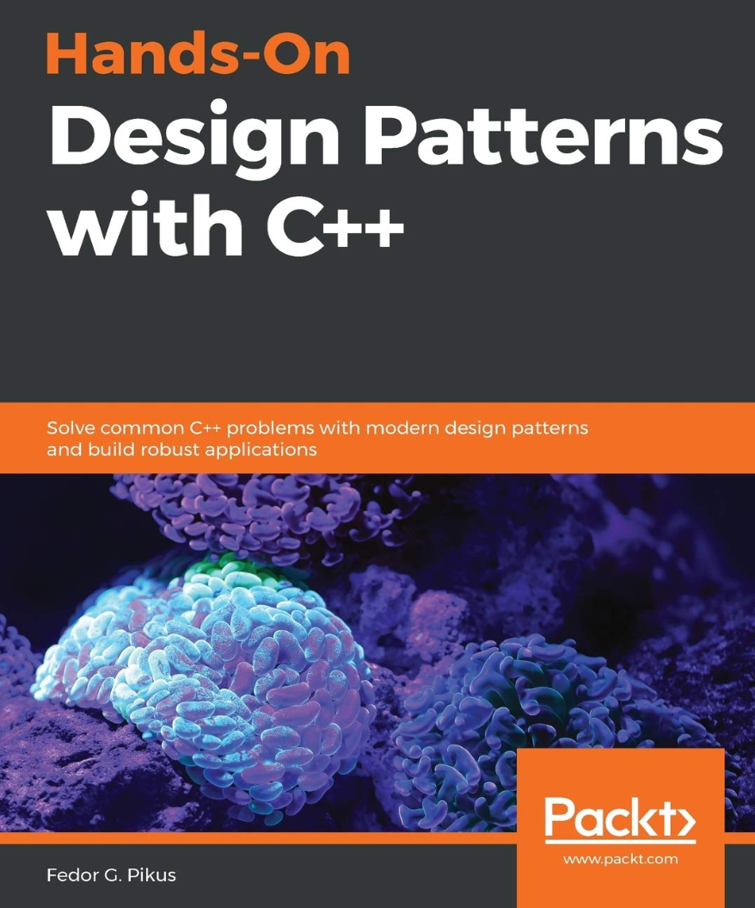
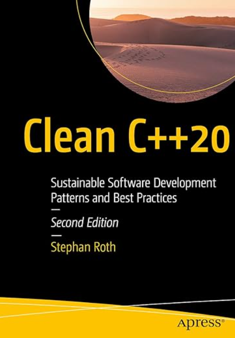
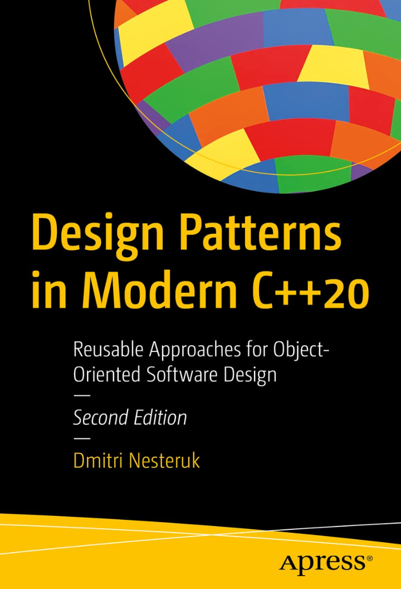
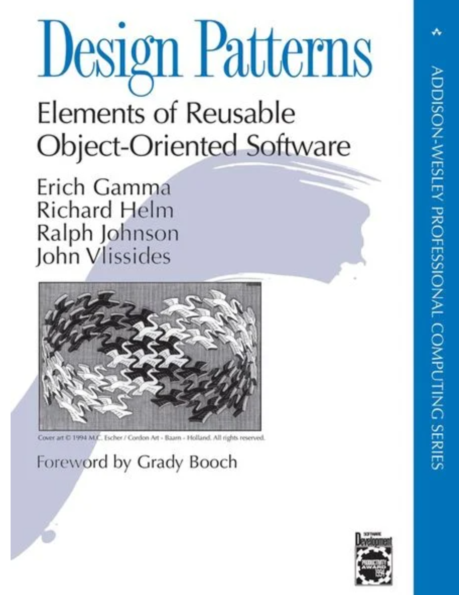
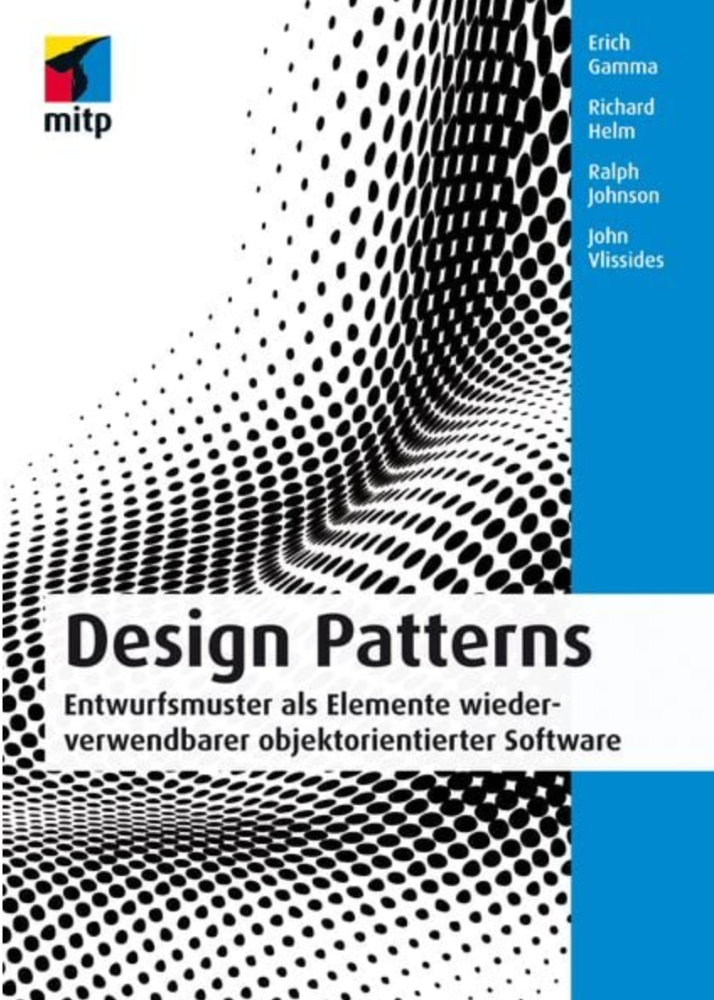
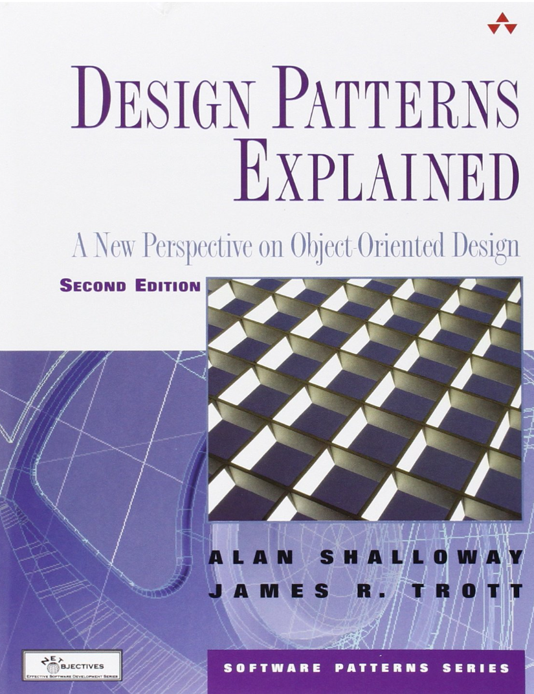
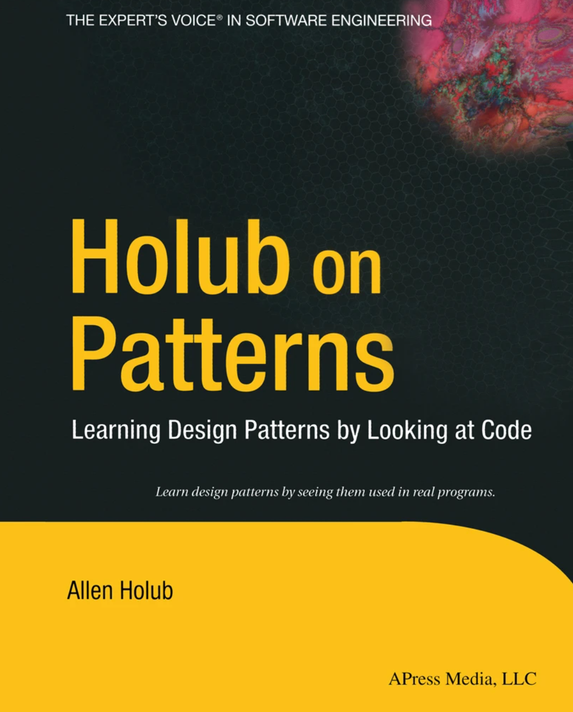
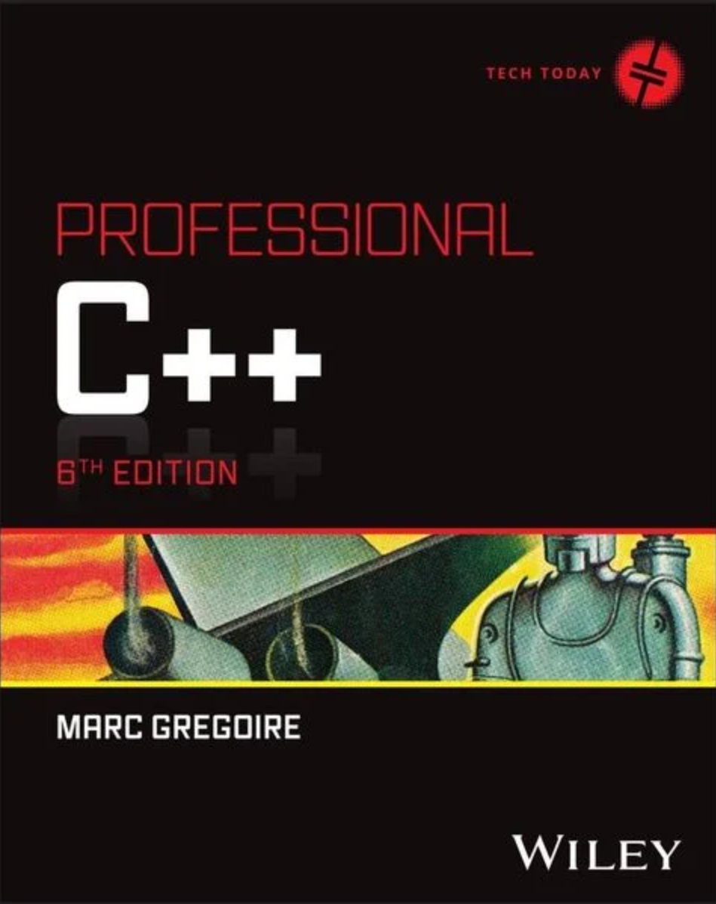

# Literatur zu Design Patterns (Entwurfsmuster)

[Zurück](../Readme.md)

---

  * Matthias Geirhos: &bdquo;Entwurfsmuster: Das umfassende Handbuch&rdquo;. 
    Rheinwerk Verlag GmbH (1. Juni 2015), 643 Seiten. Sprache: Deutsch. ISBN-10: 3836227622, ISBN-13: 978-3836227629.

    Hier werden die wichtigsten Entwurfsmuster für die verschiedensten Anwendungsfälle aufgelistet
    und anschaulich anhand praxisnaher Beispiele erläutert. Kaufempfehlung für alle, die sich mit Entwurfsmustern auseinandersetzen wollen.

    

---

  * Fedor G. Pikus: &bdquo;Hands-On Design Patterns with C++&rdquo;. 
    Packt Publishing (30. Januar 2019), 512 Seiten. Sprache: Englisch. ISBN-10: 1788832566, ISBN-13: 978-1788832564.

    Ein vergleichsweise anspruchsvolles Buch zu Entwurfsmustern in C++. Neben Klassikern wir *Singleton*, *Factory* und *Adapter*
    werden moderne C++-Konzepte wie RAII, SFINAE, CRTP und Type Erasure betrachtet. Sehr gut geschrieben,
    möglicherweise nichts für den Einsteiger in diese Thematik.

    

---

  * Stephan Roth: &bdquo;Clean C++ 20&rdquo;. 
    Apress (18. Juni 2021), 508 Seiten. Sprache: Englisch. ISBN-10: 1484259483, ISBN-13: 978-1484259481.

    Der Autor schöpft aus einem umfangreichen Repertoire programmiersprachlicher Erfahrungen.
    Dieses Wissen wird in einem ganzheitlichen Ansatz für das Thema Softwareentwicklung &ndash; vorzugsweise in C++ &ndash; aufbereitet,
    ein besonderer Fokus ruht auf der Betrachtung von Entwurfsprinzipien und Entwurfsmustern.

    Die Beispiel sind vergleichsweise einfach gehalten, aber dadurch besitzen sie eine starke Prägnanz,
    um den Blick auf das Wesentliche zu lenken. 

    

---

  * Dmitri Nesteruk: &bdquo;Design Patterns in Modern C++: Reusable Approaches for Object-Oriented Software Design&rdquo;. 
    Apress (19. April 2018), 332 Seiten. Sprache: Englisch. ISBN-10: 9781484236024, ISBN-13: 978-1484236024.

    Einfach zu lesendes Buch zum Thema &bdquo;Design Patterns&rdquo;. An vielen Stellen wird versucht,
    die neuen Sprachelemente von C++ in den Beispielen zur Anwendung zu bringen.

    

---

  * Erich Gamma, John Vlissides, Ralph Johnson, Richard Helm: &bdquo;Design Patterns: Elements of Reusable Object-Oriented Software&rdquo;. 
    Addison-Wesley Professional (10. November 1994), 416 Seiten. Sprache: Englisch. ISBN-13: 978-0201633610, ISBN-10: 0201633612.

    Der Bestseller von Gamma und Co. in englischer Originalfassung. Der Klassiker für alle Programmierer.
    Das Standardwerk für die objektorientierte Softwareentwicklung.
    Es werden 23 Patterns vorstellt, die die Grundlage der meisten Bücher zu diesem Thema darstellen.
    Das Buch ist auch in deutscher Fassung erschienen, siehe den folgenden Abschnitt.

    

---

  * Erich Gamma, John Vlissides, Ralph Johnson, Richard Helm: &bdquo;Design Patterns: Entwurfsmuster als Elemente wiederverwendbarer objektorientierter Software&rdquo;. 
    MITP Verlag (1. Februar 2015), 480 Seiten. Sprache: Deutsch. ISBN-13: 978-3826697005, ISBN-10: 3826697006.

    Deutsche Version des Bestsellers von Gamma und Co., siehe Abschitt zuvor.

    

---

  * Alan Shalloway, James Trott: &bdquo;Design Patterns Explained: A New Perspective on Object-Oriented Design&rdquo;. 
    Addison-Wesley Professional (9. Juli 2001), 368 Seiten. Sprache: Englisch. ISBN-13: 978-0201715941, ISBN-10: 0201715945.

    Meines Erachtens eines der besten Bücher zu diesem Thema. Alle Muster sind einfach verständlich beschrieben,
    die Auswahl der Beispiel ist gut gelungen. Einziger Nachteil aus Sicht von C++: Die Beispiele sind in Java
    geschrieben. Auf der WebSite zu diesem Buch sind auch C++&ndash;Beispiele verfügbar.

    

---

  * Allen Holub: &bdquo;Holub on Patterns: Learning Design Patterns by Looking at Code&rdquo;. 
    Apress (30. September 2004), 432 Seiten. Sprache: Englisch. ISBN-10: 1850158479, ISBN-13: 978-1850158479.

    Was kann über Allen Holub noch sagen? Meiner Meinung nach der beste Fachbuchautor weltweit! Werke wie
    *Compiler design in C*, *C+ C++: Programming With Objects in C and C++*, *C Companion* sprechen für sich.
    &bdquo;Holub on Patterns&rdquo; zählt möglicherweise nicht zu seinen besten Werken, aber für Holub-Fans ein Muss.
    In seinem Buch sind mehrere &bdquo;Real-World&rdquo;-Beispiele implementiert, so zum Beispiel der 
    Klassiker &bdquo;Game of Life&rdquo;, leider - für diesen Kontext - ebenfalls nur in Java implementiert.

    

---

  * Marc Gregoire, &bdquo;*Professional C++ (6. Auflage)*&rdquo;. 
    Wiley John + Sons (13. Februar 2024), 1326 Seiten. Sprache: Englisch. ISBN-13: 978-1394193172, ISBN-10: 1394193173.

    Kein reines Buch zu Entwurfsmustern, für mich das derzeit beste C++&ndash;Buch am Markt.
    Zugegeben, sehr umfangreich, aber dafür versteht es der Autor,
    seine Leser mit einem jederzeit erkennbaren roten Faden durch alle Niederungen der Sprache C++ 
    in verständlichen (englischen) Erklärungen zu führen. Großartig!

    

---

  * Christopher Alexander: &bdquo;A Pattern Language&rdquo;. 
    Oxford University Press (1977), 1171 Seiten. Sprache: Englisch. ISBN-10: 0195019199, ISBN-13: 978-0195019193.

---

  * Christopher Alexander: &bdquo;The Timeless Way of Building&rdquo;. 
    Oxford University Press (1979), 552 Seiten. Sprache: Englisch. ISBN-10: 0195024028, ISBN-13: 978-0195024029.

---

  * Martin Fowler: &bdquo;Patterns of Enterprise Application Architecture&rdquo;. 
    Addison-Wesley Professional (15. November 2002), 560 Seiten. Sprache: Englisch. ISBN-10: 0321127420, ISBN-13: 978-0321127426.

---

  * Video Tutorials von Microsoft: [Visual Studio Toolbox zu Design Pattern](https://learn.microsoft.com/de-de/shows/visual-studio-toolbox/design-patterns-strategy)
    (abgerufen am 20.01.2023)

---

  * Blog von Vishal Chovatiya: [Design Patterns With Modern C++](https://vishalchovatiya.com/pages/start-here/)
    (abgerufen am 20.01.2023)

---

  * EBook: [Refactoring.Guru](https://refactoring.guru/design-patterns/book)
    (abgerufen am 20.01.2023)

---

  * Dreiteilige Artikelserie auf *CodeProject.com*: 
    [Design Patterns 1 of 3 - Creational Design Patterns](https://www.codeproject.com/Articles/430590/Design-Patterns-1-of-3-Creational-Design-Patterns) 
    [Design Patterns 2 of 3 - Structural Design Patterns](https://www.codeproject.com/Articles/438922/Design-Patterns-2-of-3-Structural-Design-Patterns) 
    [Design Patterns 3 of 3 - Behavioral Design Patterns](https://www.codeproject.com/Articles/455228/Design-Patterns-3-of-3-Behavioral-Design-Patterns) 
    (abgerufen am 20.01.2023)

---

[Zurück](../Readme.md)

---
