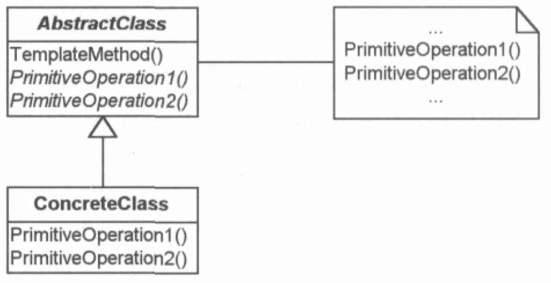

# Template Method Pattern

Bild:

## Kategorie: *Behavioral Pattern*

## Anwendungen des Design Pattern in der STL:

  * TBD

## Beschreibung:

Das *Template Method Pattern* beschreibt das "Skelett" (*Schablone*, *Template*) eines Algorithmus in einer Oberklasse,
typischerweise in einer Methode. Diese Methode setzt sich typischerweise aus mehreren (Teil-)Methoden zusammen,
die die einzelnen Schritte umsetzen.

## Hinweis:

Template Method Pattern und Strategy Pattern besitzen viele Gemeinsamkeiten. Ein Unterschied zwischen den beiden Mustern ist,
dass das Template Method Pattern auf Vererbung beruht, dass Strategy Pattern hingehen auf Komposition.

## Anwendungsbeispiel:

In Spezialisierungen der Oberklasse können bzw. sollten ein oder mehrere Teilmethoden überschrieben werden,
um die **Template Methode* in der Oberklasse zu vervollständigen. 

Die Skelett-Methode ist davon ausgenommen - die prinzipielle Struktur des Algorithmus ist beizubehalten,
also nicht zu verändern.

Beispiele:

Die Beispiele zu diesem Pattern orientieren sich an:

[https://refactoring.guru/design-patterns/strategy](https://refactoring.guru/design-patterns/strategy/java/example)
